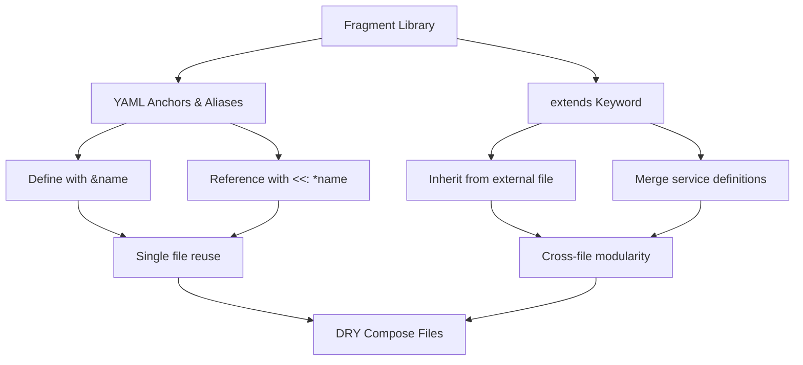
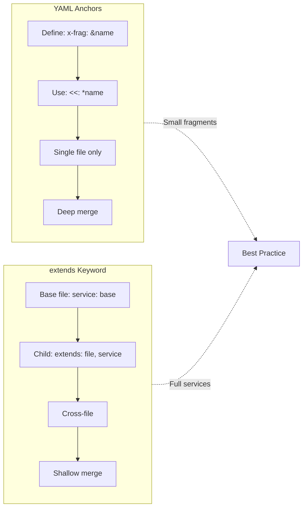
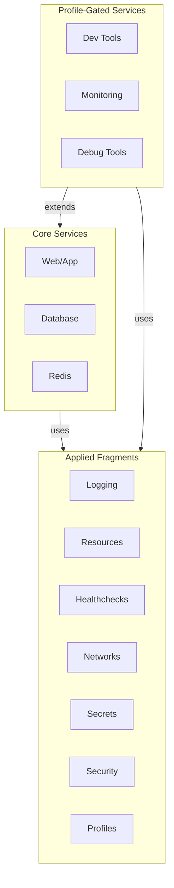

<!-- header start -->

<a href="https://stackoverflow.com/users/1755598/codewizard"></a>&emsp;&emsp;[](https://www.linkedin.com/in/nirgeier/)&emsp;[](mailto:nirgeier@gmail.com)&emsp;[](mailto:nirg@codewizard.co.il)

<!-- header end -->

---

# Docker Compose Fragments - Reusable Configuration Patterns

- This lab teaches you **Docker Compose fragments** using YAML anchors, aliases, and the `extends` mechanism.
- You'll learn how to define **reusable configuration blocks** for logging, resources, healthchecks, networks, secrets, security, and profiles.
- Each concept includes a **standalone example** and a **combined all-in-one** production-ready stack.

---


[](https://console.cloud.google.com/cloudshell/editor?cloudshell_git_repo=https://github.com/nirgeier/DockerComposeLabs)

**<kbd>CTRL</kbd> + click to open in new window**

---

[](009-Fragments.zip)

---

## Table of Contents

- [Docker Compose Fragments - Reusable Configuration Patterns](#docker-compose-fragments---reusable-configuration-patterns)
  - [**CTRL + click to open in new window**](#ctrl--click-to-open-in-new-window)
  - [Table of Contents](#table-of-contents)
  - [What Are Docker Compose Fragments?](#what-are-docker-compose-fragments)
    - [YAML Anchors (`&`) and Aliases (`<<: *`)](#yaml-anchors--and-aliases--)
    - [The `extends` Mechanism](#the-extends-mechanism)
    - [Anchors vs Extends - When to Use Which](#anchors-vs-extends---when-to-use-which)
  - [Fragment Categories](#fragment-categories)
    - [1. Logging Drivers](#1-logging-drivers)
    - [2. Restart Policies](#2-restart-policies)
    - [3. Resource Constraints](#3-resource-constraints)
    - [4. Healthchecks](#4-healthchecks)
    - [5. Networks](#5-networks)
    - [6. Secrets](#6-secrets)
    - [7. Security Configurations](#7-security-configurations)
    - [8. Profiles](#8-profiles)
  - [All-in-One Reference Stack](#all-in-one-reference-stack)
  - [Using the Central Fragments Library](#using-the-central-fragments-library)
    - [Library Location and Contents](#library-location-and-contents)
    - [Method 1: Direct YAML Anchor Reference (Single File)](#method-1-direct-yaml-anchor-reference-single-file)
    - [Method 2: `extends` from External Files](#method-2-extends-from-external-files)
    - [Method 3: Combined Anchors + Extends (Most Powerful)](#method-3-combined-anchors--extends-most-powerful)
    - [Method 4: Multi-File Fragment Libraries](#method-4-multi-file-fragment-libraries)
    - [Using the Library Across a Monorepo](#using-the-library-across-a-monorepo)
    - [Library Versioning and Change Management](#library-versioning-and-change-management)
    - [CI/CD Integration](#cicd-integration)
    - [Creating a Company-Wide Fragment Library](#creating-a-company-wide-fragment-library)
    - [Real-World Example: Full Production Stack](#real-world-example-full-production-stack)
    - [Validating Your Fragment Library](#validating-your-fragment-library)
    - [Library Maintenance Tips](#library-maintenance-tips)
    - [Fragment Reference Card](#fragment-reference-card)
  - [Best Practices](#best-practices)
  - [Troubleshooting](#troubleshooting)
  - [Hands-On Tasks](#hands-on-tasks)
    - [Task 1: Create Your Own Fragment Library](#task-1-create-your-own-fragment-library)
    - [Task 2: Profile-Based Environment Switching](#task-2-profile-based-environment-switching)
    - [Task 3: Healthcheck Dependency Chain](#task-3-healthcheck-dependency-chain)
    - [Task 4: Combine All Fragments](#task-4-combine-all-fragments)
    - [Task 5: Extends from External Files](#task-5-extends-from-external-files)
  - [Verification Checklist](#verification-checklist)
  - [Additional Resources](#additional-resources)
  - [Cleanup](#cleanup)

---

## What Are Docker Compose Fragments?

Fragments are **reusable YAML configuration blocks** that let you define common patterns once and apply them across multiple services. Docker Compose supports two main approaches: **YAML anchors** (native YAML feature) and the `extends` keyword (Docker Compose built-in).



### YAML Anchors (`&`) and Aliases (`<<: *`)

```yaml
# Define a fragment with & (anchor)
x-logging-default: &logging-default
  logging:
    driver: "json-file"
    options:
      max-size: "10m"
      max-file: "3"

# Use it with <<: * (alias merge)
services:
  web:
    image: nginx
    <<: *logging-default
```

The `x-` prefix marks **extension fields** that Docker Compose ignores but YAML processes. Anchors (`&name`) define reusable blocks. Aliases (`<<: *name`) merge them into a service.

### The `extends` Mechanism

```yaml
# Inherit a full service definition from another file
services:
  web:
    extends:
      file: ./base/web.yaml
      service: web-base
    # Add service-specific overrides here
    ports:
      - "8080:80"
```

`extends` loads a complete service definition from an external compose file and merges it with the current service. This enables true modularity - base definitions live in their own files.

### Anchors vs Extends - When to Use Which

| Feature | YAML Anchors (`<<:*`) | `extends` |
|---------|----------------------|-----------|
| **Scope** | Within a single file | Across multiple files |
| **Override** | Deep merge (anchors win) | Shallow merge (child wins) |
| **Flexibility** | Merge any YAML block | Merge full service definitions |
| **Reusability** | Define once, use anywhere | Define in central library |
| **Complexity** | Simple, no extra files | Requires file management |
| **Best for** | Small config blocks | Full service templates |



---

## Fragment Categories

### 1. Logging Drivers

Docker supports multiple logging drivers. Using fragments you can switch between them without repeating configuration.

**Available drivers:**

| Driver | Use Case | Config Fragment |
|--------|----------|-----------------|
| `json-file` | Default, structured JSON logs | `&logging-json` |
| `local` | Faster, more efficient than json-file | `&logging-local` |
| `syslog` | Centralized syslog aggregation | `&logging-syslog` |
| `gelf` | Graylog Extended Log Format | `&logging-gelf` |
| `fluentd` | Fluentd log collector | `&logging-fluentd` |
| `awslogs` | Amazon CloudWatch Logs | `&logging-aws` |
| `gcplogs` | Google Cloud Logging | `&logging-gcplogs` |
| `splunk` | Splunk log ingestion | `&logging-splunk` |
| `none` | Disable logging entirely | `&logging-none` |

```bash
# Try it:
cd examples/logging
docker compose config   # View resolved config
docker compose up -d    # Start all logging variants
docker compose logs app-json   # View JSON logs
docker compose logs app-local  # View local driver logs
docker compose down
```

**Key options:**

- `max-size`: Rotate log file at this size
- `max-file`: Keep this many rotated files
- `tag`: Custom tag format for identifying log sources
- `labels` / `env`: Include specific labels or env vars in logs

---

### 2. Restart Policies

Control how containers restart when they exit.

| Policy | Behavior | Fragment |
|--------|----------|----------|
| `no` | Never restart (default) | `&restart-no` |
| `always` | Always restart unless manually stopped | `&restart-always` |
| `on-failure` | Restart only on non-zero exit | `&restart-on-failure` |
| `unless-stopped` | Always restart, but not after manual stop | `&restart-unless-stopped` |
| `on-failure:N` | Restart on failure, max N retries | `&restart-on-failure-3` |

```bash
cd examples/restart
docker compose up -d
docker compose ps  # See restart status
# Test on-failure: container will restart after exit
docker compose logs -f restart-on-failure
docker compose down
```

---

### 3. Resource Constraints

Define CPU and memory limits/reservations to prevent resource starvation.

**Resource tiers:**

| Tier | CPU Limit | Memory Limit | Use Case | Fragment |
|------|-----------|-------------|----------|----------|
| Tiny | 0.1 | 64M | Sidecars, init containers | `&resources-tiny` |
| Small | 0.25 | 128M | Nginx, Redis | `&resources-small` |
| Medium | 0.5 | 256M | Node.js, Python apps | `&resources-medium` |
| Large | 1.0 | 512M | Databases, Java apps | `&resources-large` |
| XLarge | 2.0 | 1G | Heavy workloads | `&resources-xlarge` |
| GPU | - | - | ML/AI workloads | `&resources-gpu` |

```bash
cd examples/resources
docker compose config --services  # List services with their resource tiers
docker compose up -d
docker stats  # Monitor resource usage
docker compose down
```

**Understanding limits vs reservations:**

- `limits`: Hard ceiling - container cannot exceed this
- `reservations`: Soft guarantee - Docker tries to give this much
- In Swarm mode, reservations affect scheduling; in Compose standalone, they document requirements

---

### 4. Healthchecks

Healthchecks tell Docker how to verify a container is working correctly.

**Pre-built healthcheck fragments:**

| Check | Command | Suitable For | Fragment |
|-------|---------|-------------|----------|
| HTTP | `curl -f http://localhost` | Web servers, APIs | `&healthcheck-http` |
| HTTPS | `curl -fk https://localhost` | TLS-enabled web services | `&healthcheck-https` |
| TCP | `nc -z localhost <port>` | Generic port liveness | `&healthcheck-tcp` |
| PostgreSQL | `pg_isready -U postgres` | PostgreSQL databases | `&healthcheck-postgres` |
| Redis | `redis-cli ping` | Redis / Valkey caches | `&healthcheck-redis` |
| MySQL | `mysqladmin ping` | MySQL / MariaDB | `&healthcheck-mysql` |
| MongoDB | `mongosh --eval ping` | MongoDB databases | `&healthcheck-mongo` |
| Elasticsearch | `curl .../_cluster/health` | Elasticsearch / OpenSearch | `&healthcheck-elastic` |

```bash
cd examples/healthcheck
docker compose up -d
docker compose ps  # Check health status column
# Watch health status transitions
watch docker compose ps
docker compose down
```

**Healthcheck options explained:**

```yaml
healthcheck:
  test: ["CMD", "curl", "-f", "http://localhost"]  # Command to run
  interval: 30s       # Run every 30 seconds
  timeout: 10s        # Max time for one check
  retries: 3          # Failures before marking unhealthy
  start_period: 10s   # Grace period before first check
```

- `start_period` is critical for databases and slow-starting services
- Without healthchecks, `depends_on` waits only for container start, not readiness
- Use `depends_on:` with `condition: service_healthy` for ordered startup

---

### 5. Networks

Define network topologies for isolation and security.

**Network patterns:**

| Pattern | Description | Fragment |
|---------|-------------|----------|
| Bridge | Default isolated network | `&network-bridge` |
| Internal | No external access | `&network-internal` |
| Multi-tier | Frontend + backend separation | `&network-multi` |
| DMZ | Public-facing + private tiers | `&network-dmz` |
| IPAM | Custom subnet/gateway | custom |

```bash
cd examples/networks
docker compose up -d
# Inspect network isolation
docker compose exec app ping -c 2 proxy   # Works (same network)
docker compose exec db ping -c 2 app      # Works (same network)
docker compose exec adminer ping -c 2 app  # Fails (different network)
docker compose down
```

**Network isolation levels:**

```yaml
# Public network - accessible from host
public:
  driver: bridge

# Internal network - no external access  
internal:
  driver: bridge
  internal: true   # No external connectivity

# DMZ pattern - proxy bridges public and private
proxy:
  networks:
    public:     # Accepts external traffic
    dmz:        # Talks to app tier
```

---

### 6. Secrets

Manage sensitive data (passwords, API keys, TLS certs) without hardcoding them in compose files.

**Secret patterns:**

| Pattern | Description | Fragment |
|---------|-------------|----------|
| File-based | Load from local files | `&secrets-file` |
| External | Use Docker Swarm secrets | `&secrets-external` |
| DB credentials | Database passwords | `&secrets-db` |
| TLS | Certificate/key pairs | `&secrets-tls` |

```bash
cd examples/secrets
# Create secret files
mkdir -p secrets
echo "supersecret123" > secrets/db_password.txt
echo "apikey-abc-123" > secrets/api_key.txt
echo "cert-data" > secrets/tls_cert.pem
echo "key-data" > secrets/tls_key.pem

docker compose up -d
# Verify secrets are mounted
docker compose exec web ls -la /run/secrets/
docker compose exec web cat /run/secrets/db_password
docker compose down
```

**Security best practices:**

- Never commit secret files to git (add `secrets/*.txt` to `.gitignore`)
- Use `.env` files for non-sensitive defaults only
- In production, prefer external secrets (Docker Swarm, HashiCorp Vault)
- Secrets are mounted as tmpfs files in `/run/secrets/<name>` inside the container
- Only containers that need a secret should have access to it

---

### 7. Security Configurations

Apply the principle of least privilege to containers.

**Security tiers:**

| Level | Description | Fragment |
|-------|-------------|----------|
| Default | Drop all caps, add NET_BIND_SERVICE | `&security-default` |
| Read-only | Read-only root filesystem + tmpfs for /tmp | `&security-readonly` |
| Web | Read-only + network permissions only | `&security-web` |
| Database | Read-write filesystem, minimal caps | `&security-db` |
| Debug | Extended privileges for debugging | `&security-privileged` |

```bash
cd examples/security
docker compose up -d
# Verify read-only filesystem blocks writes
docker compose exec web-app touch /test.txt
docker compose down
```

**Security options explained:**

```yaml
security_opt:
  - no-new-privileges:true   # Prevent privilege escalation
  
cap_drop:
  - ALL                       # Start with zero capabilities
  
cap_add:
  - NET_BIND_SERVICE          # Allow binding to ports <1024
  
read_only: true               # Filesystem becomes read-only
tmpfs:
  - /tmp                      # Ephemeral write space
```

---

### 8. Profiles

Control which services start in different environments without maintaining separate compose files.

**Profile patterns:**

| Profile | Purpose | Fragment |
|---------|---------|----------|
| `dev` | Development tools | `&profile-dev` |
| `staging` | Pre-prod test services | `&profile-staging` |
| `production` | Production-only services | `&profile-prod` |
| `monitoring` | Prometheus, Grafana, etc. | `&profile-monitoring` |
| `debug` | Debugging / troubleshooting | `&profile-debug` |
| `devops` | Portainer, CI tools | `&profile-devops` |

```bash
cd examples/profiles

# Start only core services
docker compose up -d

# Start with dev profile
docker compose --profile dev up -d

# Start with multiple profiles
docker compose --profile dev --profile monitoring up -d

# Start everything
docker compose --profile '*' up -d

# See which services use each profile
docker compose config --services
docker compose down
```

**Profile rules:**

- Services without a profile always start
- Services with a profile start only when that profile is active
- Use `--profile '*'` to start all profiled services
- Multiple `--profile` flags are additive

---

## All-in-One Reference Stack

The `examples/all-in-one/` directory contains a complete production-ready stack that combines ALL fragment types:



```bash
cd examples/all-in-one
mkdir -p secrets
echo "my-db-pass-123" > secrets/db_password.txt
echo "my-api-key-456" > secrets/api_key.txt

# Start core services
docker compose up -d

# Start with dev tools
docker compose --profile dev up -d

# Start everything including monitoring
docker compose --profile dev --profile monitoring up -d

# View the resolved configuration
docker compose config

# Monitor health
docker compose ps

# Clean up
docker compose down -v
```

**What this stack demonstrates:**

- Multi-network topology (frontend, backend, database tiers)
- Conditional service startup with profiles
- Healthcheck-based dependency ordering
- Secrets mounted from files
- Resource constraints per service tier
- Read-only security for web services
- Centralized logging configuration

---

## Using the Central Fragments Library

The repository includes a central fragment library at `../../resources/compose/fragments.yaml` that you can use across any Docker Compose project. This section covers every way to consume, extend, and maintain a fragment library.

### Library Location and Contents

The central library (`../../resources/compose/fragments.yaml`) contains **30+ reusable fragments** organized into 8 categories:

| Category | Fragments | Prefix |
|----------|-----------|--------|
| Logging | json-file, local, syslog, gelf, fluentd, none | `&logging-*` |
| Restart | no, on-failure, always, unless-stopped | `&restart-*` |
| Resources | small, medium, large | `&resources-*` |
| Healthchecks | HTTP, TCP, PostgreSQL, Redis | `&healthcheck-*` |
| Networks | default, internal, IPAM | `&network-*` |
| Secrets | file-based, external | `&secrets-*` |
| Security | default, readonly | `&security-*` |
| Profiles | dev, staging, prod, monitoring, debug | `&profile-*` |

### Method 1: Direct YAML Anchor Reference (Single File)

Include the library file directly into your compose file using YAML's `!include` or by concatenating files:

```yaml
# docker-compose.yaml
# Paste the library fragments at the top, then reference with <<:
services:
  web:
    image: nginx:alpine
    ports:
      - "8080:80"
    <<: *logging-json
    <<: *restart-always
    <<: *resources-small
    <<: *healthcheck-http
    <<: *security-web
```

**How it works:**

- The `x-` prefix marks extension fields Docker Compose ignores
- `&name` creates a YAML anchor
- `<<: *name` merges the anchor into the current map
- `<<: [*a, *b, *c]` merges multiple anchors in one line

### Method 2: `extends` from External Files

The `extends` keyword loads a full service definition from another file:

```yaml
# docker-compose.yaml
services:
  grafana:
    extends:
      file: ../../resources/compose/fragments.yaml
      service: grafana
    ports:
      - "3001:3000"

  prometheus:
    extends:
      file: ../../resources/compose/prometheus.yaml
      service: prometheus-base
    environment:
      - SCRAPE_INTERVAL=15s
```

**extends rules:**

- The target file must be valid Docker Compose with named services
- `extends` merges the base service with the current one
- Child service values override base values (shallow merge)
- Lists (e.g., `ports:`, `environment:`) are replaced, not merged
- `depends_on`, `links`, `volumes_from` from the base are ignored
- Path is relative to the current compose file's directory

### Method 3: Combined Anchors + Extends (Most Powerful)

The most flexible approach uses **both** mechanisms together:

```yaml
# docker-compose.yaml
# ── Inline fragments from the central library ──────────────
x-logging: &logging-json
  logging:
    driver: "json-file"
    options:
      max-size: "10m"
      max-file: "3"

x-healthcheck-http: &healthcheck-http
  healthcheck:
    test: ["CMD", "curl", "-f", "http://localhost"]
    interval: 30s
    timeout: 10s
    retries: 3
    start_period: 10s

# ── Combine extends with anchors ──────────────────────────
services:
  web:
    extends:
      file: ./base/web.yaml
      service: web-base
    ports:
      - "8080:80"
    <<: [*logging-json, *healthcheck-http]

  db:
    extends:
      file: ./base/database.yaml
      service: postgres-base
    environment:
      POSTGRES_DB: myapp_production
    <<: *resources-medium
```

!!! info "**Why combine them?**"

    - `extends` gives you full service templates from files
    - Anchors add cross-cutting concerns (logging, healthchecks) without modifying the base
    - Each mechanism handles what it does best

### Method 4: Multi-File Fragment Libraries

For large organizations, split fragments into domain-specific files:

```
fragments/
├── logging.yaml          # All logging drivers
├── resources.yaml        # CPU/memory tiers
├── healthchecks.yaml     # Database healthchecks
├── security.yaml         # Security profiles
├── networks.yaml         # Network topologies
└── monitoring.yaml       # Monitoring stack fragments
```

```yaml
# docker-compose.yaml
# ── Import fragments from multiple files ───────────────────
# (Inlined at build time or via !include preprocessor)

x-logging: &logging-json
  logging:
    driver: "json-file"
    options:
      max-size: "10m"
      max-file: "3"

x-resources-medium: &resources-medium
  deploy:
    resources:
      limits:
        cpus: "0.5"
        memory: "256M"
      reservations:
        cpus: "0.25"
        memory: "128M"

x-healthcheck-http: &healthcheck-http
  healthcheck:
    test: ["CMD", "curl", "-f", "http://localhost"]
    interval: 30s
    timeout: 10s
    retries: 3

services:
  api:
    image: myapp:latest
    ports:
      - "8080:3000"
    <<: [*logging-json, *resources-medium, *healthcheck-http]
```

!!!  info "**Automation tip:**"

    - " Use a simple `cat` script to assemble fragments at build time:

```bash
#!/bin/bash
# assemble-compose.sh - Build docker-compose.yaml from fragments
cat > docker-compose.yaml << 'HEADER'
### Auto-generated - do not edit ###
HEADER
cat fragments/logging.yaml >> docker-compose.yaml
cat fragments/resources.yaml >> docker-compose.yaml
cat fragments/healthchecks.yaml >> docker-compose.yaml
cat services/web.yaml >> docker-compose.yaml
cat services/db.yaml >> docker-compose.yaml
```

### Using the Library Across a Monorepo

In a monorepo structure, the central library lives at the repo root and is referenced from any project:

```
monorepo/
├── resources/
│   └── compose/
│       └── fragments.yaml       # Central library
├── project-alpha/
│   └── docker-compose.yaml      # References ../../resources/compose/fragments.yaml
└── project-beta/
    └── docker-compose.yaml      # Same reference path
```

```yaml
# project-alpha/docker-compose.yaml
x-logging: &logging-json !include ../resources/compose/fragments.yaml
# OR inline the fragments at the top of your file

services:
  api:
    image: myapp:latest
    <<: *logging-json
    <<: *resources-medium
```

!!! info "**Path resolution rules:**"

    - `extends` paths are relative to the current compose file
    - Anchors are resolved at the YAML level (same file only)
    - Use absolute paths or repo-relative symlinks for team-wide consistency
    - CI/CD pipelines can inject the correct paths via environment variables

### Library Versioning and Change Management

Treat your fragment library like any other dependency:

**Strategy 1: Git Submodule**

```bash
# Library lives in its own repo
git submodule add git@github.com:team/compose-fragments.git fragments

# docker-compose.yaml
x-logging: &logging-json
  logging:
    driver: "json-file"
    options:
      max-size: "10m"
      max-file: "3"
# Pin to a specific submodule commit for stability
```

**Strategy 2: Semantic Versioning in File Names**

```
fragments/
├── v1/
│   └── fragments.yaml     # Stable v1 API
├── v2/
│   └── fragments.yaml     # Breaking changes
└── latest/
    └── fragments.yaml     # Edge / bleeding edge
```

```yaml
# docker-compose.yaml - pin to v1
x-logging: &logging-json !include fragments/v1/fragments.yaml
```

**Strategy 3: Release Tags**

```bash
# Tag versions of the library
git tag compose-fragments-v1.0.0
git tag compose-fragments-v1.1.0
git tag compose-fragments-v2.0.0
```

### CI/CD Integration

Use the fragment library in your pipeline:

```yaml
# .github/workflows/deploy.yml
jobs:
  deploy:
    steps:
      - uses: actions/checkout@v4
        with:
          submodules: recursive   # If using submodule strategy

      - name: Generate compose config
        run: |
          docker compose config > resolved-config.yaml
          echo "Compose file resolved successfully"

      - name: Validate fragments
        run: |
          # Check all anchored references resolve
          if grep -q "<<: \*" docker-compose.yaml; then
            echo "Unresolved anchors found!" && exit 1
          fi
```

### Creating a Company-Wide Fragment Library

**Step 1: Structure your library**

```
docker-fragments/
├── README.md              # Usage guide
├── CHANGELOG.md           # Version history
├── fragments.yaml         # Main entry point (includes everything)
├── logging.yaml           # Driver configurations
├── resources.yaml         # CPU/memory tiers
├── healthchecks.yaml      # Service healthchecks
├── security.yaml          # Security profiles
├── networks.yaml          # Network topologies
└── monitoring/
    ├── prometheus.yaml    # Prometheus service definition
    └── grafana.yaml       # Grafana service definition
```

**Step 2: Create the combined library**

```yaml
# fragments.yaml - imports all domain files
# Users can either import individual files or this combined file

x-logging-json: &logging-json
  logging:
    driver: "json-file"
    options:
      max-size: "10m"
      max-file: "3"

x-logging-local: &logging-local
  logging:
    driver: "local"
    options:
      max-size: "10m"
      max-file: "3"

x-resources-tiny: &resources-tiny
  deploy:
    resources:
      limits:
        cpus: "0.1"
        memory: "64M"

x-resources-small: &resources-small
  deploy:
    resources:
      limits:
        cpus: "0.25"
        memory: "128M"

x-resources-medium: &resources-medium
  deploy:
    resources:
      limits:
        cpus: "0.5"
        memory: "256M"
      reservations:
        cpus: "0.25"
        memory: "128M"

x-resources-large: &resources-large
  deploy:
    resources:
      limits:
        cpus: "1"
        memory: "512M"

x-healthcheck-http: &healthcheck-http
  healthcheck:
    test: ["CMD", "curl", "-f", "http://localhost"]
    interval: 30s
    timeout: 10s
    retries: 3
    start_period: 10s

x-healthcheck-postgres: &healthcheck-postgres
  healthcheck:
    test: ["CMD-SHELL", "pg_isready -U postgres"]
    interval: 10s
    timeout: 5s
    retries: 5

x-healthcheck-redis: &healthcheck-redis
  healthcheck:
    test: ["CMD", "redis-cli", "ping"]
    interval: 10s
    timeout: 3s
    retries: 5

x-security-web: &security-web
  security_opt:
    - no-new-privileges:true
  cap_drop:
    - ALL
  cap_add:
    - NET_BIND_SERVICE
  read_only: true
  tmpfs:
    - /tmp

x-restart-always: &restart-always
  restart: always

x-restart-no: &restart-no
  restart: "no"

x-profile-dev: &profile-dev
  profiles:
    - dev

x-profile-monitoring: &profile-monitoring
  profiles:
    - monitoring
```

**Step 3: Consume in your projects**

```yaml
# project/docker-compose.yaml
# Paste the library content OR use !include with a preprocessor

services:
  web:
    image: nginx:alpine
    ports:
      - "8080:80"
    <<: [*logging-json, *restart-always, *resources-small, *healthcheck-http, *security-web]
    depends_on:
      db:
        condition: service_healthy

  db:
    image: postgres:16-alpine
    environment:
      POSTGRES_PASSWORD: example
    volumes:
      - pgdata:/var/lib/postgresql/data
    <<: [*logging-json, *restart-always, *resources-medium, *healthcheck-postgres]

  redis:
    image: redis:7-alpine
    <<: [*logging-json, *restart-always, *resources-tiny, *healthcheck-redis]

  adminer:
    image: adminer
    ports:
      - "8081:8080"
    <<: [*logging-json, *restart-no, *resources-tiny, *profile-dev]

volumes:
  pgdata:
```

### Real-World Example: Full Production Stack

Here's how a real team uses the fragment library for their production and development environments:

```yaml
# docker-compose.yaml - Production stack using fragments
x-logging: &logging
  logging:
    driver: "json-file"
    options:
      max-size: "10m"
      max-file: "3"

x-restart: &restart
  restart: unless-stopped

x-resources-api: &resources-api
  deploy:
    resources:
      limits: { cpus: "1", memory: "512M" }
      reservations: { cpus: "0.5", memory: "256M" }

x-resources-db: &resources-db
  deploy:
    resources:
      limits: { cpus: "2", memory: "2G" }
      reservations: { cpus: "1", memory: "1G" }

x-healthcheck-api: &healthcheck-api
  healthcheck:
    test: ["CMD", "wget", "-qO-", "http://localhost:3000/health"]
    interval: 15s
    timeout: 5s
    retries: 3
    start_period: 30s

x-healthcheck-db: &healthcheck-db
  healthcheck:
    test: ["CMD-SHELL", "pg_isready -U ${DB_USER:-postgres}"]
    interval: 10s
    timeout: 5s
    retries: 10
    start_period: 60s

x-security-api: &security-api
  security_opt:
    - no-new-privileges:true
  cap_drop:
    - ALL
  cap_add:
    - NET_BIND_SERVICE
  read_only: true
  tmpfs:
    - /tmp
    - /var/run

x-profile-dev: &profile-dev
  profiles: [dev]

x-profile-staging: &profile-staging
  profiles: [staging]

x-profile-prod: &profile-prod
  profiles: [production]

services:
  # ── Core (always on) ────────────────────────────────────
  api:
    image: myapp/api:${TAG:-latest}
    ports:
      - "${API_PORT:-3000}:3000"
    environment:
      - NODE_ENV=${NODE_ENV:-production}
      - DB_URL=postgres://${DB_USER}:${DB_PASS}@db:5432/myapp
    depends_on:
      db:
        condition: service_healthy
      redis:
        condition: service_healthy
    <<: [*logging, *restart, *resources-api, *healthcheck-api, *security-api]

  db:
    image: postgres:16-alpine
    volumes:
      - pgdata:/var/lib/postgresql/data
    environment:
      - POSTGRES_DB=myapp
      - POSTGRES_USER=${DB_USER:-app}
      - POSTGRES_PASSWORD=${DB_PASS:?error}
    <<: [*logging, *restart, *resources-db, *healthcheck-db]

  redis:
    image: redis:7-alpine
    volumes:
      - redis-data:/data
    <<: [*logging, *restart, *healthcheck-redis]

  # ── Development tools (profile only) ────────────────────
  adminer:
    image: adminer
    ports:
      - "8080:8080"
    <<: [*logging, *profile-dev]

  mailhog:
    image: mailhog/mailhog
    ports:
      - "8025:8025"
      - "1025:1025"
    <<: [*logging, *profile-dev]

  # ── Staging tools (profile only) ────────────────────────
  k6:
    image: grafana/k6:latest
    volumes:
      - ./k6-scripts:/scripts
    <<: [*profile-staging]

  # ── Monitoring (profile only) ───────────────────────────
  prometheus:
    image: prom/prometheus:latest
    ports:
      - "9090:9090"
    volumes:
      - ./prometheus.yml:/etc/prometheus/prometheus.yml
    <<: [*logging, *resources-api, *profile-staging, *profile-prod]

  grafana:
    image: grafana/grafana:latest
    ports:
      - "3001:3000"
    depends_on:
      - prometheus
    <<: [*logging, *resources-api, *profile-staging, *profile-prod]

volumes:
  pgdata:
  redis-data:
```

**Deploy this stack by environment:**

```bash
# Development
docker compose --profile dev up -d

# Staging (with monitoring)
docker compose --profile staging up -d

# Production (no dev tools, with monitoring)
docker compose --profile production up -d

# Full deployment
docker compose --profile dev --profile staging --profile production up -d
```

### Validating Your Fragment Library

Always verify your library references resolve correctly:

```bash
# Check that the resolved config is valid YAML
docker compose config > /dev/null && echo "Valid"

# Show the fully resolved configuration (anchors expanded)
docker compose config

# Validate without starting containers
docker compose config --quiet

# Check for unused anchors
grep -r "&" docker-compose.yaml | grep -v "^#" | grep "&[a-z]"
```

### Library Maintenance Tips

| Practice | Why |
|----------|-----|
| **Keep fragments focused** | One concern per fragment (logging, resources, etc.) |
| **Document each fragment** | Add a comment above each anchor explaining its purpose |
| **Version your library** | Tag releases so projects can pin to stable versions |
| **Test with CI** | Run `docker compose config` in CI to catch broken references |
| **Deprecate gracefully** | Keep old fragments alongside new ones during migration periods |
| **Use consistent naming** | `&category-description` pattern prevents collisions |
| **Review regularly** | Remove unused fragments, update defaults, add new patterns |

### Fragment Reference Card

Keep this reference handy when writing compose files:

```yaml
# ── Logging ────────────────────────────────────────────────
x-logging: &logging-json {logging: {driver: "json-file", options: {max-size: "10m", max-file: "3"}}}

# ── Restart ────────────────────────────────────────────────
x-restart: &restart-always {restart: always}

# ── Resources ──────────────────────────────────────────────
x-resources: &resources-medium {deploy: {resources: {limits: {cpus: "0.5", memory: "256M"}, reservations: {cpus: "0.25", memory: "128M"}}}}

# ── Healthcheck ────────────────────────────────────────────
x-healthcheck: &healthcheck-http {healthcheck: {test: ["CMD", "curl", "-f", "http://localhost"], interval: "30s", timeout: "10s", retries: 3, start_period: "10s"}}

# ── Security ───────────────────────────────────────────────
x-security: &security-web {security_opt: ["no-new-privileges:true"], cap_drop: ["ALL"], cap_add: ["NET_BIND_SERVICE"], read_only: true, tmpfs: ["/tmp"]}

# ── Profiles ───────────────────────────────────────────────
x-profile: &profile-dev {profiles: ["dev"]}
```

---

## Best Practices

**1. Organize fragments by category**

```yaml
x-logging: &logging ...
x-restart: &restart ...
x-resources: &resources ...
x-healthcheck: &healthcheck ...
```

**2. Use `docker compose config` to verify**

```bash
docker compose config  # Shows resolved YAML (anchors expanded)
```

**3. Name fragments descriptively**

```yaml
# Good
x-resources-medium: &resources-medium

# Avoid
x-r1: &r1
```

**4. Combine multiple anchors**

```yaml
services:
  web:
    <<: [*logging, *restart, *resources-medium, *healthcheck]
```

**5. Prefer `extends` for cross-file reuse**

```yaml
# When fragments span files, extends is cleaner
services:
  db:
    extends:
      file: ../base/database.yaml
      service: postgres-base
```

**6. Keep sensitive defaults in `.env`, secrets in files**

```yaml
# .env
DB_PASSWORD=changeme

# docker-compose.yaml
environment:
  DB_PASSWORD_FILE: /run/secrets/db_password
```

---

## Troubleshooting

| Problem | Solution |
|---------|----------|
| `Cannot find service` in extends | Check the `file:` path is relative to the compose file |
| `YAML anchors not supported` | Use Docker Compose v2.20+ or switch to `extends` |
| `unknown logging driver` | Install the logging driver plugin |
| `Healthcheck never passes` | Increase `start_period` or check the test command |
| `Secrets not mounted` | Verify secret files exist and paths are correct |
| `Profile not working` | Services without profiles always start; add `profiles:` explicitly |
| `Read-only filesystem error` | Add `tmpfs: /path` for directories that need writes |
| `Resource limits ignored` | Set `ORCHESTRATOR=swarm` or deploy in Swarm mode |

---

## Hands-On Tasks

### Task 1: Create Your Own Fragment Library

```bash
# Create a fragments.yaml with your preferred defaults
cat > fragments.yaml << 'EOF'
x-logging: &logging
  logging:
    driver: "json-file"
    options:
      max-size: "10m"
      max-file: "3"

x-restart: &restart
  restart: unless-stopped

x-resources: &resources
  deploy:
    resources:
      limits:
        cpus: "0.5"
        memory: "256M"
      reservations:
        cpus: "0.25"
        memory: "128M"
EOF

# Create a service that uses them
cat > docker-compose.yaml << 'EOF'
x-logging: &logging !include fragments.yaml
services:
  web:
    image: nginx:alpine
    ports:
      - "8080:80"
    <<: *logging
    <<: *restart
    <<: *resources
EOF

docker compose config  # Verify the merged result
```

### Task 2: Profile-Based Environment Switching

```bash
cd examples/profiles

# Development environment
docker compose --profile dev up -d
echo "Dev tools (adminer, mailhog) are active"
docker compose ps

# Switch to production-like (no dev tools)
docker compose down
docker compose up -d
echo "Only core services running"
docker compose ps

# Add monitoring
docker compose --profile monitoring up -d
echo "Monitoring stack added"
docker compose ps

docker compose down
```

### Task 3: Healthcheck Dependency Chain

```bash
cd examples/healthcheck

# Start database first, see healthcheck in action
docker compose up -d db
watch docker compose ps  # Watch health status

# Once healthy, start dependent services
docker compose up -d
echo "Web service waits for db to report healthy"
docker compose ps

# See what happens when healthcheck fails
docker compose stop db
docker compose ps  # Web becomes unhealthy too

docker compose down
```

### Task 4: Combine All Fragments

```bash
cd examples/all-in-one

# Start the full stack
docker compose --profile dev --profile monitoring up -d

# Inspect the network topology
docker compose ps
docker network ls

# Check health dependencies
docker compose events &

# Scale a service
docker compose up -d --scale web=3

# View resolved secrets
docker compose exec web ls -la /run/secrets/

# View resource constraints
docker compose config | grep -A5 resources

# Clean up
docker compose down -v
```

### Task 5: Extends from External Files

```bash
cd examples/extends

# View the base definitions
cat base/app.yaml
cat base/database.yaml

# Start services
docker compose up -d

# Verify the inherited configurations
docker compose config | grep -E "(image:|environment:|healthcheck:)" 

docker compose down
```

---

## Verification Checklist

- [ ] I understand YAML anchors (`&`) and aliases (`<<: *`)
- [ ] I can create reusable logging, restart, and resource fragments
- [ ] I know the difference between `limits` and `reservations`
- [ ] I can define custom healthchecks for different service types
- [ ] I understand network isolation patterns (internal, DMZ)
- [ ] I can mount secrets as files in `/run/secrets/`
- [ ] I can apply least-privilege security to containers
- [ ] I can use profiles to control service startup per environment
- [ ] I can combine multiple fragments with YAML array syntax
- [ ] I can use `extends` to inherit from external compose files
- [ ] I can verify resolved config with `docker compose config`
- [ ] I can organize fragments into a reusable library

---

## Additional Resources

- [Docker Compose File Reference](https://docs.docker.com/compose/compose-file/)
- [YAML Anchors Guide](https://yaml.org/type/merge.html)
- [Docker Logging Drivers](https://docs.docker.com/config/containers/logging/)
- [Docker Healthchecks](https://docs.docker.com/engine/reference/builder/#healthcheck)
- [Docker Secrets Management](https://docs.docker.com/engine/swarm/secrets/)
- [Docker Compose Profiles](https://docs.docker.com/compose/profiles/)
- [Docker Security Best Practices](https://docs.docker.com/develop/security-best-practices/)

---

## Cleanup

```bash
# Stop all running containers from this lab
docker compose -f examples/logging/docker-compose.yaml down
docker compose -f examples/restart/docker-compose.yaml down
docker compose -f examples/resources/docker-compose.yaml down
docker compose -f examples/healthcheck/docker-compose.yaml down
docker compose -f examples/networks/docker-compose.yaml down
docker compose -f examples/secrets/docker-compose.yaml down
docker compose -f examples/security/docker-compose.yaml down
docker compose -f examples/profiles/docker-compose.yaml down
docker compose -f examples/extends/docker-compose.yaml down
docker compose -f examples/all-in-one/docker-compose.yaml down -v
```


