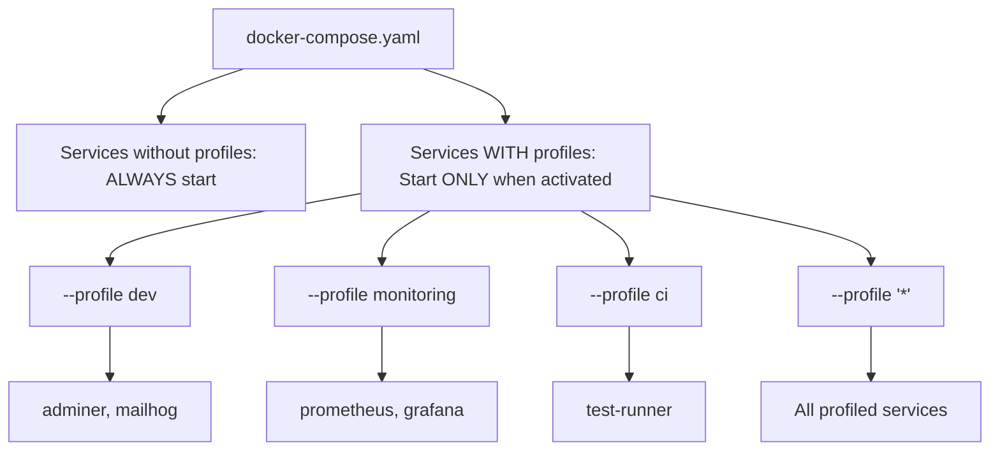
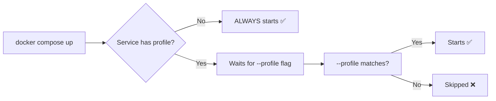
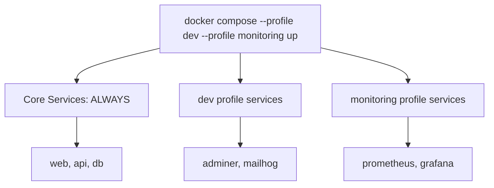
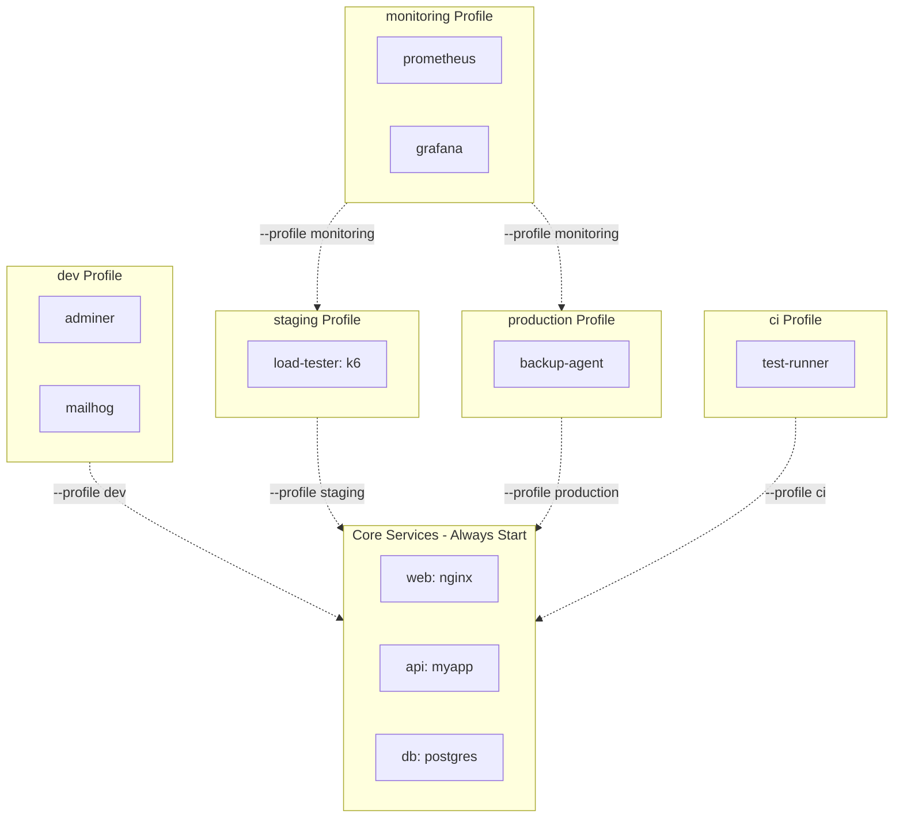

<!-- header start -->

<a href="https://stackoverflow.com/users/1755598/codewizard"></a>&emsp;&emsp;[](https://www.linkedin.com/in/nirgeier/)&emsp;[](mailto:nirgeier@gmail.com)&emsp;[](mailto:nirg@codewizard.co.il)

<!-- header end -->

---

# Docker Compose Profiles - Environment-Aware Service Management

- This lab teaches you **Docker Compose profiles** - a powerful feature for controlling which services start in different environments, all from a single compose file.
- You'll learn how to define profiles using `x-` fragments, combine them, integrate them with CI/CD, and replace the traditional multi-file approach.

---


[](https://console.cloud.google.com/cloudshell/editor?cloudshell_git_repo=https://github.com/nirgeier/DockerComposeLabs)

**<kbd>CTRL</kbd> + click to open in new window**

---

[](010-Profiles.zip)

---

## Table of Contents

- [Docker Compose Profiles - Environment-Aware Service Management](#docker-compose-profiles---environment-aware-service-management)
  - [**CTRL + click to open in new window**](#ctrl--click-to-open-in-new-window)
  - [Table of Contents](#table-of-contents)
  - [What Are Docker Compose Profiles?](#what-are-docker-compose-profiles)
  - [Why Use Profiles?](#why-use-profiles)
  - [Defining Profiles](#defining-profiles)
    - [Inline Profile Definition](#inline-profile-definition)
    - [Reusable Profile Fragments (x-)](#reusable-profile-fragments-x-)
  - [Starting Services with Profiles](#starting-services-with-profiles)
  - [Core Rule: Services Without Profiles Always Start](#core-rule-services-without-profiles-always-start)
  - [Combining Multiple Profiles](#combining-multiple-profiles)
  - [Starting All Profiled Services (`--profile '*'`)](#starting-all-profiled-services---profile-)
  - [Profiles vs Multiple Compose Files](#profiles-vs-multiple-compose-files)
  - [Real-World Profile Patterns](#real-world-profile-patterns)
    - [Environment-Based Profiles (dev/staging/prod)](#environment-based-profiles-devstagingprod)
    - [Team-Based Profiles](#team-based-profiles)
    - [Pipeline Stage Profiles (CI/CD)](#pipeline-stage-profiles-cicd)
  - [Profiles with Environment Variables](#profiles-with-environment-variables)
  - [Profiles and extends](#profiles-and-extends)
  - [Profiles with Multiple Compose Files](#profiles-with-multiple-compose-files)
  - [CI/CD Pipeline Integration](#cicd-pipeline-integration)
  - [Profiles Reference Card](#profiles-reference-card)
  - [Best Practices](#best-practices)
  - [Common Mistakes](#common-mistakes)
  - [Troubleshooting](#troubleshooting)
  - [Hands-On Tasks](#hands-on-tasks)
    - [Task 1: Basic Profile Separation](#task-1-basic-profile-separation)
    - [Task 2: Environment Switching](#task-2-environment-switching)
    - [Task 3: CI/CD Pipeline Stages](#task-3-cicd-pipeline-stages)
    - [Task 4: Using `COMPOSE_PROFILES` in `.env`](#task-4-using-compose_profiles-in-env)
    - [Task 5: Multi-File Profiles](#task-5-multi-file-profiles)
    - [Task 6: Diagnose Which Services Start](#task-6-diagnose-which-services-start)
  - [Verification Checklist](#verification-checklist)
  - [Additional Resources](#additional-resources)
  - [Cleanup](#cleanup)

---

## What Are Docker Compose Profiles?

Profiles are a **built-in Docker Compose feature** (v2.20+) that lets you mark services with one or more profile names. Services with a profile only start when that profile is explicitly activated. Services without a profile always start.



**Without profiles** you need multiple compose files:

```bash
docker compose -f docker-compose.yaml -f docker-compose.dev.yaml up -d
docker compose -f docker-compose.yaml -f docker-compose.prod.yaml up -d
```

**With profiles** you use a single file:

```yaml
services:
  web:
    image: nginx          # Always starts

  adminer:
    image: adminer
    profiles: [dev]       # Only starts with --profile dev

  prometheus:
    image: prom/prometheus
    profiles: [monitoring] # Only starts with --profile monitoring
```

```bash
docker compose --profile dev up -d
docker compose --profile monitoring up -d
```

---

## Why Use Profiles?

| Problem | Solution with Profiles |
|---------|----------------------|
| Multiple compose files to maintain | Single file, profile-based activation |
| Dev tools (adminer, mailhog) in production | Auto-excluded unless `--profile dev` |
| Monitoring stack only sometimes | Activate on demand with `--profile monitoring` |
| CI tests need different services | `--profile ci` starts only test containers |
| Forgetting which `-f` flags to use | One command, one file |
| New team member onboarding confusion | Clear profile naming convention |

---

## Defining Profiles

There are two ways to define profiles on a service.

### Inline Profile Definition

```yaml
services:
  adminer:
    image: adminer
    profiles:
      - dev
      - staging
```

A service can belong to **multiple profiles** - it starts when ANY of them is active.

### Reusable Profile Fragments (x-)

Using YAML anchors (`&`) with extension fields (`x-`) keeps your compose file DRY:

```yaml
# ── Define once ──────────────────────────────────────────
x-profile-dev: &profile-dev
  profiles:
    - dev

x-profile-staging: &profile-staging
  profiles:
    - staging

x-profile-prod: &profile-prod
  profiles:
    - production

x-profile-monitoring: &profile-monitoring
  profiles:
    - monitoring

x-profile-debug: &profile-debug
  profiles:
    - debug

x-profile-ci: &profile-ci
  profiles:
    - ci

# ── Use everywhere ───────────────────────────────────────
services:
  adminer:
    image: adminer
    <<: *profile-dev

  grafana:
    image: grafana/grafana:latest
    <<: [*profile-dev, *profile-staging]
```

This is the pattern used throughout this lab and in the central fragment library at `../../resources/compose/fragments.yaml`.

---

## Starting Services with Profiles

```bash
# Start only core services (no profiled services)
docker compose up -d

# Start core + dev profile services
docker compose --profile dev up -d

# Start core + monitoring
docker compose --profile monitoring up -d
```

**What happens:**

| Command | Core Services | dev services | monitoring services |
|---------|:---:|:---:|:---:|
| `docker compose up -d` | ✅ | ❌ | ❌ |
| `--profile dev` | ✅ | ✅ | ❌ |
| `--profile monitoring` | ✅ | ❌ | ✅ |
| `--profile dev --profile monitoring` | ✅ | ✅ | ✅ |

---

## Core Rule: Services Without Profiles Always Start

This is the most important rule to remember:

```yaml
services:
  web:          # NO profile → ALWAYS starts
    image: nginx

  adminer:      # HAS a profile → starts only with --profile dev
    image: adminer
    profiles: [dev]
```



**Implication:** Core infrastructure (web server, database, cache) should never have a profile. Only optional/supplementary services should be profiled.

---

## Combining Multiple Profiles

Pass `--profile` multiple times to activate several profiles at once:



```bash
# Dev environment with monitoring
docker compose --profile dev --profile monitoring up -d

# Full stack: dev tools + monitoring + debug
docker compose --profile dev --profile monitoring --profile debug up -d
```

**Shorthand with `.env`:**

```bash
# .env
COMPOSE_PROFILES=dev,monitoring
```

Then simply `docker compose up -d` automatically activates both profiles.

---

## Starting All Profiled Services (`--profile '*'`)

To start every service regardless of profile:

```bash
docker compose --profile '*' up -d
```

Use this for a full system test or when you need every tool available. Be aware it starts **everything** - including debug containers and CI-only services.

---

## Profiles vs Multiple Compose Files

Before profiles, teams used multiple files:

```bash
# Old way
docker compose -f docker-compose.yaml -f docker-compose.dev.yaml up -d
```

**Profiles are better because:**

| Aspect | Multiple Files | Profiles |
|--------|:---:|:---:|
| Files to maintain | 3-5 | 1 |
| Config duplication | High (copy/paste between files) | None |
| Clarity | "Which file does this service live in?" | "Which profile activates this service?" |
| Override behavior | Shallow merge, lists replaced | No merge issues |
| CI/CD integration | Complex flag management | Simple `--profile ci` |

**When multiple files still make sense:**

- Different teams own different services
- Secret/credential files must be isolated
- You need to pass different `.env` files per environment
- Orchestrating across different host machines

Example combining both approaches:

```bash
docker compose \
  -f docker-compose.yaml \
  -f docker-compose.prod-overrides.yaml \
  --profile monitoring \
  up -d
```

---

## Real-World Profile Patterns

### Environment-Based Profiles (dev/staging/prod)

The most common pattern. A single compose file serves all environments:



```yaml
# docker-compose.yaml
x-profile-dev: &profile-dev { profiles: [dev] }
x-profile-staging: &profile-staging { profiles: [staging] }
x-profile-prod: &profile-prod { profiles: [production] }
x-profile-monitoring: &profile-monitoring { profiles: [monitoring] }
x-profile-ci: &profile-ci { profiles: [ci] }

services:
  # ── Core (always starts) ────────────────────────────────
  web:
    image: nginx:alpine
    ports:
      - "${PORT:-8181}:80"

  api:
    image: myapp/api:latest

  db:
    image: postgres:16-alpine

  # ── Dev only ────────────────────────────────────────────
  adminer:
    image: adminer
    <<: *profile-dev

  mailhog:
    image: mailhog/mailhog
    <<: *profile-dev

  # ── Staging only ────────────────────────────────────────
  load-tester:
    image: grafana/k6:latest
    <<: *profile-staging

  # ── CI only ─────────────────────────────────────────────
  test-runner:
    image: node:20-alpine
    command: ["npm", "test"]
    <<: *profile-ci

  # ── Monitoring (used in staging + prod) ────────────────
  prometheus:
    image: prom/prometheus:latest
    <<: [*profile-staging, *profile-prod, *profile-monitoring]

  grafana:
    image: grafana/grafana:latest
    <<: [*profile-staging, *profile-prod, *profile-monitoring]

  # ── Production only ─────────────────────────────────────
  backup-agent:
    image: alpine:latest
    command: ["sleep", "infinity"]
    <<: *profile-prod
```

```bash
# Developer workstation
docker compose --profile dev --profile monitoring up -d

# CI pipeline
docker compose --profile ci up -d

# Staging server
docker compose --profile staging --profile monitoring up -d

# Production
docker compose --profile production --profile monitoring up -d
```

### Team-Based Profiles

Different teams get different services:

```yaml
x-profile-frontend: &profile-frontend { profiles: [frontend] }
x-profile-backend: &profile-backend { profiles: [backend] }
x-profile-data: &profile-data { profiles: [data] }
x-platform: &profile-platform { profiles: [platform] }

services:
  # ── Frontend team ───────────────────────────────────────
  storybook:
    image: storybook/storybook:latest
    <<: *profile-frontend

  cypress:
    image: cypress/included:latest
    <<: *profile-frontend

  # ── Backend team ────────────────────────────────────────
  swagger:
    image: swaggerapi/swagger-ui:latest
    <<: *profile-backend

  postman:
    image: postman/newman:latest
    <<: *profile-backend

  # ── Data team ───────────────────────────────────────────
  jupyter:
    image: jupyter/datascience-notebook:latest
    <<: *profile-data

  # ── Platform/infra team ─────────────────────────────────
  portainer:
    image: portainer/portainer-ce:latest
    <<: *profile-platform

  dozzle:
    image: amir20/dozzle:latest
    <<: *profile-platform
```

```bash
# Frontend developer
docker compose --profile frontend up -d

# Full team integration
docker compose --profile frontend --profile backend up -d
```

### Pipeline Stage Profiles (CI/CD)

Run different CI stages by profile:

```yaml
services:
  # ── Lint stage ──────────────────────────────────────────
  hadolint:
    image: hadolint/hadolint:latest
    profiles: [lint]

  eslint:
    image: node:20-alpine
    command: ["npm", "run", "lint"]
    profiles: [lint]

  # ── Unit tests ─────────────────────────────────────────
  unit-tests:
    image: node:20-alpine
    command: ["npm", "test"]
    profiles: [unit]

  # ── Integration tests ───────────────────────────────────
  integration-tests:
    image: node:20-alpine
    command: ["npm", "run", "test:integration"]
    profiles: [integration]
    depends_on:
      db:
        condition: service_healthy

  # ── E2E tests ──────────────────────────────────────────
  cypress:
    image: cypress/included:latest
    profiles: [e2e]
```

```bash
# CI pipeline stages
docker compose --profile lint up --abort-on-container-exit
docker compose --profile unit up --abort-on-container-exit
docker compose --profile integration up --abort-on-container-exit
docker compose --profile e2e up --abort-on-container-exit
```

---

## Profiles with Environment Variables

Combine profiles with env vars for dynamic control:

```yaml
# .env
COMPOSE_PROFILES=dev,monitoring
ENV_SUFFIX=dev
PORT=8181
```

```yaml
# docker-compose.yaml
services:
  api:
    image: myapp/api:latest
    environment:
      - NODE_ENV=${ENV_SUFFIX:-production}

  db:
    image: postgres:16-alpine
    environment:
      - POSTGRES_DB=myapp_${ENV_SUFFIX:-prod}
```

With `COMPOSE_PROFILES` set in `.env`, a simple `docker compose up -d` activates those profiles automatically.

---

## Profiles and extends

Profiles work seamlessly with `extends`:

```yaml
# base/web.yaml
services:
  web-base:
    image: nginx:alpine
    ports:
      - "80"
    profiles: [dev]   # Base service has a profile
```

```yaml
# docker-compose.yaml
services:
  web:
    extends:
      file: base/web.yaml
      service: web-base
    # Inherits the profile from the base service
    ports:
      - "8080:80"     # Override port mapping
```

The child service inherits the profile from the base service. You can add more profiles:

```yaml
services:
  web:
    extends:
      file: base/web.yaml
      service: web-base
    profiles:
      - staging      # Additional profile
    ports:
      - "8080:80"
```

Now `web` starts with either `--profile dev` (inherited) or `--profile staging`.

---

## Profiles with Multiple Compose Files

Profiles work across multiple compose files too:

```bash
# File structure
docker-compose.yaml         # Core services (web, db)
docker-compose.dev.yaml     # Dev services with profiles
docker-compose.monitoring.yaml  # Monitoring with profiles
```

```yaml
# docker-compose.dev.yaml
services:
  adminer:
    image: adminer
    profiles: [dev]
```

```bash
# Start core + dev profile (from a different file)
docker compose \
  -f docker-compose.yaml \
  -f docker-compose.dev.yaml \
  --profile dev \
  up -d
```

This is useful when different teams maintain different files while keeping the profile pattern consistent.

---

## CI/CD Pipeline Integration

**GitHub Actions example:**

```yaml
# .github/workflows/test.yml
jobs:
  test:
    runs-on: ubuntu-latest
    steps:
      - uses: actions/checkout@v4

      - name: Start dependencies
        run: |
          docker compose --profile ci up -d
          docker compose run --rm test-runner

      - name: Run lint
        run: |
          docker compose --profile lint up \
            --abort-on-container-exit
      
      - name: Run integration tests
        run: |
          docker compose --profile integration up \
            --abort-on-container-exit

      - name: Cleanup
        run: docker compose down
```

**GitLab CI example:**

```yaml
# .gitlab-ci.yml
stages:
  - lint
  - test
  - integration

lint:
  script:
    - docker compose --profile lint up --abort-on-container-exit

unit-test:
  script:
    - docker compose --profile unit up --abort-on-container-exit

integration-test:
  services:
    - docker:dind
  script:
    - docker compose --profile integration up --abort-on-container-exit
```

**Key CI flags:**

- `--abort-on-container-exit`: Stop all containers when one exits (for test runners)
- `--exit-code-from <service>`: Return the exit code of a specific service
- `--profile ci`: Only start CI-specific containers

---

## Profiles Reference Card

```yaml
# ── Environment profiles ──────────────────────────────────
x-profile-dev: &profile-dev       { profiles: [dev] }
x-profile-staging: &profile-staging { profiles: [staging] }
x-profile-prod: &profile-prod     { profiles: [production] }

# ── Cross-cutting profiles ────────────────────────────────
x-profile-monitoring: &profile-monitoring { profiles: [monitoring] }
x-profile-debug: &profile-debug   { profiles: [debug] }
x-profile-ci: &profile-ci         { profiles: [ci] }
x-profile-qa: &profile-qa         { profiles: [qa] }
x-profile-security: &profile-security { profiles: [security] }

# ── Team profiles ─────────────────────────────────────────
x-profile-frontend: &profile-frontend { profiles: [frontend] }
x-profile-backend: &profile-backend  { profiles: [backend] }
x-profile-data: &profile-data      { profiles: [data] }
x-profile-platform: &profile-platform { profiles: [platform] }
x-profile-devops: &profile-devops   { profiles: [devops] }

# ── CI/CD stage profiles ──────────────────────────────────
x-profile-lint: &profile-lint      { profiles: [lint] }
x-profile-unit: &profile-unit      { profiles: [unit] }
x-profile-integration: &profile-integration { profiles: [integration] }
x-profile-e2e: &profile-e2e        { profiles: [e2e] }
x-profile-security-scan: &profile-security-scan { profiles: [security-scan] }
```

---

## Best Practices

**1. Core services never get profiles**

```yaml
# ❌ Bad: web won't start without --profile core
web:
  image: nginx
  profiles: [core]

# ✅ Good: web always starts
web:
  image: nginx
```

**2. Use descriptive, consistent profile names**

```yaml
# ✅ Good
profiles: [dev, staging, production, monitoring, ci]

# ❌ Avoid
profiles: [d, s, p, m, c]
```

**3. Prefer fragments (`x-`) over inline definitions**

```yaml
# ✅ Good - DRY, reusable
x-profile-dev: &profile-dev { profiles: [dev] }

adminer:
  <<: *profile-dev

mailhog:
  <<: *profile-dev

# ❌ Avoid - repeated, error-prone
adminer:
  profiles: [dev]

mailhog:
  profiles: [dev]
```

**4. Use `COMPOSE_PROFILES` in `.env` for defaults**

```bash
# .env
COMPOSE_PROFILES=dev,monitoring
```

**5. Document profiles in README**

| Profile    | Services            | When to use                |
|------------|---------------------|----------------------------|
| dev        | adminer, mailhog    | Local development          |
| monitoring | prometheus, grafana | When debugging performance |
| ci         | test-runner         | CI/CD pipeline             |

**6. Test profile isolation**

```bash
# Verify only expected services start
docker compose --profile dev config --services
docker compose --profile monitoring config --services
```

**7. Keep the number of profiles manageable**

Too many profiles become confusing. Aim for 3-6 profiles max. If you need more, consider splitting into separate compose files or projects.

---

## Common Mistakes

| Mistake | Why It's Wrong | Fix |
|---------|---------------|-----|
| `--profile *` instead of `--profile '*'` | Shell expands `*` before Compose sees it | Quote it: `'*'` |
| Putting profiles on core services | They won't start without explicit `--profile` | Remove profiles from core |
| Typo in profile name | Service silently doesn't start | Use fragments to avoid typos |
| Forgetting `--profile` flag | Profiled services are missing | Check `COMPOSE_PROFILES` in `.env` |
| Profiles on `depends_on` targets | Dependency chain breaks | Core deps should be unprofiled |
| Mixing profiles with multiple `-f` files without care | Services may be duplicated or missing | Test with `config --services` |
| Expecting `docker compose run` to respect profiles | `run` ignores profiles | Use `up` or explicitly set `COMPOSE_PROFILES` |

---

## Troubleshooting

| Problem | Solution |
|---------|----------|
| Service didn't start | Does it have a profile? Check `docker compose config --services` |
| Service started when it shouldn't | Verify the profile name matches (typo?) |
| `--profile '*'` not working | Use quotes: `--profile '*'` |
| Profiles ignored in CI | Is `COMPOSE_PROFILES` set globally? |
| extends + profile not inherited correctly | Explicitly add profiles to the child service |
| Service in multiple profiles starts unexpectedly | That's expected - service starts if ANY profile is active |
| `docker compose run` ignores profiles | `run` doesn't use profiles; use `up` or set env var |

---

## Hands-On Tasks

### Task 1: Basic Profile Separation

```bash
cd examples/basics

# Start with NO profiles (core only)
docker compose up -d
docker compose ps
echo "Only web, db, redis should be running"

# Add dev profile
docker compose --profile dev up -d
docker compose ps
echo "adminer and mailhog should now be running"

# Add debugging
docker compose --profile debug up -d
docker compose ps
echo "netshoot should now be running"

# Start everything
docker compose --profile dev --profile debug --profile monitoring up -d
docker compose ps

# Clean up
docker compose down
```

**Expected:** You see exactly which services belong to each profile. Core services (web, db, redis) appear in every `ps` output; profiled services appear only when their profile is active.

### Task 2: Environment Switching

```bash
cd examples/environments

# Development
NODE_ENV=development ENV_SUFFIX=dev \
  docker compose --profile dev up -d
curl http://localhost:8181
docker compose ps
echo "Dev tools (adminer, mailhog) are running"

# Switch to production-like
docker compose down
NODE_ENV=production ENV_SUFFIX=prod \
  docker compose --profile production up -d
docker compose ps
echo "Only core + production services running"

# Staging with monitoring
docker compose down
NODE_ENV=staging ENV_SUFFIX=stg \
  docker compose --profile staging --profile monitoring up -d
docker compose ps
echo "Core + staging + monitoring services"

docker compose down
```

### Task 3: CI/CD Pipeline Stages

```bash
cd examples/ci

# Run lint stage
docker compose --profile lint up --abort-on-container-exit
echo "Lint completed (exit code: $?)"

# Run unit tests
docker compose --profile unit up --abort-on-container-exit
echo "Unit tests completed (exit code: $?)"

# Run integration tests (requires db healthcheck)
docker compose --profile integration up --abort-on-container-exit
echo "Integration tests completed (exit code: $?)"

# Run full pipeline sequentially
docker compose --profile lint --profile unit --profile integration up --abort-on-container-exit

docker compose down
```

### Task 4: Using `COMPOSE_PROFILES` in `.env`

```bash
cd examples/basics

# Set default profiles
echo "COMPOSE_PROFILES=dev,monitoring" >> .env

# Now a plain `up` activates dev + monitoring
docker compose up -d
docker compose ps
echo "dev and monitoring services auto-started"

# Clean up
docker compose down
```

### Task 5: Multi-File Profiles

```bash
cd examples/compose

# Start core + dev services from multiple files
docker compose \
  -f docker-compose-main.yaml \
  -f docker-compose-dev.yaml \
  --profile dev \
  up -d

docker compose ps

# Add monitoring
docker compose \
  -f docker-compose-main.yaml \
  -f docker-compose-monitoring.yaml \
  --profile monitoring \
  up -d

docker compose ps

docker compose down
```

### Task 6: Diagnose Which Services Start

```bash
cd examples/basics

# See which services start with each profile combination
echo "=== No profile ==="
docker compose config --services

echo "=== dev profile ==="
docker compose --profile dev config --services

echo "=== monitoring profile ==="
docker compose --profile monitoring config --services

echo "=== all profiles ==="
docker compose --profile '*' config --services
```

---

## Verification Checklist

- [ ] I understand that services without profiles always start
- [ ] I can define profiles inline and with `x-` fragments
- [ ] I can start services with `docker compose --profile <name> up`
- [ ] I can combine multiple profiles with `--profile a --profile b`
- [ ] I can start all profiled services with `--profile '*'`
- [ ] I can use `COMPOSE_PROFILES` in `.env` for defaults
- [ ] I can design environment-specific profiles (dev/staging/prod)
- [ ] I can create team-specific profiles (frontend/backend/data)
- [ ] I can build CI/CD pipeline stages with profiles
- [ ] I can verify which services start with `config --services`
- [ ] I know when to use profiles vs multiple compose files
- [ ] I can combine profiles with extends and multi-file setups

---

## Additional Resources

- [Docker Compose Profiles Documentation](https://docs.docker.com/compose/profiles/)
- [Docker Compose File Reference](https://docs.docker.com/compose/compose-file/)
- [Docker Compose CLI Reference](https://docs.docker.com/compose/reference/)
- [Central Fragment Library](../../resources/compose/fragments.yaml)
- [Lab 009: Fragments](../009-Fragments/README.md)

---

## Cleanup

```bash
# Stop all running containers from this lab
docker compose -f examples/basics/docker-compose.yaml down
docker compose -f examples/environments/docker-compose.yaml down
docker compose -f examples/ci/docker-compose.yaml down
docker compose -f examples/compose/docker-compose-main.yaml down 2>/dev/null || true

# Remove any .env files created during tasks
find . -name ".env" -not -path "./.env" -delete 2>/dev/null || true
```
