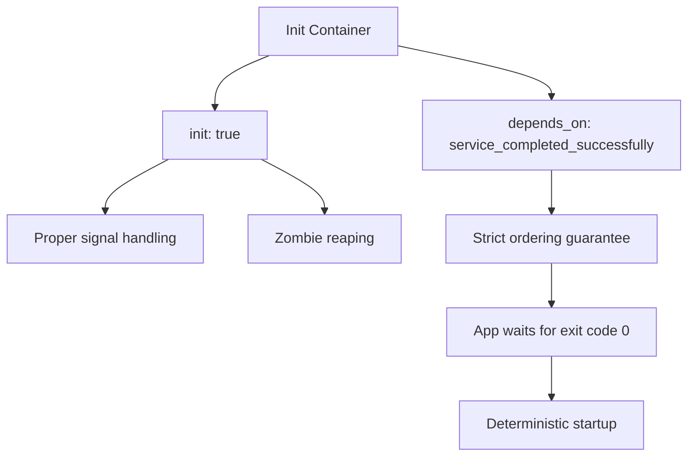
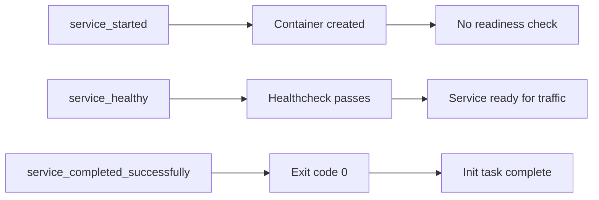
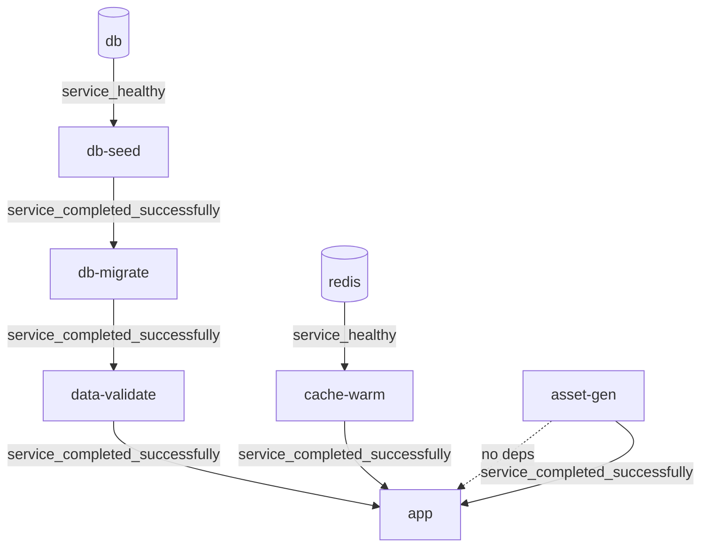
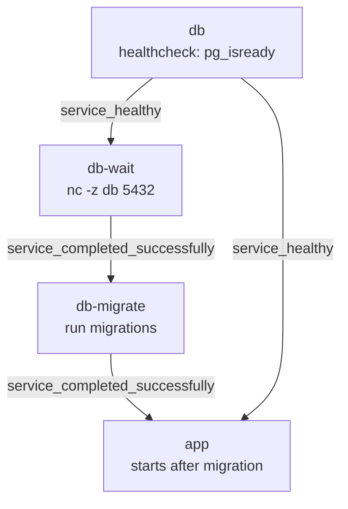

<!-- header start -->

<a href="https://stackoverflow.com/users/1755598/codewizard"></a>&emsp;&emsp;[](https://www.linkedin.com/in/nirgeier/)&emsp;[](mailto:nirgeier@gmail.com)&emsp;[](mailto:nirg@codewizard.co.il)

<!-- header end -->

---

# Init Containers & Startup Orchestration

- This lab teaches you **init containers** in Docker Compose - one-shot services that run to completion before your main application starts.
- You'll learn about the `init: true` pattern, the `service_completed_successfully` dependency condition, healthcheck chaining, and reusable init container fragments.
- Each concept includes a **standalone example** and a **multi-stage pipeline** that demonstrates real-world startup orchestration.

---


[](https://console.cloud.google.com/cloudshell/editor?cloudshell_git_repo=https://github.com/nirgeier/DockerComposeLabs)

**<kbd>CTRL</kbd> + click to open in new window**

---

[](011-InitContainers.zip)

---

## Table of Contents

- [Init Containers & Startup Orchestration](#init-containers--startup-orchestration)
  - [**CTRL + click to open in new window**](#ctrl--click-to-open-in-new-window)
  - [Table of Contents](#table-of-contents)
  - [What Are Init Containers?](#what-are-init-containers)
    - [Why Init Containers Matter](#why-init-containers-matter)
  - [The `init: true` Pattern](#the-init-true-pattern)
  - [The `service_completed_successfully` Condition](#the-service_completed_successfully-condition)
  - [Example 1: Basics - Simple Migration Before App](#example-1-basics---simple-migration-before-app)
  - [Example 2: Multi-Stage Pipeline](#example-2-multi-stage-pipeline)
  - [Example 3: Wait Strategies](#example-3-wait-strategies)
  - [Example 4: Reusable Init Container Fragments](#example-4-reusable-init-container-fragments)
  - [Healthcheck Chaining for Ordered Startup](#healthcheck-chaining-for-ordered-startup)
  - [Using the Central Fragments Library](#using-the-central-fragments-library)
  - [Best Practices](#best-practices)
  - [Troubleshooting](#troubleshooting)
  - [Hands-On Tasks](#hands-on-tasks)
    - [Task 1: Run the Basic Init Container Pipeline](#task-1-run-the-basic-init-container-pipeline)
    - [Task 2: Multi-Stage Startup Orchestration](#task-2-multi-stage-startup-orchestration)
    - [Task 3: Compare Wait Strategies](#task-3-compare-wait-strategies)
    - [Task 4: Build a Pipeline with Reusable Fragments](#task-4-build-a-pipeline-with-reusable-fragments)
    - [Task 5: Combine Init Containers with Healthchecks](#task-5-combine-init-containers-with-healthchecks)
  - [Verification Checklist](#verification-checklist)
  - [Next Steps](#next-steps)

---

## What Are Init Containers?

**Init containers** are services in Docker Compose that run to completion (exit code 0) before other services start. They are ideal for:

- **Database migrations** - Run schema changes before the app connects
- **Data seeding** - Populate initial data sets
- **Cache warming** - Pre-populate Redis or Memcached
- **Asset generation** - Build static files, compile templates
- **Validation** - Check configuration, environment variables, or data integrity
- **Prerequisite checks** - Verify external dependencies are reachable
- **Permission setup** - Create directories, set ownership, initialize secrets

In Docker Compose, any service with `init: true` and a `depends_on` condition of `service_completed_successfully` behaves as an init container.



### Why Init Containers Matter

| Problem | Without Init Containers | With Init Containers |
|---------|------------------------|---------------------|
| **Race conditions** | App starts before DB is ready, crashes | Init container blocks until DB is healthy |
| **Failed migrations** | App connects to an un-migrated schema | Migration runs first; app starts only on success |
| **Complex startup** | Scripts embedded in app image entrypoint | Separate, testable, reusable init steps |
| **Idempotency** | Hard to retry failed initialization | Each init container is a clean one-shot run |
| **Observability** | Startup logic buried in app logs | Each init step has its own logs and exit status |

Init containers make startup **deterministic**, **observable**, and **recoverable**.

---

## The `init: true` Pattern

The `init: true` flag in a Docker Compose service definition does two things:

1. **Enables init process support** - Docker runs an init process (tini) as PID 1 inside the container, ensuring proper signal handling and zombie reaping
2. **Signals intent** - The service is designed to run once and exit with a zero exit code

```yaml
services:
  db-migrate:
    image: node:20-alpine
    init: true
    command: >
      sh -c "
        echo 'Running migrations...' &&
        npm run migrate
      "
```

> `init: true` is **not** strictly required for one-shot services - any container that exits successfully works. The flag is a best practice that ensures:
>
> - `SIGTERM`/`SIGINT` are properly forwarded to the process
> - Zombie processes are cleaned up
> - The container behaves predictably under `docker compose down` or `docker compose stop`

---

## The `service_completed_successfully` Condition

Docker Compose supports three `depends_on` conditions for controlling service startup order:

| Condition | Behavior | Use Case |
|-----------|----------|----------|
| `service_started` | Start after container is created (default) | No real dependency |
| `service_healthy` | Start after healthcheck passes | Database/app readiness |
| `service_completed_successfully` | Start after service exits with code 0 | Init containers |

```yaml
services:
  db-migrate:
    init: true
    # ... migration logic ...

  app:
    image: nginx:alpine
    depends_on:
      db-migrate:
        condition: service_completed_successfully
    # App only starts after migration exits with code 0
```



This creates a **strict ordering guarantee**: the app will never start until the migration has completed successfully. If the migration fails (non-zero exit), the app stays in a `depends_on` wait state.

---

## Example 1: Basics - Simple Migration Before App

```bash
cd examples/basics
```

This example demonstrates the simplest init container pattern: a database, a migration, and an application.

```yaml
services:
  db:
    image: postgres:16-alpine
    healthcheck:
      test: ["CMD-SHELL", "pg_isready -U postgres"]
      interval: 3s
      timeout: 3s
      retries: 10
      start_period: 5s

  db-migrate:
    image: node:20-alpine
    init: true
    command: >
      sh -c "
        echo 'Waiting for db...' &&
        until nc -z db 5432; do sleep 1; done &&
        echo 'Running migrations...' &&
        sleep 3 &&
        echo 'Migrations complete!'
      "
    depends_on:
      db:
        condition: service_healthy

  app:
    image: nginx:alpine
    ports:
      - "8191:80"
    depends_on:
      db-migrate:
        condition: service_completed_successfully
```

**Startup sequence:**

1. `db` starts first (no dependencies)
2. Docker waits for `db` to pass its healthcheck (`pg_isready`)
3. `db-migrate` starts once `db` is healthy
4. `db-migrate` waits for TCP port 5432, then runs migrations
5. `app` starts **only after** `db-migrate` exits with code 0

```bash
# Run it
docker compose up -d
docker compose logs db-migrate    # See migration output
docker compose ps                 # app stays in "starting" until migration completes
docker compose down -v
```

---

## Example 2: Multi-Stage Pipeline

```bash
cd examples/multi-stage
```

This example shows a **5-stage init pipeline** with strict ordering. Each stage depends on the previous one completing successfully.



```yaml
services:
  db:
    image: postgres:16-alpine
    healthcheck:
      test: ["CMD-SHELL", "pg_isready -U postgres"]

  redis:
    image: redis:7-alpine
    healthcheck:
      test: ["CMD", "redis-cli", "ping"]

  # Stage 1: Seed database
  db-seed:
    image: alpine:latest
    init: true
    command: sh -c "echo 'Seeding database...' && sleep 2 && echo 'Seed complete!'"
    depends_on:
      db:
        condition: service_healthy

  # Stage 2: Run schema migrations
  db-migrate:
    image: alpine:latest
    init: true
    command: sh -c "echo 'Running migrations...' && sleep 3 && echo 'Migration applied!'"
    depends_on:
      db-seed:
        condition: service_completed_successfully

  # Stage 3: Warm up caches
  cache-warm:
    image: alpine:latest
    init: true
    command: sh -c "echo 'Warming up redis caches...' && sleep 2 && echo 'Cache warm!'"
    depends_on:
      redis:
        condition: service_healthy

  # Stage 4: Validate data integrity
  data-validate:
    image: alpine:latest
    init: true
    command: sh -c "echo 'Validating data integrity...' && sleep 2 && echo 'Validation passed!'"
    depends_on:
      db-migrate:
        condition: service_completed_successfully

  # Stage 5: Generate static assets
  asset-gen:
    image: alpine:latest
    init: true
    command: >
      sh -c "
        echo 'Generating static assets...' &&
        mkdir -p /assets &&
        echo '<html><body>Hello</body></html>' > /assets/index.html &&
        echo 'Assets generated!'
      "

  # Main application - waits for ALL init stages
  app:
    image: nginx:alpine
    ports:
      - "8192:80"
    volumes:
      - assets-data:/usr/share/nginx/html:ro
    depends_on:
      db-migrate:
        condition: service_completed_successfully
      data-validate:
        condition: service_completed_successfully
      cache-warm:
        condition: service_completed_successfully
      asset-gen:
        condition: service_completed_successfully

volumes:
  assets-data:
```

**Pipeline diagram:**

```
db ──► db-seed ──► db-migrate ──► data-validate ──┐
                                                    ├──► app
redis ──► cache-warm ──────────────────────────────┘
                                        asset-gen ──┘
```

All init paths are **parallelizable** - `db-seed`/`db-migrate`/`data-validate` form a chain, while `cache-warm` depends only on `redis`, and `asset-gen` has no dependencies at all. The app waits for all of them to complete.

```bash
docker compose up -d
docker compose logs --tail=50 -f
docker compose down -v
```

---

## Example 3: Wait Strategies

```bash
cd examples/wait-Strategies
```

This example compares **six different strategies** for waiting on service readiness inside init containers.

| Strategy | Tool/Command | When to Use |
|----------|-------------|-------------|
| **Healthcheck** | Built-in Docker healthcheck | Native, declarative, preferred approach |
| **netcat TCP** | `nc -z host port` | Simple TCP port liveness check |
| **curl HTTP** | `curl -f http://endpoint` | HTTP/HTTPS service readiness |
| **pg_isready** | `pg_isready -h host -U user` | PostgreSQL-specific native check |
| **Custom script** | `[ -f /tmp/ready ]` | File-based or arbitrary readiness condition |
| **Time-based** | `sleep N` | Fixed delay (least reliable, use as fallback) |

```yaml
services:
  db:
    image: postgres:16-alpine
    healthcheck:
      test: ["CMD-SHELL", "pg_isready -U postgres"]
      interval: 3s
      retries: 15

  # Strategy 1: netcat TCP wait
  app-wait-nc:
    image: alpine:latest
    init: true
    command: sh -c "until nc -z db 5432; do sleep 1; done && echo 'Port is open!'"

  # Strategy 2: curl HTTP health endpoint
  app-wait-curl:
    image: alpine:latest
    init: true
    command: sh -c "apk add --no-cache curl && until curl -sf http://web:80; do sleep 1; done && echo 'Web is ready!'"

  # Strategy 3: pg_isready (PostgreSQL native)
  app-wait-pg:
    image: postgres:16-alpine
    init: true
    command: sh -c "until pg_isready -h db -U postgres; do sleep 1; done && echo 'PostgreSQL is ready!'"

  # Strategy 4: Custom script (file-based)
  app-wait-custom:
    image: alpine:latest
    init: true
    command: sh -c "until [ -f /tmp/ready ]; do sleep 1; done && echo 'Ready file found!'"

  # Strategy 5: Time-based delay
  app-wait-time:
    image: alpine:latest
    init: true
    command: sh -c "sleep 10 && echo 'Done waiting!'"

  web:
    image: nginx:alpine
    ports:
      - "8193:80"
```

```bash
# See all wait strategies in action
docker compose up -d
docker compose logs --tail=20 -f
docker compose down -v
```

**Strategy comparison:**

| Strategy | Reliability | Image Size | External Deps | Use Case |
|----------|------------|------------|---------------|----------|
| Healthcheck | ★★★★★ | Minimal | None | Preferred for all services |
| netcat TCP | ★★★★☆ | ~7 MB (alpine) | `alpine` with netcat | Quick TCP port checks |
| curl HTTP | ★★★★☆ | ~12 MB | `apk add curl` | HTTP health endpoints |
| pg_isready | ★★★★★ | ~200 MB (postgres) | `postgres` image | PostgreSQL specifically |
| Custom script | ★★★☆☆ | Minimal | None | Arbitrary conditions |
| Time-based | ★☆☆☆☆ | Minimal | None | Last resort only |

---

## Example 4: Reusable Init Container Fragments

```bash
cd examples/init-fragments
```

This example uses **YAML anchors** (`&`) and aliases (`<<: *`) to define reusable init container definitions - a pattern identical to the [Central Fragments Library](../../resources/compose/fragments.yaml).

```yaml
# Define reusable init container fragments
x-init-wait-for-db: &init-wait-for-db
  init: true
  image: alpine:latest
  command: >
    sh -c "until nc -z db 5432; do echo 'waiting for db'; sleep 2; done && echo 'db ready'"
  depends_on:
    db:
      condition: service_healthy

x-init-migrate: &init-migrate
  init: true
  image: alpine:latest
  command: ["sh", "-c", "echo 'Running migrations...' && sleep 3 && echo 'Migrations done'"]

x-init-seed: &init-seed
  init: true
  image: alpine:latest
  command: ["sh", "-c", "echo 'Seeding data...' && sleep 2 && echo 'Seed done'"]

x-init-cache-warm: &init-cache-warm
  init: true
  image: alpine:latest
  command: ["sh", "-c", "echo 'Warming cache...' && sleep 2 && echo 'Cache warm'"]

x-init-healthcheck: &init-healthcheck
  init: true
  image: alpine:latest
  command: ["sh", "-c", "echo 'Healthcheck passed ✓' && exit 0"]

services:
  db:
    image: postgres:16-alpine
    environment:
      POSTGRES_PASSWORD: example
    healthcheck:
      test: ["CMD-SHELL", "pg_isready -U postgres"]
      interval: 3s
      timeout: 3s
      retries: 10
      start_period: 5s

  redis:
    image: redis:7-alpine
    healthcheck:
      test: ["CMD", "redis-cli", "ping"]
      interval: 3s
      timeout: 3s
      retries: 5

  db-wait:
    <<: *init-wait-for-db

  db-migrate:
    <<: *init-migrate
    depends_on:
      db-wait:
        condition: service_completed_successfully

  db-seed:
    <<: *init-seed
    depends_on:
      db-migrate:
        condition: service_completed_successfully

  app:
    image: nginx:alpine
    ports:
      - "8194:80"
    depends_on:
      db-seed:
        condition: service_completed_successfully
```

The `x-` prefix marks **extension fields** that Docker Compose ignores but YAML processes. Anchors (`&name`) define reusable blocks. Aliases (`<<: *name`) merge them into a service.

```bash
docker compose up -d
docker compose config          # See the resolved configuration
docker compose down -v
```

---

## Healthcheck Chaining for Ordered Startup

Healthchecks are the backbone of init container orchestration. The pattern works in two layers:

| Layer | Mechanism | Purpose |
|-------|-----------|---------|
| **Service health** | `depends_on: condition: service_healthy` | Wait for database/app readiness |
| **Init completion** | `depends_on: condition: service_completed_successfully` | Wait for one-shot tasks |

**Combined pattern - healthcheck + init chain:**



> **Why both layers?** The healthcheck ensures `db` is truly ready (not just started), while `service_completed_successfully` ensures the migration actually succeeded. Without the healthcheck, `db-migrate` would start the moment `db` container is created - before PostgreSQL is accepting connections.

```yaml
services:
  db:
    image: postgres:16-alpine
    healthcheck:
      test: ["CMD-SHELL", "pg_isready -U postgres"]
      interval: 5s
      retries: 10
      start_period: 10s

  db-migrate:
    image: alpine:latest
    init: true
    command: sh -c "until nc -z db 5432; do sleep 1; done && echo 'migrating' && sleep 3"
    depends_on:
      db:
        condition: service_healthy    # Layer 1: wait for DB health

  app:
    image: nginx:alpine
    healthcheck:
      test: ["CMD", "wget", "-qO-", "http://localhost:80"]
      interval: 10s
    depends_on:
      db-migrate:
        condition: service_completed_successfully  # Layer 2: wait for init
```

> **Why both layers?** The healthcheck ensures `db` is truly ready (not just started), while `service_completed_successfully` ensures the migration actually succeeded. Without the healthcheck, `db-migrate` would start the moment `db` container is created - before PostgreSQL is accepting connections.

---

## Using the Central Fragments Library

The repository includes a central fragment library at `../../resources/compose/fragments.yaml` that contains reusable healthcheck, logging, and resource fragments. You can use these alongside init container patterns.

```yaml
# Import fragments from the central library
x-logging: &logging-json
  logging:
    driver: "json-file"
    options:
      max-size: "10m"
      max-file: "3"

x-healthcheck-postgres: &healthcheck-postgres
  healthcheck:
    test: ["CMD-SHELL", "pg_isready -U postgres"]
    interval: 10s
    timeout: 5s
    retries: 5
    start_period: 10s

services:
  db:
    image: postgres:16-alpine
    <<: [*logging-json, *healthcheck-postgres]

  db-migrate:
    image: alpine:latest
    init: true
    command: sh -c "until nc -z db 5432; do sleep 1; done && echo 'done'"
    depends_on:
      db:
        condition: service_healthy

  app:
    image: nginx:alpine
    ports:
      - "8195:80"
    depends_on:
      db-migrate:
        condition: service_completed_successfully
    <<: *logging-json
```

The library provides **30+ reusable fragments** across 8 categories. See the [Fragments Lab](../009-Fragments/README.md) for complete documentation.

```bash
# Verify your compose file resolves correctly
docker compose config > /dev/null && echo "Valid"
docker compose config  # Show fully resolved YAML
```

---

## Best Practices

**1. Always use `init: true` for one-shot services**

```yaml
services:
  db-migrate:
    init: true   # Proper signal handling and zombie reaping
    # ...
```

**2. Keep init containers focused - one responsibility per container**

```yaml
# Good: single purpose
db-seed:     # Seeds initial data only
db-migrate:  # Runs schema migrations only
cache-warm:  # Pre-populates cache only

# Avoid: one container doing everything
db-setup:    # Seeds + migrates + warms caches
```

**3. Always use healthchecks for databases your init containers depend on**

```yaml
db:
  healthcheck:
    test: ["CMD-SHELL", "pg_isready -U postgres"]
    interval: 5s
    retries: 10
    start_period: 10s   # Give PostgreSQL time to initialize
```

**4. Use `service_completed_successfully` to chain init containers**

```yaml
depends_on:
  db-seed:
    condition: service_completed_successfully
  cache-warm:
    condition: service_completed_successfully
```

**5. Make init containers idempotent where possible**

- Use `IF NOT EXISTS` in SQL migrations
- Check if data already exists before seeding
- Use `mkdir -p` instead of `mkdir`

**6. Log generously in init containers**

```yaml
command: >
  sh -c "
    echo '[$(date)] Starting migration...' &&
    npm run migrate &&
    echo '[$(date)] Migration complete'
  "
```

**7. Use reusable fragments for common init patterns**

```yaml
x-init-wait-for-db: &init-wait-for-db
  init: true
  image: alpine:latest
  command: sh -c "until nc -z db 5432; do sleep 1; done"
```

**8. Combine with `docker compose config` for validation**

```bash
docker compose config   # Validate without starting
```

---

## Troubleshooting

| Problem | Solution |
|---------|----------|
| `App starts before init completes` | Use `condition: service_completed_successfully` in `depends_on` |
| `Init container never starts` | Check the `depends_on` condition - parent may not be healthy |
| `Init container exits with non-zero` | Check logs with `docker compose logs <service>` |
| `Healthcheck never passes` | Increase `start_period` or `retries` |
| `Container stuck in "starting"` | The dependency chain has a blocking step - check each link |
| `netcat: not found` | Use `apk add --no-cache netcat-openbsd` on Alpine |
| `curl: not found` | Add `apk add --no-cache curl` to the command |
| `YAML anchor not found` | Ensure the anchor (`&name`) is defined before the alias (`<<: *name`) |
| `service_completed_successfully not supported` | Use Docker Compose v2.20+ (file format 3.8+) |
| `Init container re-runs on restart` | Init containers run every time; design them to be idempotent |

---

## Hands-On Tasks

### Task 1: Run the Basic Init Container Pipeline

```bash
cd examples/basics

# Start the stack
docker compose up -d

# Watch the startup sequence
docker compose logs -f

# Check the migration output
docker compose logs db-migrate

# Verify the app waited for migration
docker compose ps

# Clean up
docker compose down -v
```

**Expected result:** The `db-migrate` container runs to completion, and `app` starts only after migrations finish.

### Task 2: Multi-Stage Startup Orchestration

```bash
cd examples/multi-stage

# Start the entire pipeline
docker compose up -d

# Observe the sequential execution order
docker compose logs --tail=100 -f

# See each stage complete
docker compose ps -a  # Shows exited init containers

# Verify assets were generated
docker compose run --rm alpine ls -la /assets

# Clean up
docker compose down -v
```

**Expected result:** Init containers execute in their dependency order. The `app` container starts only after `db-migrate`, `data-validate`, `cache-warm`, and `asset-gen` all complete.

### Task 3: Compare Wait Strategies

```bash
cd examples/wait-Strategies

# Start all wait strategy containers
docker compose up -d

# Observe which completes first
docker compose logs --tail=50 -f

# Check exit status of each
docker compose ps -a

# Clean up
docker compose down -v
```

**Expected result:** Different strategies complete at different times. `time-based` waits exactly 10 seconds, while `nc` waits for the actual port to open.

### Task 4: Build a Pipeline with Reusable Fragments

```bash
cd examples/init-fragments

# Start the fragment-based pipeline
docker compose up -d

# View the resolved configuration
docker compose config

# Observe the init chain
docker compose logs -f

# Clean up
docker compose down -v
```

**Expected result:** The fragment-based pipeline works identically to the inline version but is cleaner and more maintainable. Add a new init stage by referencing an existing fragment.

### Task 5: Combine Init Containers with Healthchecks

```bash
# Create a hybrid stack that uses both healthchecks and init containers
mkdir -p hybrid-lab && cd hybrid-lab

cat > docker-compose.yaml << 'EOF'
services:
  db:
    image: postgres:16-alpine
    environment:
      POSTGRES_PASSWORD: example
    healthcheck:
      test: ["CMD-SHELL", "pg_isready -U postgres"]
      interval: 3s
      timeout: 3s
      retries: 10
      start_period: 5s

  db-migrate:
    image: alpine:latest
    init: true
    command: >
      sh -c "
        until nc -z db 5432; do sleep 1; done &&
        echo 'Migration applied!'
      "
    depends_on:
      db:
        condition: service_healthy

  app:
    image: nginx:alpine
    ports:
      - "8196:80"
    healthcheck:
      test: ["CMD", "wget", "-qO-", "http://localhost:80"]
      interval: 10s
      timeout: 5s
      retries: 3
      start_period: 5s
    depends_on:
      db-migrate:
        condition: service_completed_successfully

volumes:
  pgdata:
EOF

docker compose up -d
docker compose ps  # See healthy status
docker compose down -v

# Clean up
cd ..
rm -rf hybrid-lab
```

---

## Verification Checklist

- [ ] I understand the difference between `service_started`, `service_healthy`, and `service_completed_successfully`
- [ ] I can define an init container using `init: true`
- [ ] I can chain multiple init containers in sequence
- [ ] I can use healthchecks to ensure databases are ready before init containers run
- [ ] I understand the six wait strategies and when to use each
- [ ] I can create reusable init container fragments with YAML anchors
- [ ] I can combine init containers with the central fragments library
- [ ] I can verify init container execution order with `docker compose logs`
- [ ] I can design init containers to be idempotent
- [ ] I understand why `init: true` matters for proper signal handling

---

## Next Steps

Now that you've mastered init containers and startup orchestration, you're ready to explore more advanced Docker Compose patterns:

| Lab | Description |
|-----|-------------|
| [**009 - Fragments**](../009-Fragments/README.md) | Deep dive into reusable YAML fragments and the `extends` mechanism |
| [**010 - Multiple Compose Files**](../README.md) | Combine and override multiple compose files |
| [**012 - External Services**](../README.md) | Connect to services outside the compose stack |
| [**Central Fragments Library**](../../resources/compose/fragments.yaml) | 30+ reusable configuration fragments for any project |

**What to try next:**

- Combine init containers with **profiles** to run migrations only in certain environments
- Use **multi-file compose** to separate init containers into their own file
- Add **resource constraints** to init containers so they don't starve running services
- Create a **company-wide init container library** using YAML anchors
- Integrate init containers into a **CI/CD pipeline** for pre-deployment validation
