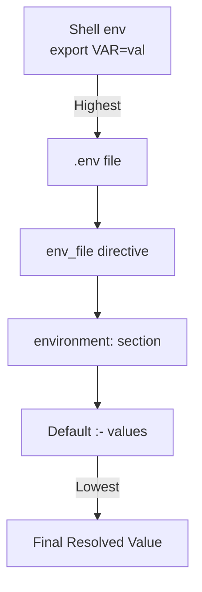
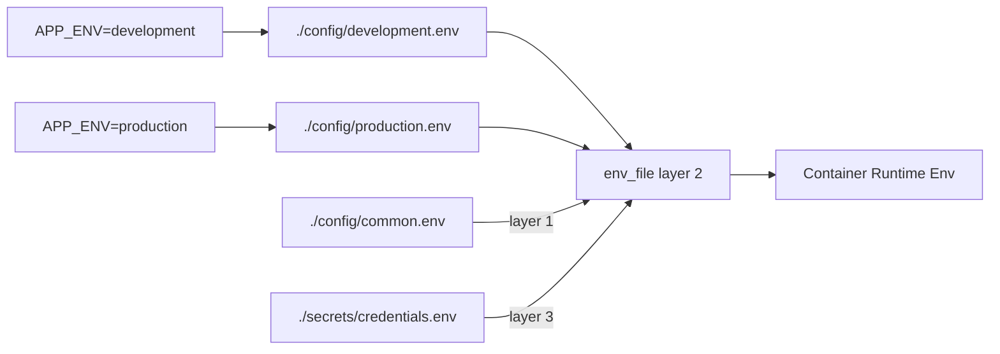

<!-- header start -->

<a href="https://stackoverflow.com/users/1755598/codewizard"></a>&emsp;&emsp;[](https://www.linkedin.com/in/nirgeier/)&emsp;[](mailto:nirgeier@gmail.com)&emsp;[](mailto:nirg@codewizard.co.il)

<!-- header end -->

---

# Docker Compose Variable Substitution Deep-Dive

- This lab is a **deep-dive into Docker Compose variable substitution** - the mechanism that makes your compose files dynamic, environment-aware, and reusable across different contexts.
- You'll learn every syntax form (`${VAR}`, `${VAR:-default}`, `${VAR:?error}`, `${VAR:+replacement}`, `$$` escaping), understand the `.env` file loading order, master the `env_file` per-service directive, and explore real-world patterns like concatenation, nested variables, and multi-env configuration.
- Each concept is backed by a **standalone example** and a **progressive set of exercises** that build from simple defaults to production-grade multi-file setups.

---


[](https://console.cloud.google.com/cloudshell/editor?cloudshell_git_repo=https://github.com/nirgeier/DockerComposeLabs)

**<kbd>CTRL</kbd> + click to open in new window**

---

[](012-VariableSubstitution.zip)

---

## Table of Contents

- [Docker Compose Variable Substitution Deep-Dive](#docker-compose-variable-substitution-deep-dive)
  - [**CTRL + click to open in new window**](#ctrl--click-to-open-in-new-window)
- [Table of Contents](#table-of-contents)
- [Why Variable Substitution Matters](#why-variable-substitution-matters)
- [Substitution Syntax Reference](#substitution-syntax-reference)
  - [1. Basic Substitution - `${VAR}`](#1-basic-substitution--var)
  - [2. Default Value - `${VAR:-default}`](#2-default-value--var-default)
  - [3. Mandatory Variable - `${VAR:?error}`](#3-mandatory-variable--varerror)
  - [4. Alternate Value - `${VAR:+replacement}`](#4-alternate-value--varreplacement)
  - [5. Literal Dollar Sign - `$$` Escape](#5-literal-dollar-sign---escape)
- [The `.env` File - Project-Level Variables](#the-env-file--project-level-variables)
  - [Loading Order and Precedence](#loading-order-and-precedence)
- [The `env_file` Directive - Per-Service Variables](#the-env_file-directive--per-service-variables)
  - [Multi-File Strategy](#multi-file-strategy)
- [Precedence Rules (From Highest to Lowest)](#precedence-rules-from-highest-to-lowest)
- [Advanced Patterns](#advanced-patterns)
  - [Nested / Indirect Variable References](#nested--indirect-variable-references)
  - [Concatenation](#concatenation)
  - [Empty String Defaults](#empty-string-defaults)
  - [Dynamic `env_file` Paths](#dynamic-env_file-paths)
  - [Environment-Specific Configuration](#environment-specific-configuration)
- [Lab Examples](#lab-examples)
  - [Example 1: Basics - Default Values](#example-1-basics---default-values)
  - [Example 2: Mandatory Variables](#example-2-mandatory-variables)
  - [Example 3: Advanced - All Techniques Combined](#example-3-advanced---all-techniques-combined)
  - [Example 4: Env-File Strategy](#example-4-env-file-strategy)
- [Best Practices](#best-practices)
- [Troubleshooting](#troubleshooting)
- [Hands-On Tasks](#hands-on-tasks)
  - [Task 1: Run the Basics Example](#task-1-run-the-basics-example)
  - [Task 2: Enforce Mandatory Variables](#task-2-enforce-mandatory-variables)
  - [Task 3: Explore All Advanced Techniques](#task-3-explore-all-advanced-techniques)
  - [Task 4: Multi-File Environment Strategy](#task-4-multi-file-environment-strategy)
  - [Task 5: Build Your Own Multi-Env Setup](#task-5-build-your-own-multi-env-setup)
- [Verification Checklist](#verification-checklist)
- [Additional Resources](#additional-resources)
- [Next Steps](#next-steps)
- [Cleanup](#cleanup)

---

## Why Variable Substitution Matters

Hardcoding values in `docker-compose.yaml` creates brittle configurations that break across environments. Variable substitution solves this by letting you:

- Use the **same compose file** for development, staging, and production
- Keep **secrets out of version control** (load them from `.env` or secret files)
- Set **sensible defaults** that can be overridden per deployment
- **Fail fast** when required configuration is missing
- Compose **dynamic values** from multiple variables (concatenation)

Instead of this:

```yaml
services:
  web:
    image: nginx:alpine
    ports:
      - "8080:80"
    environment:
      - NODE_ENV=development
```

You write this:

```yaml
services:
  web:
    image: nginx:${NGINX_TAG:-alpine}
    ports:
      - "${HOST_PORT:-8080}:80"
    environment:
      - NODE_ENV=${NODE_ENV:-development}
```

Now one file works everywhere - just change the `.env` file or shell environment.

---

## Substitution Syntax Reference

Docker Compose supports five variable syntax forms, inspired by POSIX shell parameter expansion:

### 1. Basic Substitution - `${VAR}`

Replaces `${VAR}` with the value of the environment variable. If the variable is **unset or empty**, the compose file is invalid and `docker compose config` will raise an error.

```yaml
services:
  web:
    image: nginx:${NGINX_TAG}
    ports:
      - "${HOST_PORT}:80"
```

```bash
# Must set these before running:
export NGINX_TAG=alpine
export HOST_PORT=8080
docker compose up -d

# Alternatively, define them in a .env file:
echo "NGINX_TAG=alpine" >> .env
echo "HOST_PORT=8080" >> .env
```

### 2. Default Value - `${VAR:-default}`

If `VAR` is **unset or empty**, the `:-` operator substitutes the literal string after the colon. This is the most common form - it makes your compose file self-documenting with sensible fallbacks.

```yaml
services:
  web:
    image: nginx:${NGINX_TAG:-alpine}
    ports:
      - "${HOST_PORT:-8195}:80"
    environment:
      - APP_NAME=${APP_NAME:-MyApp}
      - APP_ENV=${APP_ENV:-development}
      - APP_VERSION=${APP_VERSION:-latest}
      - LOG_LEVEL=${LOG_LEVEL:-info}
      - MAX_CONNECTIONS=${MAX_CONNECTIONS:-100}
```

```bash
# With defaults only (no .env needed):
docker compose up -d

# Override specific variables:
APP_NAME=ProductionApp APP_ENV=production docker compose up -d
```

### 3. Mandatory Variable - `${VAR:?error}`

If `VAR` is **unset or empty**, Docker Compose prints the error message and **refuses to start**. Use this for values that must always be provided - passwords, API keys, etc.

```yaml
services:
  db:
    image: postgres:16-alpine
    environment:
      POSTGRES_USER: ${DB_USER:?error}
      POSTGRES_PASSWORD: ${DB_PASS:?password is required}
      POSTGRES_DB: ${DB_NAME:-myapp}

  api:
    image: node:20-alpine
    environment:
      DB_USER: ${DB_USER:?}
      DB_PASS: ${DB_PASS:?}
      API_KEY: ${API_KEY:?API key is mandatory}
      NODE_ENV: ${NODE_ENV:-development}
```

```bash
# This will fail with a clear error:
docker compose up -d
# ❌ Compose file is invalid because:
#   DB_USER is not set and is required

# Provide the mandatory variables:
DB_USER=admin DB_PASS=supersecret API_KEY=sk-abc-def-ghi docker compose up -d
```

| Syntax | Error Message |
|--------|---------------|
| `${VAR:?}` | `VAR` is not set and is required |
| `${VAR:?error}` | `VAR` is not set and is required / error |
| `${VAR:?custom message}` | `VAR` is not set and is required / custom message |

### 4. Alternate Value - `${VAR:+replacement}`

If `VAR` is **set and non-empty**, substitutes the replacement string. Otherwise substitutes an **empty string**. This is the inverse of `:-`.

```yaml
services:
  web:
    image: nginx:alpine
    environment:
      # If DEBUG_MODE is set to "true", use "debug"; otherwise empty
      LOG_LEVEL: ${DEBUG_MODE:+debug}

      # Conditional feature flag
      EXTRA_FEATURES: ${ENABLE_BETA:+beta,experimental}
```

```bash
# LOG_LEVEL will be empty:
docker compose up -d

# LOG_LEVEL becomes "debug":
DEBUG_MODE=true docker compose up -d
```

### 5. Literal Dollar Sign - `$$` Escape

When you need a **literal `$`** in your configuration (e.g., shell variables inside a `command` or `entrypoint`), double the dollar sign. `$$` is replaced with a single `$` before the value reaches the container.

```yaml
services:
  web:
    image: nginx:alpine
    environment:
      # This becomes: RAW_DOLLAR=$not_a_variable
      RAW_DOLLAR: $$not_a_variable

  app:
    image: alpine
    command: sh -c "echo \$$HOME"  # Escaped for shell
```

```bash
# Verify the escaping:
docker compose run --rm web env | grep RAW_DOLLAR
# Output: RAW_DOLLAR=$not_a_variable

# Without $$, Docker Compose would try to substitute ${not_a_variable}
```

---

## The `.env` File - Project-Level Variables

By default, Docker Compose reads a file named `.env` in the **project directory** (where you run `docker compose` from). Every variable defined in `.env` is available for substitution in `docker-compose.yaml`.

```bash
# .env - loaded automatically by docker compose
NGINX_TAG=alpine
PORT=8196
APP_NAME=VariableSubDemo
LOG_LEVEL=debug
```

```yaml
# docker-compose.yaml - uses variables from .env
services:
  web:
    image: nginx:${NGINX_TAG:-alpine}
    ports:
      - "${PORT:-8196}:80"
    environment:
      - APP_NAME=${APP_NAME:-MyApp}
      - LOG_LEVEL=${LOG_LEVEL:-info}
```

### Loading Order and Precedence

Docker Compose loads variables in this order (later sources override earlier ones):

1. **Shell environment variables** (highest priority)
2. **`.env` file** in the project directory
3. **`env_file`** directive inside a service definition
4. **`environment`** section inside a service definition
5. Variable **defaults** (`:-` syntax inside the compose file)



> **Important:** The `.env` file is used for **variable substitution** in the compose file itself. It is **not** automatically passed to containers. To make variables available inside containers, use the `environment` section or `env_file`.

---

## The `env_file` Directive - Per-Service Variables

The `env_file` directive loads environment variables **into the container** from one or more files. Unlike `.env` (which is global and used for substitution), `env_file` is per-service.

```yaml
services:
  web:
    image: nginx:alpine
    env_file:
      - ./config/common.env
      - ./config/development.env
      - ./secrets/credentials.env
```

### Multi-File Strategy

You can specify multiple `env_file` entries. Docker Compose processes them in order - variables from later files override earlier ones. This enables a **layered configuration pattern**:

```
Project Structure:
├── .env                          ← Project-level (substitution)
├── docker-compose.yaml
├── config/
│   ├── common.env                ← Shared defaults
│   ├── development.env           ← Dev overrides
│   └── production.env            ← Prod overrides
└── secrets/
    └── credentials.env           ← Sensitive values (git-ignored)
```

```bash
# config/common.env - shared across all environments
APP_NAME=MultiEnvApp
CACHE_ENABLED=true
CACHE_TTL=300

# config/development.env - dev-specific
LOG_LEVEL=debug
DEBUG=true
HOT_RELOAD=true

# config/production.env - prod-specific
LOG_LEVEL=warn
DEBUG=false
HOT_RELOAD=false

# secrets/credentials.env - sensitive (never commit!)
DB_USER=admin
DB_PASS=supersecret123
API_KEY=sk-abc-def-ghi
```

```yaml
# docker-compose.yaml
services:
  web:
    image: nginx:${NGINX_TAG:-alpine}
    ports:
      - "${PORT:-8197}:80"
    env_file:
      - ./config/common.env
      - ./config/${APP_ENV:-development}.env          # Dynamic path!
      - ./secrets/credentials.env
    environment:
      APP_NAME: ${APP_NAME:-FallbackApp}              # Overrides env_file
```



```bash
# Switch environments by changing APP_ENV:
APP_ENV=development docker compose up -d   # Uses development.env
APP_ENV=production  docker compose up -d   # Uses production.env
```

---

## Precedence Rules (From Highest to Lowest)

Understanding precedence is critical for predictable behavior. Here is the complete hierarchy:

| Priority | Source | Scope | Used For |
|----------|--------|-------|----------|
| 1 (highest) | Shell environment (`export VAR=val`) | Global | CI/CD, ad-hoc overrides |
| 2 | `environment:` section in service | Per-service | Container-injected variables |
| 3 | `env_file:` files (last wins) | Per-service | Layered config files |
| 4 | `.env` file in project directory | Global | Substitution defaults |
| 5 | `:-` default in compose file | Inline | Fallback values |

**Key nuance:** Shell environment variables and `.env` are used for **substitution** in the compose file. The `environment` section and `env_file` define what actually reaches the **container runtime**.

```yaml
# docker-compose.yaml
services:
  web:
    image: nginx:${NGINX_TAG:-alpine}      # Substitution: shell > .env > :- default
    env_file:
      - ./config/common.env                # Runtime: loaded into container
    environment:
      APP_NAME: ${APP_NAME:-FallbackApp}   # Substitution + override of env_file
```

> **Rule of thumb:** Use `.env` for compose-file substitution defaults. Use `env_file` for layered runtime configuration. Use `environment:` for per-service overrides and inline values.

---

## Advanced Patterns

### Nested / Indirect Variable References

You can nest variable references by using a variable's value as the default for another:

```yaml
services:
  web:
    image: nginx:alpine
    environment:
      ENV_NAME: ${ENV_NAME:-${DEFAULT_ENV:-development}}
```

How this resolves:

1. If `ENV_NAME` is set, use it directly
2. If `ENV_NAME` is unset, check `DEFAULT_ENV`
3. If `DEFAULT_ENV` is also unset, use `development`

```bash
# All three produce different results:
docker compose up -d
# → ENV_NAME=development (both fallbacks)

DEFAULT_ENV=staging docker compose up -d
# → ENV_NAME=staging (second fallback)

ENV_NAME=production docker compose up -d
# → ENV_NAME=production (direct value)
```

### Concatenation

Build compound values by combining multiple variables:

```yaml
services:
  web:
    image: nginx:alpine
    environment:
      DB_URL: "postgres://${DB_USER:-app}:${DB_PASS:-secret}@${DB_HOST:-db}:5432/${DB_NAME:-myapp}"
```

With defaults set via `.env`:

```bash
DB_USER=app
DB_PASS=secret
DB_HOST=db
DB_NAME=myapp
```

The resolved value becomes:

```
postgres://app:secret@db:5432/myapp
```

### Empty String Defaults

Sometimes you want a variable to resolve to an **empty string** rather than a fallback:

```yaml
services:
  web:
    image: nginx:alpine
    environment:
      OPTIONAL_FEATURE: ${OPTIONAL_FEATURE:-}
```

If `OPTIONAL_FEATURE` is unset, it becomes an empty string (`""`) instead of causing an error. This is useful for optional flags or feature toggles.

### Dynamic `env_file` Paths

The `env_file` paths can themselves use variable substitution, enabling environment-aware config loading:

```yaml
services:
  web:
    image: nginx:${NGINX_TAG:-alpine}
    env_file:
      - ${ENV_FILE:-./.env}
      - ./secrets/env.${APP_ENV:-dev}
```

```bash
# .env file
NGINX_TAG=alpine
PORT=8196
APP_ENV=dev

# secrets/env.dev - loaded when APP_ENV=dev
DB_USER=dev_user
DB_PASS=dev_pass
DB_HOST=localhost

# secrets/env.prod - loaded when APP_ENV=prod
DB_USER=prod_user
DB_PASS=prod_pass_123
DB_HOST=db.prod.internal
```

### Environment-Specific Configuration

Combine everything above for a production-grade pattern that selects configuration at runtime:

```yaml
services:
  web:
    image: nginx:${NGINX_TAG:-alpine}
    ports:
      - "${PORT:-8196}:80"
    env_file:
      - ./config/common.env
      - ./config/${APP_ENV:-development}.env
      - ./secrets/credentials.env
    environment:
      APP_NAME: ${APP_NAME:-MyApp}
      DB_URL: "postgres://${DB_USER:-app}:${DB_PASS:-secret}@${DB_HOST:-db}:5432/${DB_NAME:-myapp}"
      API_KEY: "${API_KEY:?API key required}"
```

```bash
# Development
APP_ENV=development docker compose up -d

# Production (fails if API_KEY is missing)
APP_ENV=production API_KEY=sk-live-xxx docker compose up -d
```

---

## Lab Examples

### Example 1: Basics - Default Values

**Directory:** `examples/basics/`

Demonstrates the `:-` operator for ports, environment variables, and image tags. Every variable has a sensible default so the compose file works out of the box.

```yaml
# examples/basics/docker-compose.yaml
services:
  web:
    image: nginx:${NGINX_TAG:-alpine}
    ports:
      - "${HOST_PORT:-8195}:80"
    environment:
      - APP_NAME=${APP_NAME:-MyApp}
      - APP_ENV=${APP_ENV:-development}
      - APP_VERSION=${APP_VERSION:-latest}
      - LOG_LEVEL=${LOG_LEVEL:-info}
      - MAX_CONNECTIONS=${MAX_CONNECTIONS:-100}
      - ${CUSTOM_VAR:-SKIP_THIS}
```

```bash
cd examples/basics

# Start with all defaults
docker compose up -d
docker compose config
docker compose down

# Override specific values
APP_NAME=MyProductionApp APP_ENV=production docker compose up -d
docker compose exec web env | grep APP_
docker compose down
```

### Example 2: Mandatory Variables

**Directory:** `examples/mandatory/`

Demonstrates `:-` for optional values and `:?` to enforce required variables. The config will refuse to start if mandatory variables are missing.

```yaml
# examples/mandatory/docker-compose.yaml
services:
  db:
    image: postgres:16-alpine
    environment:
      POSTGRES_USER: ${DB_USER:?error}
      POSTGRES_PASSWORD: ${DB_PASS:?password is required}
      POSTGRES_DB: ${DB_NAME:-myapp}

  api:
    image: node:20-alpine
    command: ["sh", "-c", "node -e \"console.log('DB_USER:', process.env.DB_USER)\""]
    environment:
      DB_USER: ${DB_USER:?}
      DB_PASS: ${DB_PASS:?}
      API_KEY: ${API_KEY:?API key is mandatory}
      NODE_ENV: ${NODE_ENV:-development}
    depends_on:
      - db
```

```bash
cd examples/mandatory

# This will fail with a clear error:
docker compose config

# Provide mandatory variables:
DB_USER=admin DB_PASS=supersecret API_KEY=sk-abc-123 docker compose config

# Start the stack:
DB_USER=admin DB_PASS=supersecret API_KEY=sk-abc-123 docker compose up -d
docker compose logs api
docker compose down
```

### Example 3: Advanced - All Techniques Combined

**Directory:** `examples/advanced/`

A comprehensive demo that showcases defaults, mandatory variables, nested references, `$$` escaping, concatenation, and dynamic `env_file` paths.

```yaml
# examples/advanced/docker-compose.yaml
services:
  web:
    image: nginx:${NGINX_TAG:-alpine}
    ports:
      - "${PORT:-8196}:80"
    environment:
      # Default value
      APP_NAME: ${APP_NAME:-MyApp}

      # Mandatory (fails if unset)
      API_KEY: "${API_KEY:?API key required}"

      # Empty string if unset
      OPTIONAL_FEATURE: ${OPTIONAL_FEATURE:-}

      # Literal dollar sign (escaping)
      RAW_DOLLAR: $$not_a_variable

      # Nested variable (indirect reference)
      ENV_NAME: ${ENV_NAME:-${DEFAULT_ENV:-development}}

      # Concatenation
      DB_URL: "postgres://${DB_USER:-app}:${DB_PASS:-secret}@${DB_HOST:-db}:5432/${DB_NAME:-myapp}"

      # Array from env var
      ALLOWED_HOSTS: ${ALLOWED_HOSTS:-localhost}

    # Config from external file with dynamic path
    env_file:
      - ${ENV_FILE:-./.env}
      - ./secrets/env.${APP_ENV:-dev}
```

```bash
cd examples/advanced

# Explore the resolved configuration:
docker compose config

# Start with .env defaults:
docker compose up -d
docker compose exec web env | grep -E "APP_|DB_|RAW_|ENV_|API_"
docker compose down

# Switch to production secrets:
APP_ENV=prod docker compose up -d
docker compose exec web env | grep DB_
docker compose down
```

### Example 4: Env-File Strategy

**Directory:** `examples/env-file/`

A production-ready multi-file environment pattern with shared defaults, environment-specific overrides, and isolated secrets.

```
examples/env-file/
├── .env                          # Project-level substitution defaults
├── docker-compose.yaml
├── config/
│   ├── common.env                # Shared across all environments
│   ├── development.env           # Dev overrides
│   └── production.env            # Prod overrides
└── secrets/
    └── credentials.env           # Sensitive values (git-ignored)
```

```yaml
# examples/env-file/docker-compose.yaml
services:
  web:
    image: nginx:${NGINX_TAG:-alpine}
    ports:
      - "${PORT:-8197}:80"
    env_file:
      - ./config/common.env
      - ./config/${APP_ENV:-development}.env
      - ./secrets/credentials.env
    environment:
      APP_NAME: ${APP_NAME:-FallbackApp}
```

```bash
cd examples/env-file

# See substitution defaults:
cat .env

# Start with development environment:
docker compose up -d
docker compose exec web env | sort
docker compose down

# Switch to production:
APP_ENV=production docker compose up -d
docker compose exec web env | sort
docker compose down
```

---

## Best Practices

**1. Always provide defaults with `:-`**

```yaml
# Good - works without any .env
image: nginx:${NGINX_TAG:-alpine}

# Bad - fails if NGINX_TAG is unset
image: nginx:${NGINX_TAG}
```

**2. Use `:?` for secrets and required values**

```yaml
environment:
  DB_PASSWORD: ${DB_PASSWORD:?Database password is required}
  API_KEY: ${API_KEY:?}
```

**3. Keep a `.env.example` in version control**

```bash
# .env.example - commit this, not the real .env
NGINX_TAG=alpine
APP_ENV=development
DB_USER=change_me
DB_PASS=change_me
```

Add the real `.env` to `.gitignore`:

```gitignore
# .gitignore
.env
secrets/*.env
```

**4. Use layered `env_file` for complex environments**

```
config/common.env       ← Shared defaults
config/${APP_ENV}.env   ← Environment-specific (dynamic path!)
secrets/credentials.env ← Sensitive values (last, so it can override)
```

**5. Use `docker compose config` to debug substitution**

```bash
# See the fully resolved compose file
docker compose config

# Check for missing variables without starting containers
docker compose config --quiet
```

**6. Prefer `:-` over hardcoding in service definitions**

```yaml
# Good
ports:
  - "${HOST_PORT:-8080}:80"

# Avoid
ports:
  - "8080:80"
```

**7. Use `$$` when embedding shell variables**

```yaml
# Correct - $$ becomes $ in the container
command: sh -c "echo \$$HOME"

# Wrong - ${HOME} would be substituted by Compose
command: sh -c "echo $HOME"
```

**8. Keep substitution in `environment:` or `env_file:` for container runtime**
The `.env` file is for compose-file substitution, not runtime. Use `environment:` or `env_file:` to pass values into containers.

---

## Troubleshooting

| Problem | Cause | Solution |
|---------|-------|----------|
| `Compose file is invalid` | Mandatory variable (`:?`) is unset | Set the variable via shell or `.env` |
| `WARNING: The VAR variable is not set. Defaulting to a blank string.` | Variable used without `:-` default | Add `:-default` or set the variable |
| `VAR` appears literally in output | Variable name misspelled or using `$` instead of `${}` | Use `${VAR}` syntax |
| Container sees empty string | Variable set but empty in `.env` | Use `:-` default or set a non-empty value |
| Container sees wrong value | Precedence conflict | Check shell env > `.env` > `env_file` > `environment` order |
| `$` appearing literally inside container | Missing `$$` escape | Use `$$` for literal dollar signs |
| `env_file` not found | Path is relative to compose file | Verify path exists; use `${PWD}` if needed |
| `.env` file ignored | Different project directory | Ensure `.env` is in the same directory where `docker compose` is run |
| Variable not available in container | Variable was only in `.env` (substitution) | Add to `environment:` or `env_file:` |

---

## Hands-On Tasks

### Task 1: Run the Basics Example

```bash
cd examples/basics

# Run with all defaults
docker compose up -d
docker compose exec web env | grep -E "APP_|LOG_|MAX_"
docker compose ps
docker compose down

# Override via shell
APP_NAME=CustomApp LOG_LEVEL=debug docker compose up -d
docker compose exec web env | grep APP_NAME
docker compose down

# Inspect the resolved config
docker compose config
```

**Expected outcome:** The nginx container starts with your chosen environment variables. When no shell variables are set, the `:-` defaults take effect.

### Task 2: Enforce Mandatory Variables

```bash
cd examples/mandatory

# Try to start without required variables (will fail)
docker compose config 2>&1
# You should see an error about DB_USER, DB_PASS, API_KEY

# Provide ALL required variables
DB_USER=admin DB_PASS=secret123 API_KEY=sk-abc-123 \
  docker compose config

# Start the full stack
DB_USER=admin DB_PASS=secret123 API_KEY=sk-abc-123 \
  docker compose up -d

# Verify the api service received the values
docker compose logs api

# Clean up
docker compose down
```

**Expected outcome:** Without the required variables, `docker compose config` fails with a descriptive error. With them, the stack starts and the api container prints the correct DB_USER.

### Task 3: Explore All Advanced Techniques

```bash
cd examples/advanced

# View the resolved configuration with .env defaults
docker compose config

# Start and inspect environment variables
docker compose up -d
docker compose exec web env | sort
docker compose down

# Verify $$ escaping
docker compose run --rm web env | grep RAW_DOLLAR
# Should output: RAW_DOLLAR=$not_a_variable

# Test nested variable resolution
DEFAULT_ENV=staging docker compose run --rm web env | grep ENV_NAME
# Should output: ENV_NAME=staging

# Test dynamic env_file with production secrets
APP_ENV=prod docker compose run --rm web env | grep DB_
# Should show prod DB credentials
```

**Expected outcome:** Each substitution technique works as documented. Nested variables cascade correctly. `$$` produces a literal `$` in the container. Dynamic paths load environment-specific files.

### Task 4: Multi-File Environment Strategy

```bash
cd examples/env-file

# Examine the file structure
ls -la .env config/ secrets/

# Start in development mode (default)
docker compose up -d

# Inspect environment variables
docker compose exec web env | sort
# Should see: APP_NAME=MultiEnvApp (from common.env)
#             LOG_LEVEL=debug (from development.env)
#             DB_USER=admin (from credentials.env)

# Verify precedence: environment: overrides env_file
docker compose exec web env | grep APP_NAME
# Output: APP_NAME=MultiEnvApp (from common.env)
# The environment: section has ${APP_NAME:-FallbackApp}
# but APP_NAME is already set by common.env, so it uses MultiEnvApp

docker compose down

# Switch to production
APP_ENV=production docker compose up -d
docker compose exec web env | sort
# Should see: LOG_LEVEL=warn, DEBUG=false, HOT_RELOAD=false
docker compose down
```

**Expected outcome:** The env_file array loads files in order, with later files overriding earlier ones. The `environment` section has the final say. Switching `APP_ENV` changes which environment-specific config is loaded.

### Task 5: Build Your Own Multi-Env Setup

```bash
# Create a new project directory
mkdir -p my-multi-env/config my-multi-env/secrets

# Create a shared config file
cat > my-multi-env/config/common.env << 'EOF'
APP_NAME=MyApp
CACHE_ENABLED=true
EOF

# Create environment-specific files
cat > my-multi-env/config/dev.env << 'EOF'
LOG_LEVEL=debug
DEBUG=true
EOF

cat > my-multi-env/config/prod.env << 'EOF'
LOG_LEVEL=warn
DEBUG=false
EOF

# Create a secrets file
cat > my-multi-env/secrets/credentials.env << 'EOF'
DB_PASS=changeme
EOF

# Create the compose file
cat > my-multi-env/docker-compose.yaml << 'EOF'
services:
  app:
    image: alpine
    command: ["sh", "-c", "env | sort"]
    environment:
      DB_PASS: ${DB_PASS:?Database password is required}
    env_file:
      - ./config/common.env
      - ./config/${APP_ENV:-dev}.env
      - ./secrets/credentials.env
EOF

# Test both environments
cd my-multi-env
echo "=== Development ==="
APP_ENV=dev DB_PASS=devpass docker compose up --build
echo "=== Production ==="
APP_ENV=prod DB_PASS=prodpass docker compose up --build

# Clean up
cd ..
rm -rf my-multi-env
```

**Expected outcome:** Your custom setup selects the right config based on `APP_ENV`. The mandatory `DB_PASS` must be provided, and credentials are kept separate from config.

---

## Verification Checklist

- [ ] I understand all five substitution syntax forms: `${VAR}`, `:-`, `:?`, `:+`, `$$`
- [ ] I know how the `.env` file is loaded and its role in substitution
- [ ] I can use `env_file` with multiple files for layered configuration
- [ ] I understand the precedence order: shell > environment > env_file > .env > `:-`
- [ ] I can enforce mandatory variables with `:?` and custom error messages
- [ ] I can nest variable references for cascading defaults
- [ ] I can concatenate multiple variables to build compound values
- [ ] I can use `$$` to escape literal dollar signs
- [ ] I can create environment-specific config files with dynamic `env_file` paths
- [ ] I can debug variable resolution with `docker compose config`
- [ ] I know the difference between `.env` (substitution) and `env_file` (runtime)
- [ ] I can build a production-ready multi-file environment configuration

---

## Additional Resources

- [Docker Compose Variable Substitution Docs](https://docs.docker.com/compose/environment-variables/)
- [Docker Compose File Reference](https://docs.docker.com/compose/compose-file/)
- [Docker Compose `.env` File](https://docs.docker.com/compose/environment-variables/env-file/)
- [Docker Compose Precedence Rules](https://docs.docker.com/compose/environment-variables/envvars-precedence/)
- [Docker Compose Best Practices](https://docs.docker.com/compose/best-practices/)

---

## Next Steps

Now that you've mastered variable substitution, you're ready to explore more advanced Docker Compose patterns:

| Lab | Description |
|-----|-------------|
| [**009 - Fragments**](../009-Fragments/README.md) | Reusable YAML fragments with anchors and `extends` |
| [**010 - Profiles**](../010-Profiles/README.md) | Environment-aware service selection with profiles |
| [**013 - Merge & Override**](../013-MergeOverride/README.md) | Multi-file compose merging strategies |
| [**015 - Secrets & Configs**](../015-SecretsConfigs/README.md) | Secure secret management in Compose |

**What to try next:**

- Combine variable substitution with **profiles** to dynamically set profile-specific variables
- Use **multi-file compose** (`-f`) to separate environment-specific overrides into separate files
- Create a **central `.env` template** for your team with documented defaults
- Integrate variable validation into your **CI/CD pipeline** with `docker compose config`
- Build a **secret injection system** using `env_file` with git-ignored credential files
