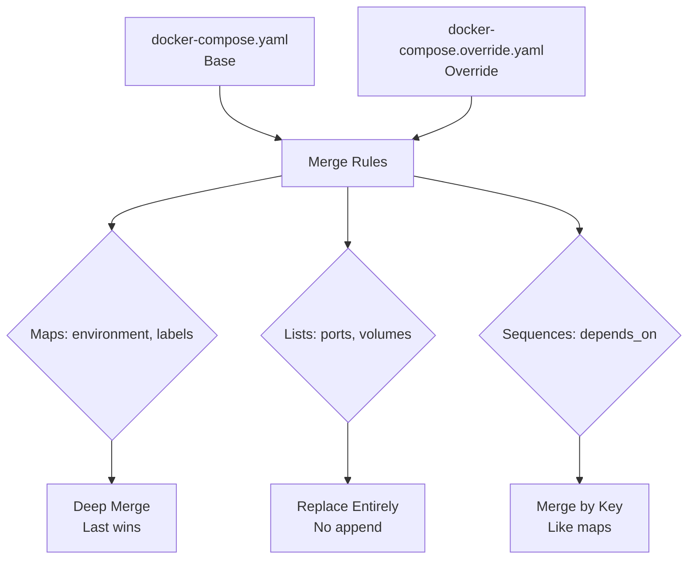
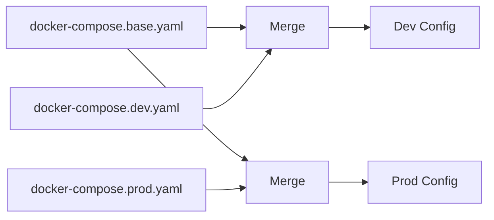

<!-- header start -->

<a href="https://stackoverflow.com/users/1755598/codewizard"></a>&emsp;&emsp;[](https://www.linkedin.com/in/nirgeier/)&emsp;[](mailto:nirgeier@gmail.com)&emsp;[](mailto:nirg@codewizard.co.il)

<!-- header end -->

---

# Docker Compose Merge & Override Strategies

- This lab teaches you **how Docker Compose merges multiple compose files** into a single configuration.
- You'll learn about the **default override file** (`docker-compose.override.yaml`), **explicit multi-file** with `-f`, and the **merge rules** for maps, lists, and sequences.
- Each concept includes a **standalone example** to experiment with.

---


[](https://console.cloud.google.com/cloudshell/editor?cloudshell_git_repo=https://github.com/nirgeier/DockerComposeLabs)

**<kbd>CTRL</kbd> + click to open in new window**

---

[](013-MergeOverride.zip)

---

## Table of Contents

- [Docker Compose Merge & Override Strategies](#docker-compose-merge--override-strategies)
  - [**CTRL + click to open in new window**](#ctrl--click-to-open-in-new-window)
  - [Table of Contents](#table-of-contents)
  - [How Merge & Override Works](#how-merge--override-works)
  - [Pattern 1: Default Override (Auto-Loaded)](#pattern-1-default-override-auto-loaded)
    - [Base File (`docker-compose.yaml`)](#base-file-docker-composeyaml)
    - [Override File (`docker-compose.override.yaml`)](#override-file-docker-composeoverrideyaml)
    - [What Happens at Runtime](#what-happens-at-runtime)
  - [Pattern 2: Explicit Multi-File with `-f`](#pattern-2-explicit-multi-file-with--f)
    - [File Breakdown](#file-breakdown)
    - [Running by Environment](#running-by-environment)
  - [Pattern 3: Merge Rules Deep Dive](#pattern-3-merge-rules-deep-dive)
    - [1. Maps Merge (Last Writer Wins)](#1-maps-merge-last-writer-wins)
    - [2. Lists Replace (Not Merged)](#2-lists-replace-not-merged)
    - [3. Sequences Merge (By Position / Key)](#3-sequences-merge-by-position--key)
    - [Merge Rules Reference](#merge-rules-reference)
  - [Environment Merge  vs  Override](#environment-merge--vs--override)
  - [Ports Override in Detail](#ports-override-in-detail)
  - [extends vs YAML Anchors for Overrides](#extends-vs-yaml-anchors-for-overrides)
  - [Best Practices](#best-practices)
  - [Troubleshooting](#troubleshooting)
  - [Hands-On Tasks](#hands-on-tasks)
    - [Task 1: Default Override Pattern](#task-1-default-override-pattern)
    - [Task 2: Multi-File Environment Switching](#task-2-multi-file-environment-switching)
    - [Task 3: Verify Merge Rules](#task-3-verify-merge-rules)
    - [Task 4: Custom Override Chain](#task-4-custom-override-chain)
  - [Verification Checklist](#verification-checklist)
  - [Additional Resources](#additional-resources)
  - [Cleanup](#cleanup)
  - [Next Steps](#next-steps)

---

## How Merge & Override Works

Docker Compose supports **merging multiple compose files** into one effective configuration. This lets you separate concerns (base vs dev vs prod) and reuse common definitions.

There are two main patterns:

| Pattern | Usage | Example |
|---------|-------|---------|
| **Default override** | `docker compose up` | Auto-loads `docker-compose.override.yaml` |
| **Explicit multi-file** | `docker compose -f file1.yaml -f file2.yaml up` | Manual control over file order |

**Merge rules** govern how overlapping keys are combined:

- **Maps** (dictionaries like `environment`) are **merged** - keys from later files override earlier ones.
- **Lists** (arrays like `ports`) are **replaced** - the later list completely replaces the earlier one.
- **Sequences** (keyed arrays like `depends_on`) are **merged by key/position**.

The **last file listed wins** for overlapping scalar values and map keys.



---

## Pattern 1: Default Override (Auto-Loaded)

When you run `docker compose up` in a directory containing both `docker-compose.yaml` and `docker-compose.override.yaml`, Docker Compose **automatically loads both files** - no `-f` flags needed.

> **Important:** When you use any `-f` flag, the auto-load of `docker-compose.override.yaml` is **disabled**.

### Base File (`docker-compose.yaml`)

```yaml
services:
  web:
    image: nginx:alpine
    ports:
      - "8198:80"
    environment:
      - APP_ENV=production
      - LOG_LEVEL=warn
    volumes:
      - ./app:/usr/share/nginx/html:ro

  db:
    image: postgres:16-alpine
    environment:
      POSTGRES_PASSWORD: example
    volumes:
      - pgdata:/var/lib/postgresql/data

volumes:
  pgdata:
```

### Override File (`docker-compose.override.yaml`)

```yaml
services:
  web:
    ports:
      - "8199:80"           # LIST replaced: only this port survives
    environment:             # MAP merged: APP_ENV→development,
      - APP_ENV=development  # LOG_LEVEL→debug, DEBUG=true added
      - LOG_LEVEL=debug
      - DEBUG=true
    volumes:                 # LIST replaced: only these volumes survive
      - ./app:/usr/share/nginx/html
      - ./src:/app/src:ro

  db:
    ports:
      - "5432:5432"
    environment:
      POSTGRES_PASSWORD: devpassword

  adminer:
    image: adminer
    ports:
      - "8080:8080"
```

### What Happens at Runtime

Run `docker compose config` (without flags) to see the **merged result**:

```yaml
services:
  web:
    image: nginx:alpine
    ports:
      - "8199:80"               # ← from override (list replaced)
    environment:
      APP_ENV: development      # ← override wins
      LOG_LEVEL: debug          # ← override wins
      DEBUG: "true"             # ← added by override
    volumes:
      - type: bind
        source: ./app
        target: /usr/share/nginx/html  # ← override list
      - type: bind
        source: ./src
        target: /app/src
        read_only: true

  db:
    image: postgres:16-alpine
    ports:
      - "5432:5432"            # ← from override
    environment:
      POSTGRES_PASSWORD: devpassword  # ← override wins
    volumes:
      - pgdata:/var/lib/postgresql/data  # ← from base (not overridden)

  adminer:
    image: adminer              # ← added by override (new service)
    ports:
      - "8080:8080"
```

```bash
# See the merged config yourself
cd examples/override
docker compose config
```

Key behaviors:

- **New services** in the override file (like `adminer`) are added to the final config.
- **Lists** (`ports`, `volumes`) are **replaced entirely** - `ports: ["8199:80"]` replaces `ports: ["8198:80"]`.
- **Maps** (`environment`) are **merged** key-by-key with the last file winning conflicts.
- **Scalars** (`image`) are kept from the base when not overridden.

---

## Pattern 2: Explicit Multi-File with `-f`

When you need more control - or want to support **multiple environments** (dev, staging, prod) - use explicit `-f` flags. This also **disables** auto-load of `docker-compose.override.yaml`.



```bash
# Development
docker compose -f docker-compose.base.yaml -f docker-compose.dev.yaml up

# Production
docker compose -f docker-compose.base.yaml -f docker-compose.prod.yaml up
```

### File Breakdown

**Base** (`docker-compose.base.yaml`) - shared by all environments:

```yaml
services:
  web:
    image: nginx:alpine
    ports:
      - "80"          # Expose port 80 (no host binding yet)
    environment:
      - APP_ENV=base

  db:
    image: postgres:16-alpine
    environment:
      POSTGRES_PASSWORD: example
```

**Dev** (`docker-compose.dev.yaml`) - developer overrides:

```yaml
services:
  web:
    ports:
      - "8198:80"         # Bind to host port 8198
    environment:
      - APP_ENV=development
      - DEBUG=true
    volumes:
      - ./src:/app/src:ro

  db:
    ports:
      - "5432:5432"
    environment:
      POSTGRES_PASSWORD: devpass

  adminer:
    image: adminer
    ports:
      - "8080:8080"
```

**Prod** (`docker-compose.prod.yaml`) - production overrides:

```yaml
services:
  web:
    ports:
      - "8200:80"
    environment:
      - APP_ENV=production
      - LOG_LEVEL=warn
    deploy:
      replicas: 3
    restart: always

  db:
    deploy:
      resources:
        limits:
          cpus: "1"
          memory: "512M"
```

### Running by Environment

```bash
cd examples/multi-file

# ── Development ──────────────────────────────────────────────
docker compose -f docker-compose.base.yaml -f docker-compose.dev.yaml up -d
docker compose ps
# web on :8198, db on :5432, adminer on :8080

# View merged config:
docker compose -f docker-compose.base.yaml -f docker-compose.dev.yaml config
docker compose down

# ── Production ───────────────────────────────────────────────
docker compose -f docker-compose.base.yaml -f docker-compose.prod.yaml up -d
docker compose ps
# web on :8200, db (no host port), 3 replicas

docker compose -f docker-compose.base.yaml -f docker-compose.prod.yaml config
docker compose down

# ── Both files listed wins for conflicts ─────────────────────
# The LAST file (dev.yaml or prod.yaml) takes precedence
```

**Why this works:**

- The `-f` flag takes a **list of files** applied in order.
- Later files override earlier ones (using merge rules).
- `docker-compose.override.yaml` is **not loaded** when `-f` is used.
- You can chain **any number of files**: `-f base.yaml -f staging.yaml -f prod.yaml`.

---

## Pattern 3: Merge Rules Deep Dive

Docker Compose applies three distinct merge strategies depending on the **YAML data type**. The `examples/merge-rules/` directory demonstrates all three.

### 1. Maps Merge (Last Writer Wins)

**Files are merged key-by-key.** If the same key appears in both files, the later file wins. Keys unique to each file are preserved.

**Base** (`docker-compose.yaml`):

```yaml
services:
  map-merge:
    image: alpine:latest
    command: ["echo", "map merge demo"]
    environment:
      SHARED_VAR: from-base
      UNIQUE_VAR: base-only
```

**Override** (`docker-compose.override.yaml`):

```yaml
services:
  map-merge:
    environment:
      SHARED_VAR: from-override   # ← overwrites base
      NEW_VAR: override-only       # ← added by override
```

**Merged result:**

```yaml
environment:
  SHARED_VAR: from-override   # ← override wins
  UNIQUE_VAR: base-only        # ← preserved from base
  NEW_VAR: override-only       # ← added by override
```

### 2. Lists Replace (Not Merged)

**Lists are replaced entirely.** The later file's list completely replaces the earlier one - items are NOT appended.

**Base:**

```yaml
services:
  list-replace:
    image: alpine:latest
    ports:
      - "8080:80"
```

**Override:**

```yaml
services:
  list-replace:
    ports:
      - "9090:80"              # ← completely replaces ["8080:80"]
```

**Merged result:**

```yaml
ports:
  - "9090:80"    # ← only this port; "8080:80" is gone
```

### 3. Sequences Merge (By Position / Key)

**Keyed sequences** (maps with string keys like `depends_on`) are **merged by key** - like a map merge, not a list replace.

**Base:**

```yaml
services:
  sequence-merge:
    image: alpine:latest
    depends_on:
      map-merge:
        condition: service_started
```

**Override:**

```yaml
services:
  sequence-merge:
    depends_on:
      list-replace:
        condition: service_started
```

**Merged result:**

```yaml
depends_on:
  map-merge:
    condition: service_started     # ← preserved from base
  list-replace:
    condition: service_started     # ← added by override
```

### Merge Rules Reference

| YAML Type | Examples | Merge Behavior |
|-----------|----------|----------------|
| **Map** (dict) | `environment`, `labels`, `deploy.labels`, `build.args` | **Merge** - keys from later file win, all others preserved |
| **List** (array) | `ports`, `volumes`, `networks`, `command`, `entrypoint`, `dns`, `tmpfs` | **Replace** - later list completely replaces earlier |
| **Keyed Sequence** | `depends_on`, `secrets`, `configs` | **Merge by key** - treat like a map merge |
| **Scalar** | `image`, `restart`, `container_name` | **Replace** - later file wins |

---

## Environment Merge vs Override

Environment variables illustrate the map-merge rule clearly:

```yaml
# base.yaml - web service
services:
  web:
    environment:
      APP_ENV: base
      LOG_LEVEL: info

# override.yaml
services:
  web:
    environment:
      APP_ENV: development   # ← overrides
      DEBUG: "true"          # ← added
```

**Result:**

| Variable | Value | Source |
|----------|-------|--------|
| `APP_ENV` | `development` | Override wins |
| `LOG_LEVEL` | `info` | Preserved from base |
| `DEBUG` | `true` | Added by override |

**Warning:** Environment variables defined as a list (`- KEY=value`) are converted to a map internally, so the same map-merge logic applies - even though the YAML syntax looks like a list.

```yaml
# Both forms are treated as maps for merging:
environment:
  - APP_ENV=development      # list form → converted to map
  - DEBUG=true

environment:
  APP_ENV: development       # map form
  DEBUG: "true"
```

---

## Ports Override in Detail

Ports are a **list**, so they follow the **replace** rule:

```yaml
# docker-compose.yaml
ports:
  - "8198:80"

# docker-compose.override.yaml
ports:
  - "8199:80"
```

```mermaid
graph LR
    A[Base: ports: [8198:80]] --> B[Override: ports: [8199:80]]
    B --> C[Result: [8199:80]]
    C -.->|8198:80 LOST| D[Not appended!]
    
    E[Correct: repeat base ports] --> F[Override: [8198:80, 8199:80, 443:443]]
    F --> G[Result: [8198:80, 8199:80, 443:443]]
    
```

**Result:** Only `"8199:80"` survives. The base port mapping is **completely lost**.

To keep ports from both files, you **must** repeat them:

```yaml
# override.yaml - manually keep both
ports:
  - "8198:80"       # repeated from base
  - "8199:80"       # new port
  - "443:443"       # additional port
```

This is a common source of confusion - developers often expect append behavior, but lists are always replaced.

---

## extends vs YAML Anchors for Overrides

Both `extends` and YAML anchors (`&` / `<<: *`) can be used alongside the override patterns. Here's how they compare:

| Feature | Default Override | Multi-File `-f` | `extends` | YAML Anchors |
|---------|-----------------|-----------------|-----------|--------------|
| **Auto-loads** | Yes | No | No | No |
| **Cross-file** | Same directory | Explicit `-f` | `file:` path | Single file |
| **Overrides** | Maps merge, lists replace | Same rules | Shallow merge | Deep merge |
| **Best for** | Local dev overrides | Environment switching | Full service templates | Reusable config blocks |

**When to use what:**

- **Default override** - your local dev machine, adding ports/volumes without modifying shared files.
- **Multi-file `-f`** - CI/CD, staging vs prod, team environments.
- **`extends`** - inheriting a complete service definition from another compose file (great for monorepos).
- **YAML anchors** - sharing small reusable blocks (`logging`, `restart`, `healthcheck`) within a single file.

**Example combining `extends` with override files:**

```yaml
# docker-compose.yaml - base
services:
  web:
    extends:
      file: ./common/web-base.yaml
      service: web-base
    ports:
      - "80"

# docker-compose.override.yaml - local only
services:
  web:
    ports:
      - "8080:80"         # replaces ports list
    environment:
      - NODE_ENV=development
```

---

## Best Practices

**1. Understand list replacement**

```yaml
# WRONG - expects ports to be additive
# override.yaml
ports:
  - "443:443"    # 🚫 - "8080:80" from base is LOST

# RIGHT - repeat base ports
ports:
  - "8080:80"    # ✅ - keep base port
  - "443:443"    # ✅ - add new port
```

**2. Use `docker compose config` to verify merges**

```bash
docker compose config          # See merged result (with auto-override)
docker compose -f base.yaml -f dev.yaml config   # See explicit merge
```

**3. Use descriptive file names for multi-file**

```yaml
# Good - clear intent
docker-compose.base.yaml
docker-compose.dev.yaml
docker-compose.staging.yaml
docker-compose.prod.yaml

# Avoid
base.yaml
dev-v2.yaml
```

**4. Keep overrides minimal**

- Override only what differs from the base.
- The smaller the override, the easier to reason about.

**5. Commit `docker-compose.yaml`, gitignore local overrides**

```gitignore
# .gitignore
docker-compose.override.yaml    # Local dev overrides
```

**6. Use `.env` files for environment-specific values**

```bash
# .env.development
APP_ENV=development
DB_PASSWORD=devpass

# .env.production
APP_ENV=production
DB_PASSWORD=prodsecret

# Run with specific env file
docker compose --env-file .env.development up
```

---

## Troubleshooting

| Problem | Solution |
|---------|----------|
| `docker-compose.override.yaml` not loaded | Are you using `-f` flags? Override is disabled when `-f` is used |
| Port from base file missing | Lists are **replaced**, not merged - repeat base ports in override |
| Environment variable lost | Check for typos in override - only overlapping keys are overwritten |
| Unexpected merge result | Run `docker compose config` to see the resolved output |
| Services defined twice error | A service name must be unique across all files for the same file set |
| `extends` file not found | Check `file:` path is **relative to the current compose file** |
| Override file ignored | Verify the filename is exactly `docker-compose.override.yaml` |

---

## Hands-On Tasks

### Task 1: Default Override Pattern

```bash
cd examples/override

# View the base config
docker compose -f docker-compose.yaml config

# View the merged config (with override auto-loaded)
docker compose config

# Start all services
docker compose up -d

# Verify ports
docker compose ps
# web → :8199, db → :5432, adminer → :8080

# Verify environment in web
docker compose exec web env | grep -E "APP_ENV|LOG_LEVEL|DEBUG"

# Clean up
docker compose down
```

### Task 2: Multi-File Environment Switching

```bash
cd examples/multi-file

# ── Development ──────────────────────────────────────────────
docker compose -f docker-compose.base.yaml -f docker-compose.dev.yaml up -d
docker compose ps
docker compose exec web env | grep APP_ENV   # → development
docker compose down

# ── Production ───────────────────────────────────────────────
docker compose -f docker-compose.base.yaml -f docker-compose.prod.yaml up -d
docker compose ps
docker compose exec web env | grep APP_ENV   # → production
docker compose down

# ── View differences ─────────────────────────────────────────
diff <(docker compose -f docker-compose.base.yaml -f docker-compose.dev.yaml config) \
     <(docker compose -f docker-compose.base.yaml -f docker-compose.prod.yaml config)
```

### Task 3: Verify Merge Rules

```bash
cd examples/merge-rules

# View the merged config
docker compose config

# Observe:
#   map-merge.APP_ENV → from-override (map merge)
#   list-replace.ports → only "9090:80" (list replace)
#   sequence-merge.depends_on → both services (sequence merge)

# Validate specific values
docker compose config | grep -A2 "SHARED_VAR"    # → from-override
docker compose config | grep -A2 "UNIQUE_VAR"    # → base-only
docker compose config | grep -A2 "NEW_VAR"       # → override-only
docker compose config | grep -A3 "list-replace:"  # → only 9090 port
```

### Task 4: Custom Override Chain

```bash
# Create a three-file override chain
cat > docker-compose.base.yaml << 'EOF'
services:
  app:
    image: nginx:alpine
    ports:
      - "80"
    environment:
      REGION: us-east
      TIER: base
EOF

cat > docker-compose.staging.yaml << 'EOF'
services:
  app:
    environment:
      TIER: staging
      DOMAIN: staging.example.com
EOF

cat > docker-compose.local.yaml << 'EOF'
services:
  app:
    ports:
      - "8080:80"
    environment:
      TIER: local
EOF

# Apply all three (last file wins most)
docker compose -f base.yaml -f staging.yaml -f local.yaml config
# TIER → local (local.yaml wins)
# REGION → us-east (preserved from base)
# DOMAIN → staging.example.com (from staging)
# ports → ["8080:80"] (list replaced by local.yaml)
```

---

## Verification Checklist

- [ ] I understand that `docker-compose.override.yaml` is auto-loaded without `-f`
- [ ] I know that using `-f` disables the auto-load of `docker-compose.override.yaml`
- [ ] I can distinguish between map merge, list replace, and sequence merge
- [ ] I understand that `ports`, `volumes`, `networks` are replaced (not merged)
- [ ] I understand that `environment`, `labels`, `build.args` are merged key-by-key
- [ ] I can use `docker compose config` to inspect the merged result
- [ ] I can switch between environments using `-f base.yaml -f env.yaml`
- [ ] I know to repeat base ports in overrides instead of expecting append
- [ ] I can combine `extends` or `fragments` with override files

---

## Additional Resources

- [Docker Compose File Reference](https://docs.docker.com/compose/compose-file/)
- [Docker Compose Merge / Override Docs](https://docs.docker.com/compose/multiple-compose-files/extends/)
- [Docker Compose CLI `-f` Flag](https://docs.docker.com/compose/reference/)
- [Docker Compose Extends](https://docs.docker.com/compose/compose-file/extends/)
- [YAML Anchors Guide](https://yaml.org/type/merge.html)
- [Lab 009 - Fragments (Anchors & Extends)](../009-Fragments/README.md)

---

## Cleanup

```bash
# Stop all running containers from this lab
docker compose -f examples/override/docker-compose.yaml down
docker compose -f examples/multi-file/docker-compose.base.yaml -f examples/multi-file/docker-compose.dev.yaml down
docker compose -f examples/multi-file/docker-compose.base.yaml -f examples/multi-file/docker-compose.prod.yaml down
docker compose -f examples/merge-rules/docker-compose.yaml down
```

## Next Steps

Now that you understand how Docker Compose merges configuration across multiple files, you're ready to explore more advanced patterns:

| Lab | Topic | What You'll Learn |
|-----|-------|-------------------|
| [014 - Docker Networks](../014-DockerNetworks/README.md) | Networking | Bridge, overlay, custom networks, DNS resolution |
| [015 - Service Discovery](../015-ServiceDiscovery/README.md) | Discovery | DNS-based service discovery, load balancing |
| [009 - Fragments](../009-Fragments/README.md) | Reusability | YAML anchors, `extends`, fragment libraries |
| [010 - Environment Files](../010-EnvironmentFiles/README.md) | Config | `.env` files, variable substitution, env_file |

**Pro tip:** Combine the multi-file override pattern with [fragments (Lab 009)](../009-Fragments/README.md) for maximum reusability - use `-f` for environment switching and YAML anchors for shared config blocks.
