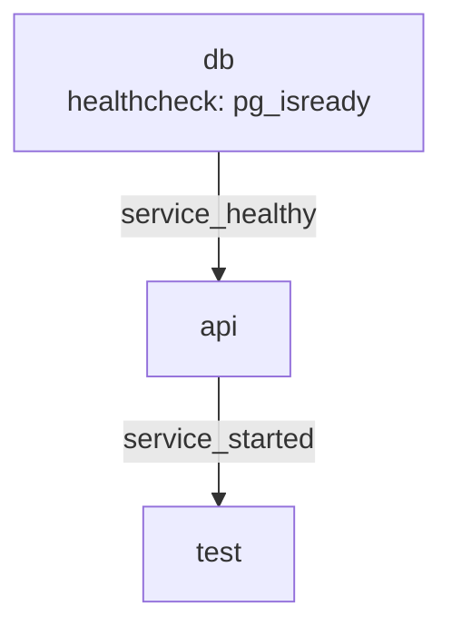
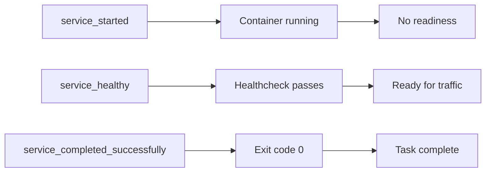

<!-- header start -->

<a href="https://stackoverflow.com/users/1755598/codewizard"></a>&emsp;&emsp;[](https://www.linkedin.com/in/nirgeier/)&emsp;[](mailto:nirgeier@gmail.com)&emsp;[](mailto:nirg@codewizard.co.il)

<!-- header end -->

---

# Docker Compose Integration Testing - Test Services in Containers

- This lab teaches you how to **run integration tests inside Docker Compose** using dedicated test services.
- You'll learn about exit code propagation, healthcheck chaining, parallel test execution, and CI pipeline patterns.
- Each concept includes a **standalone example** you can run and inspect.

---


[](https://console.cloud.google.com/cloudshell/editor?cloudshell_git_repo=https://github.com/nirgeier/DockerComposeLabs)

**<kbd>CTRL</kbd> + click to open in new window**

---

[](014-IntegrationTesting.zip)

---

## Table of Contents

- [Docker Compose Integration Testing - Test Services in Containers](#docker-compose-integration-testing---test-services-in-containers)
  - [**CTRL + click to open in new window**](#ctrl--click-to-open-in-new-window)
  - [Table of Contents](#table-of-contents)
  - [Why Run Tests in Docker Compose?](#why-run-tests-in-docker-compose)
  - [Core Concepts](#core-concepts)
    - [Test as a Service](#test-as-a-service)
    - [Exit Codes and `service_completed_successfully`](#exit-codes-and-service_completed_successfully)
    - [The `--exit-code-from` Flag](#the---exit-code-from-flag)
    - [Healthcheck-Based Dependency Chains](#healthcheck-based-dependency-chains)
  - [Example Walkthroughs](#example-walkthroughs)
    - [1. Basics - Simple App + HTTP Test](#1-basics---simple-app--http-test)
    - [2. Exit Codes - Pass, Fail, and Skip](#2-exit-codes---pass-fail-and-skip)
    - [3. Healthcheck Chain - Ordered Test Dependencies](#3-healthcheck-chain---ordered-test-dependencies)
    - [4. Parallel Execution - Run Tests Concurrently](#4-parallel-execution---run-tests-concurrently)
    - [5. CI Pipeline Pattern - Test Runner + Exit Code Propagation](#5-ci-pipeline-pattern---test-runner--exit-code-propagation)
  - [Dependency Management Patterns](#dependency-management-patterns)
    - [Basic `depends_on` (started only)](#basic-depends_on-started-only)
    - [`depends_on` with `condition: service_healthy`](#depends_on-with-condition-service_healthy)
    - [`depends_on` with `condition: service_completed_successfully`](#depends_on-with-condition-service_completed_successfully)
  - [CI Pipeline Integration](#ci-pipeline-integration)
    - [GitHub Actions Example](#github-actions-example)
    - [GitLab CI Example](#gitlab-ci-example)
    - [Jenkins Pipeline Example](#jenkins-pipeline-example)
  - [Best Practices](#best-practices)
  - [Troubleshooting](#troubleshooting)
  - [Hands-On Tasks](#hands-on-tasks)
    - [Task 1: Run the Basic Test](#task-1-run-the-basic-test)
    - [Task 2: Observe Exit Code Propagation](#task-2-observe-exit-code-propagation)
    - [Task 3: Chained Healthcheck Dependencies](#task-3-chained-healthcheck-dependencies)
    - [Task 4: Parallel Test Execution](#task-4-parallel-test-execution)
    - [Task 5: Build a CI Pipeline Test](#task-5-build-a-ci-pipeline-test)
  - [Verification Checklist](#verification-checklist)
  - [Additional Resources](#additional-resources)
  - [Cleanup](#cleanup)
  - [Next Steps](#next-steps)

---

## Why Run Tests in Docker Compose?

Running integration tests inside Docker Compose gives you:

| Benefit | Description |
|---------|-------------|
| **Isolated environment** | Tests run in fresh containers - no host pollution |
| **Real dependencies** | Databases, caches, and APIs are real, not mocks |
| **Reproducible** | Same environment everywhere - dev, CI, prod |
| **Parallel execution** | Run unit, API, DB, and E2E tests concurrently |
| **Exit code propagation** | Compose exit code reflects test pass/fail status |
| **CI-native** | Works with any CI system that supports Docker |

---

## Core Concepts

### Test as a Service

In Docker Compose, a **test is just another service**. Instead of a long-running web server, a test service runs a script and exits.

```yaml
services:
  test:
    image: alpine:latest
    command: >
      sh -c "
        apk add --no-cache curl &&
        curl -sf http://app:80 &&
        echo 'TEST PASSED'
      "
    depends_on:
      - app
```

When the test command exits with `0`, the test passes. Any non-zero exit means failure.

### Exit Codes and `service_completed_successfully`

Docker Compose v2 supports a special dependency condition:

```yaml
services:
  integration-tests:
    image: myapp:tests
    depends_on:
      db-migration:
        condition: service_completed_successfully
```

This tells Compose: *"Wait for `db-migration` to finish with exit code 0 before starting `integration-tests`."* If the migration fails, the test is never started.

### The `--exit-code-from` Flag

```bash
docker compose up --exit-code-from test
```

This flag **propagates the exit code** of the named service as Docker Compose's own exit code. Without it, `docker compose up` always exits `0` because all services are managed together. With `--exit-code-from test`:

| Service exit code | `docker compose` exit code | CI result |
|-------------------|---------------------------|-----------|
| 0 | 0 | ✅ Pass |
| 1 (or any non-zero) | 1 | ❌ Fail |

In CI, this is essential - the pipeline sees Compose's exit code and knows whether tests passed.

### Healthcheck-Based Dependency Chains

Healthchecks tell Docker *when a service is truly ready*, not just when it started. Combined with `depends_on` conditions, they create reliable startup chains:



```yaml
services:
  db:
    image: postgres:16-alpine
    healthcheck:
      test: ["CMD-SHELL", "pg_isready -U postgres"]
      interval: 3s
      timeout: 3s
      retries: 15
      start_period: 5s

  api:
    image: myapp:latest
    depends_on:
      db:
        condition: service_healthy   # Wait for DB healthcheck

  test:
    image: alpine:latest
    depends_on:
      api:
        condition: service_started   # Start after api container starts
```

The chain: **db → healthy → api → started → test**. Each link waits for the previous condition.

---

## Example Walkthroughs

### 1. Basics - Simple App + HTTP Test

**File:** `examples/basics/docker-compose.yaml`

A minimal integration test: start an Nginx server, then run a curl-based health check.

```bash
cd examples/basics
docker compose up --exit-code-from test
```

**What happens:**

1. `app` (nginx:alpine) starts on port 8201
2. `test` installs curl, polls `http://app:80` until ready
3. Test checks for HTTP 200 response
4. Exits 0 (pass) or 1 (fail)
5. `--exit-code-from test` propagates that exit code

**Expected output:**

```
test-1  | App is healthy!
test-1  | TEST PASSED: Got HTTP 200
test-1 exited with code 0
```

### 2. Exit Codes - Pass, Fail, and Skip

**File:** `examples/exit-codes/docker-compose.yaml`

Demonstrates how different exit codes affect Compose behavior.

```bash
cd examples/exit-codes
docker compose up --exit-code-from test-fail
```

| Service | Exit Code | Behavior |
|---------|-----------|----------|
| `test-pass` | 0 | Simulates a passing test suite |
| `test-fail` | 1 | Simulates a failing test - exits non-zero |
| `test-skip` | 0 | Simulates a skipped test (no assertion needed) |

**Key observation:** `docker compose up` with `--exit-code-from test-fail` will exit with code 1. Other services continue unaffected.

Try running with `test-pass` to see a clean CI pass:

```bash
docker compose up --exit-code-from test-pass
```

### 3. Healthcheck Chain - Ordered Test Dependencies

**File:** `examples/healthcheck-chain/docker-compose.yaml`

Demonstrates a multi-tier dependency chain with healthchecks.

```bash
cd examples/healthcheck-chain
docker compose up --exit-code-from test-api
```

**Dependency graph:**

```
db ──(service_healthy)──→ api ──(service_started)──→ test-api
  └──(service_healthy)──→ test-db
```

- `db` reports healthy via `pg_isready`
- `api` starts only after `db` is healthy
- `test-api` runs after `api` starts (waits for HTTP)
- `test-db` runs after `db` is healthy (checks replication)

**What makes this powerful:** If `db` never becomes healthy, `api`, `test-api`, and `test-db` never start. Failures are contained and cascading dependency issues are surfaced immediately.

### 4. Parallel Execution - Run Tests Concurrently

**File:** `examples/parallel/docker-compose.yaml`

Run multiple test suites at the same time for faster feedback.

```bash
cd examples/parallel
docker compose up --exit-code-from test-e2e
```

**Test services:**

| Service | Waits For | Duration | Type |
|---------|-----------|----------|------|
| `test-unit` | (none) | ~3s | Fast, no dependencies |
| `test-api` | `app` (started) | ~3s | Needs web server |
| `test-db` | `db` (healthy) | ~3s | Needs database |
| `test-e2e` | `app` + `db` | ~5s | Needs everything |

Since `test-unit` has no dependencies, it starts immediately. `test-api` and `test-db` start in parallel once their dependencies are ready. `test-e2e` waits for both `app` and `db`.

**Total wall time:** ~5s (the slowest test) instead of ~14s if run sequentially.

### 5. CI Pipeline Pattern - Test Runner + Exit Code Propagation

**File:** `examples/ci-pipeline/`

This pattern mirrors a production CI pipeline where a test runner service coordinates execution and propagates exit codes.

> **Note:** The `ci-pipeline` example directory is a template for you to build your own CI-ready test setup. Use it as a starting point for the hands-on tasks.

```yaml
# Conceptual structure of a CI pipeline in Compose
services:
  # ── Infrastructure ──────────────────────────────
  db:
    image: postgres:16-alpine
    healthcheck:
      test: ["CMD-SHELL", "pg_isready -U postgres"]

  app:
    image: myapp:latest
    depends_on:
      db:
        condition: service_healthy

  # ── Test Runner ──────────────────────────────────
  test-runner:
    build: ./tests
    environment:
      - DB_URL=postgres://postgres:test@db:5432/mydb
      - API_URL=http://app:8080
    depends_on:
      app:
        condition: service_started
      db:
        condition: service_healthy
```

The key CI insight: **`docker compose up --exit-code-from test-runner`** provides the CI system with a single exit code - pass (0) or fail (non-zero).

---

## Dependency Management Patterns

### Basic `depends_on` (started only)

```yaml
depends_on:
  - app
```

Starts `test` after `app` container begins running. No guarantee `app` is ready for traffic.

### `depends_on` with `condition: service_healthy`

```yaml
depends_on:
  db:
    condition: service_healthy
```

Starts `test` only after `db` passes its healthcheck. Requires `healthcheck` block on the target service.

### `depends_on` with `condition: service_completed_successfully`

```yaml
depends_on:
  db-migration:
    condition: service_completed_successfully
```

Starts `test` only after `db-migration` exits with code 0. Available in Docker Compose v2+.



---

## CI Pipeline Integration

Docker Compose testing fits naturally into any CI system. The same `docker compose` commands work everywhere.

### GitHub Actions Example

```yaml
jobs:
  integration-tests:
    runs-on: ubuntu-latest
    steps:
      - uses: actions/checkout@v4

      - name: Run integration tests
        run: |
          cd examples/basics
          docker compose up --exit-code-from test --abort-on-container-exit

      - name: Cleanup
        if: always()
        run: docker compose down
```

The `--abort-on-container-exit` flag stops all containers when any single container exits (useful to prevent orphaned services in CI).

### GitLab CI Example

```yaml
integration-tests:
  stage: test
  script:
    - cd examples/basics
    - docker compose up --exit-code-from test --abort-on-container-exit
  after_script:
    - docker compose down
  tags:
    - docker
```

### Jenkins Pipeline Example

```groovy
stage('Integration Tests') {
    agent { label 'docker' }
    steps {
        dir('examples/basics') {
            sh 'docker compose up --exit-code-from test --abort-on-container-exit'
        }
    }
    post {
        always {
            sh 'docker compose down'
        }
    }
}
```

**Pro tips for CI:**

- Always use `--abort-on-container-exit` to stop all services when a test finishes
- Add `--remove-orphans` to clean up stale containers
- Use `docker compose down --volumes` in `always`/`finally` blocks

---

## Best Practices

**1. Design tests as services**

```yaml
services:
  test:
    build: ./tests        # Dedicated test image
    depends_on:
      app:
        condition: service_healthy
```

**2. Always use `--exit-code-from`**

```bash
docker compose up --exit-code-from test
```

**3. Use healthchecks for readiness**

```yaml
healthcheck:
  test: ["CMD", "curl", "-f", "http://localhost/health"]
  interval: 5s
  timeout: 3s
  retries: 5
  start_period: 10s
```

**4. Parallelize independent test suites**
Split tests by dependency: unit tests need nothing, API tests need the web server, DB tests need the database. Run them in parallel for faster feedback.

**5. Clean up in CI with `--abort-on-container-exit`**

```bash
docker compose up --exit-code-from test --abort-on-container-exit
docker compose down --volumes
```

**6. Use `service_completed_successfully` for one-time setup**

```yaml
services:
  db-migrate:
    image: myapp:migrations
    depends_on:
      db:
        condition: service_healthy

  test:
    image: myapp:tests
    depends_on:
      db-migrate:
        condition: service_completed_successfully
```

**7. Log test output for debugging**

```bash
docker compose logs test > test-output.log
```

---

## Troubleshooting

| Problem | Solution |
|---------|----------|
| Test container exits before app is ready | Add a retry loop with `until curl -sf http://app:80; do sleep 1; done` |
| `depends_on` starts test too early | Add `condition: service_healthy` and a healthcheck block |
| Exit code is always 0 in CI | Use `--exit-code-from <test-service>` to propagate exit code |
| `service_completed_successfully` error | Requires Docker Compose v2.20+ |
| Tests pass locally but fail in CI | Check network mode, volume mounts, and environment variables |
| Containers left running after CI failure | Add `docker compose down` to `always`/`finally` in your pipeline |
| Parallel tests race on shared resources | Use separate databases or namespaces per test suite |

---

## Hands-On Tasks

### Task 1: Run the Basic Test

```bash
cd examples/basics

# Start and see the test pass
docker compose up --exit-code-from test

# Now break the app and watch the test fail
docker compose down

# Edit the port to simulate a broken app, then re-run
docker compose up --exit-code-from test
```

### Task 2: Observe Exit Code Propagation

```bash
cd examples/exit-codes

# This should PASS (exit 0)
docker compose up --exit-code-from test-pass; echo "Exit code: $?"

# This should FAIL (exit 1)
docker compose up --exit-code-from test-fail; echo "Exit code: $?"

# Check non-service-exit-code service
docker compose run --rm test-pass; echo "Exit code: $?"
```

### Task 3: Chained Healthcheck Dependencies

```bash
cd examples/healthcheck-chain

# Run and observe the startup order
docker compose up --exit-code-from test-api -d

# Watch health status transitions
docker compose ps --watch

# See what happens if db never becomes healthy
docker compose stop db
docker compose ps

# Clean up
docker compose down
```

### Task 4: Parallel Test Execution

```bash
cd examples/parallel

# Run all tests in parallel
docker compose up --exit-code-from test-e2e

# Observe timing: the slowest test determines total time
docker compose logs | grep -E "(test-unit|test-api|test-db|test-e2e)"
```

### Task 5: Build a CI Pipeline Test

```bash
cd examples/ci-pipeline

# Create a simple test runner
cat > docker-compose.yaml << 'EOF'
services:
  db:
    image: postgres:16-alpine
    environment:
      POSTGRES_PASSWORD: test
    healthcheck:
      test: ["CMD-SHELL", "pg_isready -U postgres"]
      interval: 3s
      timeout: 3s
      retries: 10
      start_period: 5s

  app:
    image: nginx:alpine
    ports:
      - "8205:80"
    depends_on:
      db:
        condition: service_healthy

  test-runner:
    image: alpine:latest
    command: >
      sh -c "
        apk add --no-cache curl postgresql-client &&
        until curl -sf http://app:80; do sleep 1; done &&
        echo '✓ App responds on HTTP' &&
        until pg_isready -h db -U postgres; do sleep 1; done &&
        echo '✓ DB is accepting connections' &&
        echo 'ALL CI TESTS PASSED'
      "
    depends_on:
      - app
EOF

# Run it like a CI pipeline would
docker compose up --exit-code-from test-runner --abort-on-container-exit
docker compose down
```

---

## Verification Checklist

- [ ] I understand how to run tests as Docker Compose services
- [ ] I can use `--exit-code-from` to propagate test results
- [ ] I know the difference between `service_started`, `service_healthy`, and `service_completed_successfully`
- [ ] I can define healthchecks and chain dependencies between services
- [ ] I can run multiple test suites in parallel
- [ ] I understand how exit codes map to CI pass/fail results
- [ ] I can clean up containers and volumes after tests
- [ ] I can integrate `docker compose up --exit-code-from` into GitHub Actions, GitLab CI, or Jenkins

---

## Additional Resources

- [Docker Compose Integration Testing Guide](https://docs.docker.com/compose/integration-tests/)
- [Docker Compose `depends_on` Reference](https://docs.docker.com/compose/compose-file/05-services/#depends_on)
- [Docker Healthchecks](https://docs.docker.com/engine/reference/builder/#healthcheck)
- [Docker Compose CLI Reference](https://docs.docker.com/compose/reference/)
- [Using Compose in CI/CD](https://docs.docker.com/compose/ci/)

---

## Cleanup

```bash
# Stop all running containers from this lab
docker compose -f examples/basics/docker-compose.yaml down
docker compose -f examples/exit-codes/docker-compose.yaml down
docker compose -f examples/healthcheck-chain/docker-compose.yaml down
docker compose -f examples/parallel/docker-compose.yaml down
docker compose -f examples/ci-pipeline/docker-compose.yaml down

# Remove any dangling test containers
docker container prune --force --filter "label=com.docker.compose.project=014-integrationtesting"
```

---

## Next Steps

- **Learn how to build custom test images** with pre-installed tools (curl, jq, database clients) for faster test startup.
- **Explore service virtualization** - mock external APIs using tools like WireMock or Mountebank inside Compose.
- **Combine with healthcheck fragments** from [Lab 009 - Fragments](../009-Fragments/README.md) to reduce boilerplate.
- **Add volume mounts** for test reports and coverage output that survives container teardown.
- **Try multi-stage test pipelines** - lint → unit → integration → E2E - each as a separate Compose service with `service_completed_successfully`.
