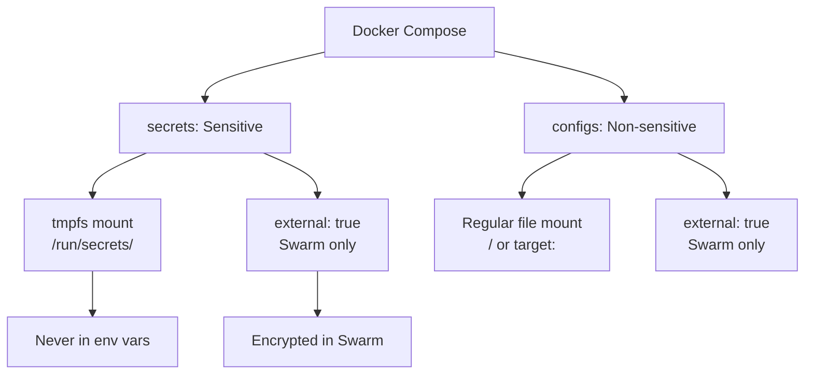
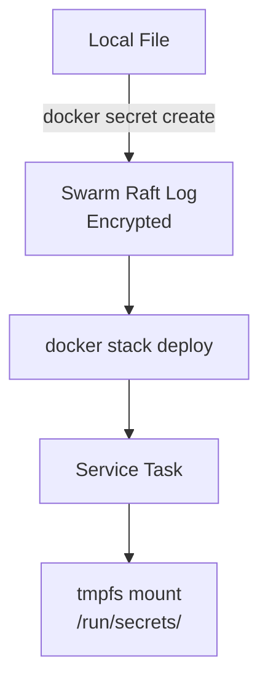
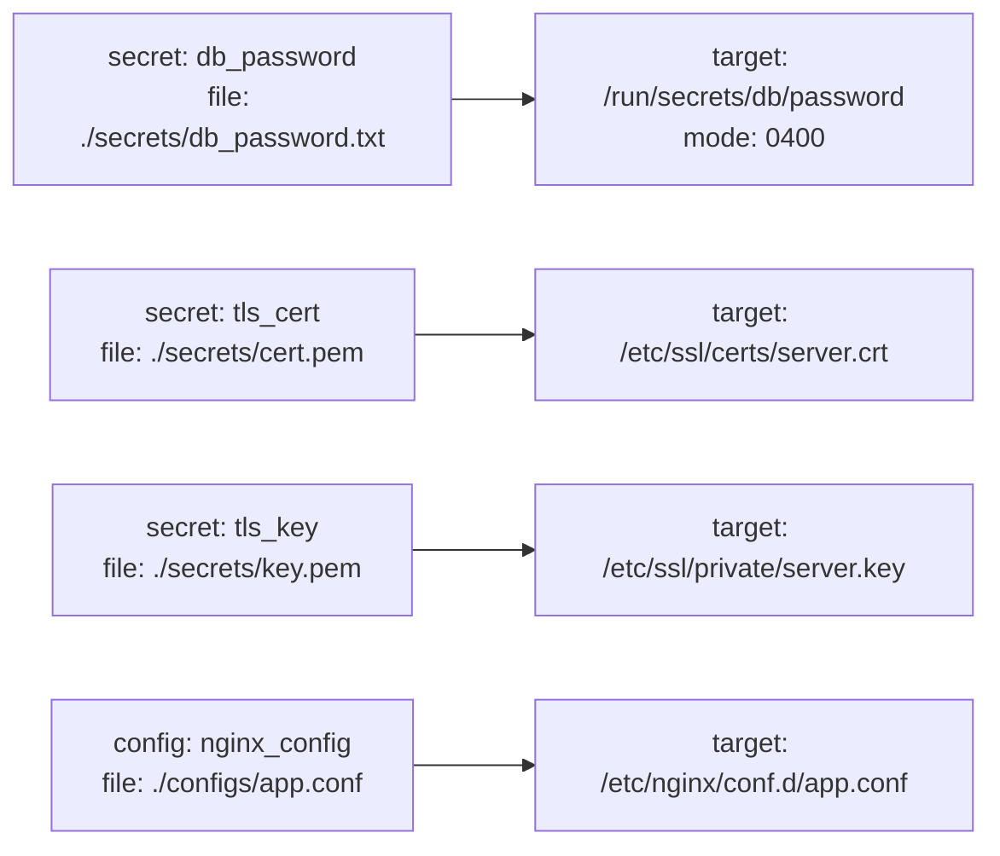

<!-- header start -->

<a href="https://stackoverflow.com/users/1755598/codewizard"></a>&emsp;&emsp;[](https://www.linkedin.com/in/nirgeier/)&emsp;[](mailto:nirgeier@gmail.com)&emsp;[](mailto:nirg@codewizard.co.il)

<!-- header end -->

---

# Docker Compose Secrets & Configs Management

- This lab teaches you how to manage **sensitive data** (passwords, API keys, TLS certificates) and **non-sensitive configuration** (config files, env vars) using Docker Compose's `secrets:` and `configs:` top-level keys.
- You'll learn the difference between **file-based** and **external** sources, how to set **custom target paths** and **file modes**, and when to use `env_file` as a simpler alternative.
- Each concept includes a **standalone example** and builds toward understanding production-ready secret and config management.

---


[](https://console.cloud.google.com/cloudshell/editor?cloudshell_git_repo=https://github.com/nirgeier/DockerComposeLabs)

**<kbd>CTRL</kbd> + click to open in new window**

---

[](015-SecretsConfigs.zip)

---

## Table of Contents

- [Docker Compose Secrets & Configs Management](#docker-compose-secrets--configs-management)
  - [**CTRL + click to open in new window**](#ctrl--click-to-open-in-new-window)
  - [Table of Contents](#table-of-contents)
  - [What Are Docker Secrets and Configs?](#what-are-docker-secrets-and-configs)
  - [Example 1: File-Based Secrets (Basics)](#example-1-file-based-secrets-basics)
  - [Example 2: External Secrets (Docker Swarm)](#example-2-external-secrets-docker-swarm)
  - [Example 3: Advanced - Target Paths, Modes, and Configs](#example-3-advanced---target-paths-modes-and-configs)
  - [Example 4: External Configs](#example-4-external-configs)
  - [Example 5: env_file as a Secrets Alternative](#example-5-env_file-as-a-secrets-alternative)
  - [Security Best Practices](#security-best-practices)
  - [Docker Swarm vs Compose Standalone Behavior](#docker-swarm-vs-compose-standalone-behavior)
  - [Summary Cheat Sheet](#summary-cheat-sheet)
  - [Next Steps](#next-steps)
  - [Cleanup](#cleanup)

---

## What Are Docker Secrets and Configs?

Docker Compose provides two top-level keys for managing data that services need at runtime:

| Feature | `secrets:` | `configs:` |
|---------|-----------|------------|
| **Purpose** | Sensitive data (passwords, keys, tokens) | Non-sensitive config (conf files, env templates) |
| **Default mount** | `/run/secrets/<name>` | `/<name>` (or custom `target:`) |
| **In-memory (tmpfs)** | Yes (never written to container filesystem) | No (regular file mount) |
| **`external: true`** | Requires Docker Swarm | Requires Docker Swarm |
| **`mode:` permission** | Supported | Supported |



**Key concept:** Secrets are **never stored in the image or in environment variables** - they are mounted as tmpfs files inside the container at runtime. Configs work similarly but are intended for non-sensitive data and do not use tmpfs.

---

## Example 1: File-Based Secrets (Basics)

**Directory:** `examples/basics/`

The most common pattern - define secrets with `file:` pointing to local files on the host:

```yaml
services:
  web:
    image: nginx:alpine
    ports:
      - "8205:80"
    secrets:
      - tls_cert
      - tls_key
      - api_key

secrets:
  tls_cert:
    file: ./secrets/cert.pem
  tls_key:
    file: ./secrets/key.pem
  api_key:
    file: ./secrets/api_key.txt
```

```bash
cd examples/basics
docker compose up -d
docker compose exec web ls -la /run/secrets/
docker compose exec web cat /run/secrets/api_key
docker compose down
```

Each secret is mounted as a file under `/run/secrets/` with the secret name as the filename. The container sees `tls_cert`, `tls_key`, and `api_key` as read-only files.

**Source files:**

| Secret | File | Content Type |
|--------|------|-------------|
| `tls_cert` | `secrets/cert.pem` | TLS certificate |
| `tls_key` | `secrets/key.pem` | TLS private key |
| `api_key` | `secrets/api_key.txt` | API key string |

---

## Example 2: External Secrets (Docker Swarm)

**Directory:** `examples/external-secrets/`

When `external: true` is set, Docker Compose expects the secret to already exist in a Docker Swarm cluster - it will **not** create the secret from a file.

```yaml
services:
  app:
    image: nginx:alpine
    ports:
      - "8206:80"
    secrets:
      - db_password
      - jwt_secret

secrets:
  db_password:
    external: true
  jwt_secret:
    external: true
```

```bash
# This will FAIL unless secrets exist in Swarm
docker compose up -d
```

**To test this example**, you must first create the secrets in a Swarm cluster:

```bash
# Initialize Swarm (if not already)
docker swarm init

# Create the secrets
echo "MyDBPass123!" | docker secret create db_password -
echo "jwt-secret-key-abc" | docker secret create jwt_secret -

# Now deploy the stack
docker stack deploy -c docker-compose.yaml secrets-demo

# Verify
docker service ps secrets-demo_app
```



**Without Swarm**, `docker compose up` will fail with: `"secret db_password is declared as external, but could not be found"`.

---

## Example 3: Advanced - Target Paths, Modes, and Configs

**Directory:** `examples/advanced/`

This example demonstrates fine-grained control over **where** secrets are mounted, **file permissions**, and how `configs:` work for non-sensitive data.



```yaml
services:
  app:
    image: nginx:alpine
    ports:
      - "8207:80"
    secrets:
      - source: db_password
        target: /run/secrets/db/password
        mode: 0400
      - source: api_key
        target: /run/secrets/api/key
        mode: 0440
      - source: tls_cert
        target: /etc/ssl/certs/server.crt
      - source: tls_key
        target: /etc/ssl/private/server.key
    environment:
      DB_PASSWORD_FILE: /run/secrets/db/password
      API_KEY_FILE: /run/secrets/api/key

  config-consumer:
    image: alpine:latest
    command: >
      sh -c "
        ls -la /etc/nginx/conf.d/ &&
        cat /etc/nginx/conf.d/app.conf
      "
    configs:
      - source: nginx_config
        target: /etc/nginx/conf.d/app.conf
      - source: logging_config
        target: /etc/nginx/conf.d/logging.conf

secrets:
  db_password:
    file: ./secrets/db_password.txt
  api_key:
    file: ./secrets/api_key.txt
  tls_cert:
    file: ./secrets/cert.pem
  tls_key:
    file: ./secrets/key.pem

configs:
  nginx_config:
    file: ./configs/app.conf
  logging_config:
    file: ./configs/logging.conf
```

```bash
cd examples/advanced

# Create additional secret files used in this example
echo "SuperS3cretP@ss!" > secrets/db_password.txt
cp ../basics/secrets/cert.pem secrets/
cp ../basics/secrets/key.pem secrets/

docker compose up -d
docker compose exec app ls -la /run/secrets/db/ /run/secrets/api/
docker compose exec app cat /run/secrets/db/password
docker compose run config-consumer
docker compose down
```

**Key techniques demonstrated:**

| Feature | Syntax | Effect |
|---------|--------|--------|
| **Custom target** | `target: /run/secrets/db/password` | Override default `/run/secrets/<name>` path |
| **File mode** | `mode: 0400` | Owner-read-only (octal, 4 digits) |
| **Configs** | `configs:` → `file:` | Mount non-sensitive config files anywhere |
| **PATH pattern** | `DB_PASSWORD_FILE: /run/secrets/...` | Apps read secret path from env var instead of hardcoding |

---

## Example 4: External Configs

**Directory:** `examples/external-configs/`

Configs can also be declared `external: true` - they must already exist in a Docker Swarm cluster, just like external secrets.

```yaml
services:
  app:
    image: nginx:alpine
    ports:
      - "8208:80"
    configs:
      - source: nginx_common
        target: /etc/nginx/conf.d/default.conf
      - source: rate_limit
        target: /etc/nginx/conf.d/rate_limit.conf
    secrets:
      - app_secret

configs:
  nginx_common:
    external: true
  rate_limit:
    external: true
    external_keys:
      name: "rate_limit_v2"

secrets:
  app_secret:
    external: true
```

```bash
# This requires Swarm secrets/configs to exist
docker config create nginx_common ./configs/default.conf
docker config create rate_limit_v2 ./configs/rate_limit.conf
docker secret create app_secret ./secrets/app_secret.txt

docker stack deploy -c docker-compose.yaml ext-config-demo
```

**The `external_keys` property** allows you to map a config name in the compose file (`rate_limit`) to a different external name (`rate_limit_v2`). This is useful when the external resource name differs from the local reference name.

---

## Example 5: env_file as a Secrets Alternative

**Directory:** `examples/env-file-alternative/`

For simple cases, `env_file` combined with the `environment:` secret source provides a lightweight alternative without needing file-based secrets.

```yaml
services:
  app:
    image: alpine:latest
    command: >
      sh -c "
        echo 'APP_SECRET=super_secret_123' > /run/secrets/app_secret &&
        cat /run/secrets/app_secret &&
        env | grep APP_
      "
    env_file:
      - ./configs/app.env
    secrets:
      - app_secret

secrets:
  app_secret:
    environment: APP_SECRET
```

```bash
cd examples/env-file-alternative

# The app.env file contains non-sensitive defaults
cat configs/app.env
# APP_NAME=MyDemoApp
# APP_ENV=development
# LOG_LEVEL=debug
# CACHE_TTL=300

docker compose up -d
docker compose logs app
docker compose down
```

**Important trade-offs:**

| Approach | Best For | Security |
|----------|----------|----------|
| `secrets:` with `file:` | Passwords, keys, tokens | Mounted as tmpfs - not in env vars |
| `secrets:` with `environment:` | Single env var as secret | Value passed via env, visible in `docker inspect` |
| `env_file:` | Non-sensitive config | Stored in container env, visible in logs/inspect |

> **Never use `env_file` or `environment` for actual secrets** - environment variables are visible in `docker inspect`, logs, and debug commands. Use `file:`-based secrets for anything sensitive.

---

## Security Best Practices

**1. Never commit secret files to version control**

```gitignore
# .gitignore
**/secrets/**/*.txt
**/secrets/**/*.pem
**/secrets/**/*.key
*.env
```

**2. Use `.env` for defaults only**

```bash
# .env - safe to commit (no real secrets)
DB_NAME=myapp
APP_ENV=development

# Secrets are in files excluded by .gitignore
```

**3. Prefer file-based secrets over environment variables**

```yaml
# ❌ BAD - secret visible in docker inspect
environment:
  DB_PASSWORD: SuperS3cretP@ss!

# ✅ GOOD - secret mounted as tmpfs file
secrets:
  db_password:
    file: ./secrets/db_password.txt
```

**4. Use strict file modes**

```yaml
secrets:
  api_key:
    file: ./secrets/api_key.txt
    mode: 0400   # Owner read-only
```

- `0400` - owner read-only (strictest for secrets)
- `0440` - owner + group read (shared between processes in same group)
- `0444` - world-readable (avoid for secrets)

**5. Least-privilege access**

- Only grant secrets to services that absolutely need them
- Use different secrets for different services
- Rotate secrets regularly - never reuse across environments

**6. Production: use external secrets**

In production with Docker Swarm or Kubernetes:

- Secrets are encrypted at rest and in transit
- Access is controlled by Swarm/K8s RBAC
- Rotation is handled by the orchestrator, not file replacements

---

## Docker Swarm vs Compose Standalone Behavior

| Feature | `docker compose` (Standalone) | `docker stack` (Swarm) |
|---------|------------------------------|------------------------|
| `secrets:` with `file:` | ✅ Works - mounts tmpfs files | ✅ Works |
| `secrets:` with `external: true` | ❌ Fails - secret not found | ✅ Requires pre-created secret |
| `configs:` with `file:` | ✅ Works (Compose v2.3+) | ✅ Works |
| `configs:` with `external: true` | ❌ Fails | ✅ Requires pre-created config |
| `mode:` permission | ✅ Supported | ✅ Supported |
| `target:` custom path | ✅ Supported | ✅ Supported |
| `external_keys:` | ❌ Not available | ✅ Supported |
| Encryption at rest | ❌ Not encrypted | ✅ Encrypted in Swarm Raft log |
| Secret rotation | Manual (file replacement) | Managed via `docker secret` commands |

> **Bottom line:** For local development, use `file:`-based secrets and configs. For production, use `external: true` with Docker Swarm or a dedicated secrets manager.

---

## Summary Cheat Sheet

```yaml
# ── File-based secret ───────────────────────────────
secrets:
  my_secret:
    file: ./secrets/secret.txt

# ── External secret (Swarm) ─────────────────────────
secrets:
  my_secret:
    external: true

# ── Secret with custom target + mode ────────────────
secrets:
  my_secret:
    file: ./secrets/secret.txt
    target: /app/config/secret
    mode: 0400

# ── Secret from environment variable ────────────────
secrets:
  my_secret:
    environment: MY_SECRET_ENV_VAR

# ── File-based config ───────────────────────────────
configs:
  app_config:
    file: ./configs/app.conf

# ── External config (Swarm) ─────────────────────────
configs:
  app_config:
    external: true
    external_keys:
      name: "app_config_v2"

# ── Grant secret/config to a service ────────────────
services:
  app:
    secrets:
      - my_secret
    configs:
      - source: app_config
        target: /etc/app/config.ini
```

---

## Next Steps

Now that you understand secrets and configs management:

1. **Explore the fragments lab** - see how secrets can be turned into reusable YAML anchors: [Lab 009 - Fragments](../009-Fragments/README.md)
2. **Try the advanced example** - combine secrets with custom targets and modes in `examples/advanced/`
3. **Add secrets to your own projects** - replace hardcoded env vars with `file:`-based secrets
4. **Read about Swarm secrets** - learn about encryption at rest and rotation: [Docker Secrets Guide](https://docs.docker.com/engine/swarm/secrets/)
5. **Study the env_file pattern** - understand when it's appropriate vs when to use real secrets

---

## Cleanup

```bash
# Stop all running containers from this lab
docker compose -f examples/basics/docker-compose.yaml down
docker compose -f examples/advanced/docker-compose.yaml down
docker compose -f examples/env-file-alternative/docker-compose.yaml down

# Remove any leftover containers
docker compose -f examples/external-secrets/docker-compose.yaml down 2>/dev/null
docker compose -f examples/external-configs/docker-compose.yaml down 2>/dev/null
```
