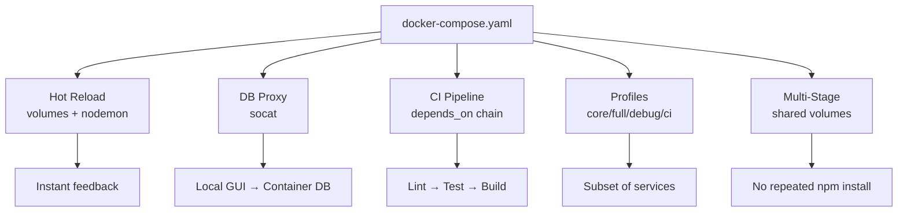
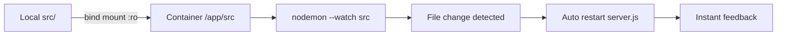
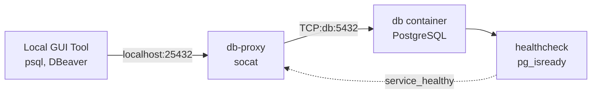
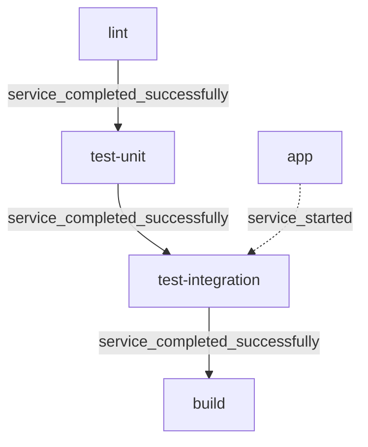
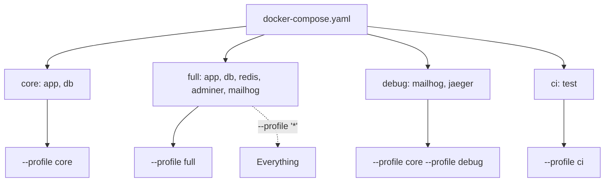
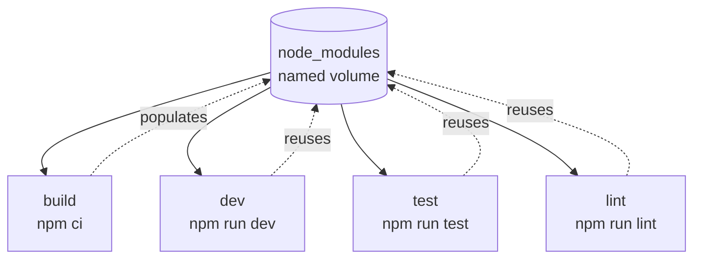
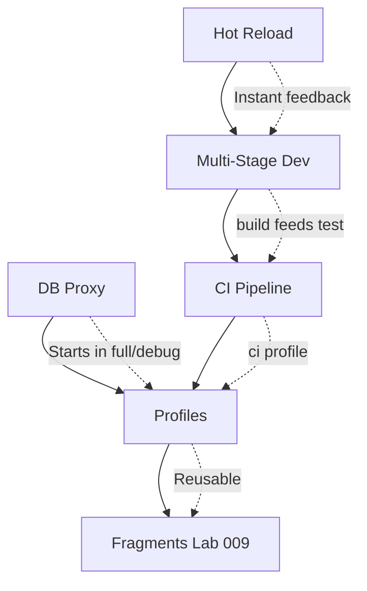

<!-- header start -->

<a href="https://stackoverflow.com/users/1755598/codewizard"></a>&emsp;&emsp;[](https://www.linkedin.com/in/nirgeier/)&emsp;[](mailto:nirgeier@gmail.com)&emsp;[](mailto:nirg@codewizard.co.il)

<!-- header end -->

---

# Local Development Workflows with Docker Compose

- This lab teaches you how to use **Docker Compose** to build efficient local development workflows.
- You'll learn patterns for **hot reload**, **service profiles**, **CI pipeline chaining**, **multi-stage development**, and **database proxy tunneling** - all from a single compose file.

---


[](https://console.cloud.google.com/cloudshell/editor?cloudshell_git_repo=https://github.com/nirgeier/DockerComposeLabs)

**<kbd>CTRL</kbd> + click to open in new window**

---

[](016-DevWorkflows.zip)

---

## Table of Contents

- [Local Development Workflows with Docker Compose](#local-development-workflows-with-docker-compose)
  - [**CTRL + click to open in new window**](#ctrl--click-to-open-in-new-window)
  - [Table of Contents](#table-of-contents)
  - [Why Docker Compose for Local Development?](#why-docker-compose-for-local-development)
  - [1. Hot Reload with Volume Mounts](#1-hot-reload-with-volume-mounts)
    - [How It Works](#how-it-works)
    - [Try It](#try-it)
  - [2. Database Proxy with socat](#2-database-proxy-with-socat)
    - [How It Works](#how-it-works-1)
    - [Try It](#try-it-1)
  - [3. CI Pipeline Chaining](#3-ci-pipeline-chaining)
    - [How It Works](#how-it-works-2)
    - [Try It](#try-it-2)
  - [4. Service Profiles for Environment Separation](#4-service-profiles-for-environment-separation)
    - [How It Works](#how-it-works-3)
    - [Try It](#try-it-3)
    - [Available Profiles](#available-profiles)
  - [5. Multi-Stage Development](#5-multi-stage-development)
    - [How It Works](#how-it-works-4)
    - [Try It](#try-it-4)
  - [Connecting the Patterns](#connecting-the-patterns)
    - [Recommended Development Workflow](#recommended-development-workflow)
  - [Best Practices](#best-practices)
  - [Troubleshooting](#troubleshooting)
  - [Hands-On Tasks](#hands-on-tasks)
    - [Task 1: Hot Reload a Node App](#task-1-hot-reload-a-node-app)
    - [Task 2: Chain a CI Pipeline](#task-2-chain-a-ci-pipeline)
    - [Task 3: Profile-Based Environment Switching](#task-3-profile-based-environment-switching)
    - [Task 4: Multi-Stage Workflow](#task-4-multi-stage-workflow)
    - [Task 5: Combine Profiles with Hot Reload](#task-5-combine-profiles-with-hot-reload)
  - [Verification Checklist](#verification-checklist)
  - [Next Steps](#next-steps)

---

## Why Docker Compose for Local Development?

Docker Compose eliminates the "works on my machine" problem by giving every developer an identical, reproducible environment. Beyond that, it powers **local development workflows** that were traditionally handled by platform-specific tooling:

| Pattern | Problem It Solves | Compose Feature |
|---------|------------------|-----------------|
| Hot Reload | Manually restarting on code changes | Volume mounts + file watchers |
| DB Proxy | Connecting local tools to containerized DBs | socat TCP forwarding |
| CI Pipeline | Running a full CI chain locally | `depends_on` + completion conditions |
| Profiles | Multiple environments from one compose file | `profiles:` service attribute |
| Multi-Stage | Build, dev, test, lint in one stack | Named volumes + shared node_modules |



---

## 1. Hot Reload with Volume Mounts

**Directory:** `examples/hot-reload/`

Hot reload watches your source files and restarts the application automatically when changes are detected, giving you instant feedback during development.

### How It Works



```yaml
services:
  app:
    image: node:20-alpine
    working_dir: /app
    volumes:
      - ./src:/app/src:ro
    command: >
      sh -c "
        npm install -g nodemon &&
        nodemon --watch src server.js
      "
```

Key points:

- `volumes: ./src:/app/src:ro` mounts your local source directory into the container
- `nodemon` watches the mounted directory and restarts on file changes
- `:ro` (read-only) ensures the container doesn't mutate your source

### Try It

```bash
cd examples/hot-reload
mkdir -p src
echo "console.log('Hello from nodemon!');" > src/server.js
docker compose up
# Edit src/server.js and watch nodemon restart automatically
docker compose down
```

---

## 2. Database Proxy with socat

**Directory:** `examples/db-proxy/`

When your database runs inside a container, local GUI tools (DataGrip, DBeaver, psql) cannot connect directly. A **socat proxy** forwards a host port to the containerized database.

### How It Works



```yaml
services:
  db-proxy:
    image: alpine:latest
    command: >
      sh -c "
        apk add --no-cache socat &&
        socat TCP-LISTEN:5432,fork TCP:db:5432
      "
    ports:
      - "25432:5432"
    depends_on:
      db:
        condition: service_healthy
```

The `db-proxy` service listens on host port `25432` and forwards every connection to the `db` service on port `5432`. The `db` service uses a healthcheck so the proxy only starts once the database is ready.

### Try It

```bash
cd examples/db-proxy
docker compose up -d
# Connect from your local machine:
# psql -h localhost -p 25432 -U devuser -d devdb
docker compose down -v
```

---

## 3. CI Pipeline Chaining

**Directory:** `examples/ci-pipeline/`

Using `docker compose` with `depends_on` and completion conditions, you can model a full CI/CD pipeline that runs locally: lint → unit tests → integration tests → build.

### How It Works

```yaml
services:
  lint:
    image: alpine:latest
    command: ["echo", "Running linter..."]

  test-unit:
    depends_on:
      lint:
        condition: service_completed_successfully

  test-integration:
    depends_on:
      test-unit:
        condition: service_completed_successfully
      app:
        condition: service_started

  build:
    depends_on:
      test-integration:
        condition: service_completed_successfully

  app:
    image: nginx:alpine
    ports:
      - "8210:80"
```

The pipeline stages execute **sequentially** - each stage waits for the previous one to complete successfully. If any stage fails, downstream stages never start.



### Try It

```bash
cd examples/ci-pipeline
docker compose up --abort-on-container-exit
# Observe: lint → test-unit → app starts → test-integration → build
docker compose down
```

Use `--abort-on-container-exit` to stop the entire pipeline when any stage fails.

---

## 4. Service Profiles for Environment Separation

**Directory:** `examples/profiles/`

Profiles let you define every environment (dev, full, debug, CI) in a single compose file and choose which services start with `--profile`. This is a companion to the concepts introduced in [Lab 010 - Profiles](../010-Profiles/README.md).

### How It Works

```yaml
services:
  app:
    image: nginx:alpine
    profiles:
      - core
      - full

  db:
    image: postgres:16-alpine
    profiles:
      - core
      - full

  redis:
    image: redis:7-alpine
    profiles:
      - full

  mailhog:
    image: mailhog/mailhog
    profiles:
      - full
      - debug

  jaeger:
    image: jaegertracing/all-in-one:latest
    profiles:
      - debug

  test:
    image: alpine:latest
    profiles:
      - ci
```

### Available Profiles

| Profile | Services | Use Case |
|---------|----------|----------|
| `core` | app, db | Minimal stack for daily development |
| `full` | app, db, redis, adminer, mailhog | Full feature development |
| `debug` | mailhog, jaeger | Troubleshooting / observability |
| `ci` | test | CI pipeline runner |



### Try It

```bash
cd examples/profiles

# Core only (minimal)
docker compose --profile core up -d
docker compose ps

# Full development stack
docker compose --profile full up -d

# Debugging - add Jaeger + MailHog on top
docker compose --profile core --profile debug up -d
docker compose ps

# CI pipeline - run only the test service
docker compose --profile ci up --abort-on-container-exit

# Everything
docker compose --profile '*' up -d
docker compose down
```

**Core rule:** Services without a profile always start. Services with a profile start only when that profile is explicitly activated.

Refer to [Lab 010 - Profiles](../010-Profiles/README.md) for an in-depth guide on profile mechanics, combining profiles, and CI/CD integration.

---

## 5. Multi-Stage Development

**Directory:** `examples/multi-stage-dev/`

A single compose file models the entire development lifecycle - build, dev, test, lint - with a **shared `node_modules` volume** that avoids redundant `npm install` across stages.

### How It Works



```yaml
services:
  build:
    image: node:20-alpine
    working_dir: /build
    volumes:
      - .:/build
      - node_modules:/build/node_modules
    command: ["npm", "ci", "&&", "npm", "run", "build"]

  dev:
    image: node:20-alpine
    working_dir: /app
    volumes:
      - .:/app
      - node_modules:/app/node_modules
    command: ["npm", "run", "dev"]
    ports:
      - "8212:5173"

  test:
    image: node:20-alpine
    working_dir: /app
    volumes:
      - .:/app
      - node_modules:/app/node_modules
    command: ["npm", "run", "test"]

  lint:
    image: node:20-alpine
    working_dir: /app
    volumes:
      - .:/app
      - node_modules:/app/node_modules
    command: ["npm", "run", "lint"]
```

The `node_modules` named volume is shared across all stages:

- `build` populates it with `npm ci`
- `dev`, `test`, and `lint` all reuse the same installed packages
- No repeated `npm install`, no disk waste

### Try It

```bash
cd examples/multi-stage-dev

# Run all stages sequentially
docker compose up --abort-on-container-exit

# Or run only the dev server (assumes node_modules already exists)
docker compose up dev

# Run tests (after build)
docker compose run --rm build
docker compose run --rm test

docker compose down -v
```

---

## Connecting the Patterns

These five patterns are designed to work together. Here is how they combine in a real project:

| Pattern | Combined With | Benefit |
|---------|--------------|---------|
| Hot Reload | Multi-Stage Dev | Instant feedback during `dev` stage |
| DB Proxy | Profiles | Proxy only starts in `full` or `debug` profile |
| CI Pipeline | Profiles | `ci` profile runs the pipeline; core services stay out |
| Profiles | Fragments (Lab 009) | Reusable profile definitions across projects |
| Multi-Stage | CI Pipeline | Build stage feeds test stages; lint gates everything |



### Recommended Development Workflow

```bash
# 1. Start core development stack with hot reload
docker compose --profile core -f docker-compose.yaml -f examples/hot-reload/docker-compose.yaml up -d

# 2. Run lint + test before committing
docker compose --profile ci up --abort-on-container-exit

# 3. Full integration testing with all services
docker compose --profile full up -d

# 4. Debug a production issue
docker compose --profile core --profile debug up -d

# 5. Clean build from scratch
docker compose -f examples/multi-stage-dev/docker-compose.yaml up --abort-on-container-exit
```

---

## Best Practices

**1. Mount source as read-only in hot reload**

```yaml
volumes:
  - ./src:/app/src:ro    # :ro prevents accidental container writes
```

**2. Use healthchecks for proxy dependencies**

```yaml
depends_on:
  db:
    condition: service_healthy   # Don't start proxy until DB is ready
```

**3. Always use `--abort-on-container-exit` for pipelines**

```bash
docker compose up --abort-on-container-exit
```

Without this, Compose keeps running even if a stage fails.

**4. Share `node_modules` with a named volume**

```yaml
volumes:
  node_modules:            # Named volume, survives container restarts
```

The volume is populated once by the `build` stage and reused by `dev`, `test`, and `lint`.

**5. Combine profiles with fragments from Lab 009**
Using the centralized fragment library (see [Lab 009 - Fragments](../009-Fragments/README.md)), you can define profile fragments once and reuse them:

```yaml
x-profile-dev: &profile-dev
  profiles:
    - dev

x-profile-ci: &profile-ci
  profiles:
    - ci
```

**6. Never hardcode secrets - use `.env` files or Docker secrets**

```yaml
environment:
  DB_PASSWORD: ${DB_PASSWORD}   # From .env file
```

**7. Run pipelines deterministically - pin service versions**

```yaml
image: node:20-alpine        # Not node:latest
```

---

## Troubleshooting

| Problem | Solution |
|---------|----------|
| `nodemon` not detecting file changes | On macOS, ensure files are not on a VirtualBox-mounted volume; use `delegated` mount option |
| `socat: bind failed: Address already in use` | Change the host port (e.g., `25433:5432`) |
| Pipeline services run in wrong order | Check `depends_on` conditions use `service_completed_successfully` |
| `node_modules` missing in dev stage | Run the `build` stage first to populate the shared volume |
| `--profile core` starts all services | Services without a profile always start - add `profiles: []` to opt out |
| `connection refused` from proxy | The `db` healthcheck might need a longer `start_period` |
| CI pipeline never exits | Use `--abort-on-container-exit` so Compose stops when a stage completes or fails |

---

## Hands-On Tasks

### Task 1: Hot Reload a Node App

```bash
cd examples/hot-reload
mkdir -p src

# Create a simple server
cat > src/server.js << 'EOF'
const http = require('http');
const server = http.createServer((req, res) => {
  res.writeHead(200, { 'Content-Type': 'text/plain' });
  res.end('Hello from nodemon! (v1)\n');
});
server.listen(3000, () => console.log('Server running on port 3000'));
EOF

docker compose up -d
curl http://localhost:8209

# Edit the response text in src/server.js, then curl again
# nodemon auto-restarts the server

docker compose down
```

### Task 2: Chain a CI Pipeline

```bash
cd examples/ci-pipeline

# Run the full pipeline
docker compose up --abort-on-container-exit

# Simulate a failure by editing the lint service command
docker compose down
```

### Task 3: Profile-Based Environment Switching

```bash
cd examples/profiles

# Start core + debug
docker compose --profile core --profile debug up -d
docker compose ps
# Observe: app, db, mailhog, jaeger are running

# Switch to CI-only
docker compose down
docker compose --profile ci up --abort-on-container-exit

docker compose down
```

### Task 4: Multi-Stage Workflow

```bash
cd examples/multi-stage-dev

# Build and populate node_modules
docker compose run --rm build

# Run lint, then tests
docker compose run --rm lint
docker compose run --rm test

# Start dev server
docker compose up -d dev
curl http://localhost:8212

docker compose down -v
```

### Task 5: Combine Profiles with Hot Reload

```bash
cd examples

# Create a multi-compose workflow
docker compose \
  -f profiles/docker-compose.yaml \
  -f hot-reload/docker-compose.yaml \
  --profile core up -d

# Check both services are running
docker compose \
  -f profiles/docker-compose.yaml \
  -f hot-reload/docker-compose.yaml ps

docker compose \
  -f profiles/docker-compose.yaml \
  -f hot-reload/docker-compose.yaml down
```

---

## Verification Checklist

- [ ] I can mount source code with `:ro` for hot reloading
- [ ] I understand how `nodemon` detects file changes via volume mounts
- [ ] I can use `socat` to proxy container ports to the host
- [ ] I can chain services with `depends_on` + `service_completed_successfully`
- [ ] I can run a multi-stage pipeline with `--abort-on-container-exit`
- [ ] I can use `--profile` to start a subset of services
- [ ] I understand the rule: services without profiles always start
- [ ] I can share a named volume (`node_modules`) across multiple services
- [ ] I can combine multiple compose files with `-f`
- [ ] I can use `--profile '*'` to start all profiled services
- [ ] I can combine profiles with fragments (Lab 009) for reusable configs
- [ ] I can model a complete dev workflow: hot reload + profiles + pipeline

---

## Next Steps

Now that you have mastered local development workflows with Docker Compose, explore these advanced topics:

| Lab | Topic | Description |
|-----|-------|-------------|
| [Lab 009 - Fragments](../009-Fragments/README.md) | Reusable Configuration | YAML anchors, `extends`, fragment libraries |
| [Lab 010 - Profiles](../010-Profiles/README.md) | Service Profiles | Deep dive into profile mechanics and patterns |
| [Lab 008 - Advanced Topics](../008-Advanced/README.md) | Advanced Compose | Multi-file projects, extends, platform configs |

**What to try next:**

- Combine the fragment library from Lab 009 with profiles from Lab 010 to build a company-wide dev template
- Add healthcheck fragments from Lab 009 to the DB proxy example for more robust dependency ordering
- Extend the multi-stage + hot reload pattern with a database proxy and profiles for a complete local dev stack
