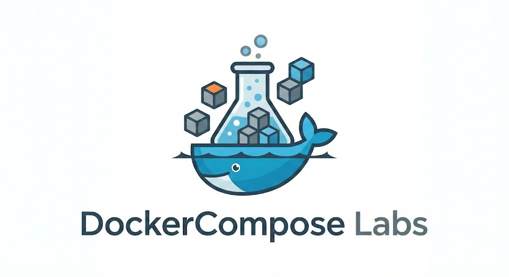

# Docker Compose Hands-on Repository

---



---

### 📚 [View Documentation Site](https://nirgeier.github.io/DockerComposeLabs/)

---

- A collection of Hands-on labs for Docker Compose.
- Each lab is a standalone lab and does not require to complete the previous labs.
- The labs cover various aspects of Docker Compose, from basic concepts to advanced configurations.
- Each lab includes detailed instructions, code examples, and explanations to help you learn Docker Compose.

---

### Usage

[](https://console.cloud.google.com/cloudshell/editor?cloudshell_git_repo=https://github.com/nirgeier/DockerComposeLabs)

---

- List of the labs in this repository:

| Lab                                                                                        | Description                      |
| :----------------------------------------------------------------------------------------- | -------------------------------- |
| [001-intro](https://nirgeier.github.io/DockerComposeLabs/001-intro/)                       | Introduction to Docker Compose   |
| [002-Compose-Demo](https://nirgeier.github.io/DockerComposeLabs/002-Compose-Demo/)         | Multi-container demo application |
| [002-Structure](https://nirgeier.github.io/DockerComposeLabs/002-Structure/)               | Docker Compose file structure    |
| [003-Commands](https://nirgeier.github.io/DockerComposeLabs/003-Commands/)                 | Essential CLI commands           |
| [004-Compose-2Helm](https://nirgeier.github.io/DockerComposeLabs/004-Compose-2Helm/)       | Converting to Helm charts        |
| [005-Compose-Advanced](https://nirgeier.github.io/DockerComposeLabs/005-Compose-Advanced/) | Advanced configurations          |
| [006-Watch](https://nirgeier.github.io/DockerComposeLabs/006-Watch/)                       | Live reload with Watch           |
| [007-Networks](https://nirgeier.github.io/DockerComposeLabs/007-Networks/)                 | Advanced networking patterns     |
| [008-Advanced](https://nirgeier.github.io/DockerComposeLabs/008-Advanced/)                   | Profiles, secrets, resource limits, logging, merge, include |
| [009-Fragments](https://nirgeier.github.io/DockerComposeLabs/009-Fragments/)               | Reusable fragments: logging, resources, healthchecks, networks, secrets, security, profiles |
| [010-Profiles](https://nirgeier.github.io/DockerComposeLabs/010-Profiles/)                 | Environment-aware service management with profiles |
| [011-InitContainers](https://nirgeier.github.io/DockerComposeLabs/011-InitContainers/)     | Startup orchestration with init containers and healthcheck chains |
| [012-VariableSubstitution](https://nirgeier.github.io/DockerComposeLabs/012-VariableSubstitution/) | Environment variable substitution, defaults, and mandatory values |
| [013-MergeOverride](https://nirgeier.github.io/DockerComposeLabs/013-MergeOverride/)       | Multi-file merge strategies and override patterns |
| [014-IntegrationTesting](https://nirgeier.github.io/DockerComposeLabs/014-IntegrationTesting/) | Automated integration testing with Compose exit codes |
| [015-SecretsConfigs](https://nirgeier.github.io/DockerComposeLabs/015-SecretsConfigs/)     | Secure secrets and configuration management |
| [016-DevWorkflows](https://nirgeier.github.io/DockerComposeLabs/016-DevWorkflows/)         | Local development hot-reload, profiles, and CI pipelines |

<!-- Labs list ends -->

---

### Preface

- Docker Compose is a tool for defining and running multi-container Docker applications
- With Compose, you use a YAML file to configure your application's services
- Then, with a single command, you create and start all the services from your configuration
- Docker Compose simplifies the development, testing, and deployment of complex applications

---

## Docker Compose Overview

- Docker Compose allows you to `define multiple services` in a single YAML file.
- Services can be `linked together` through networks and dependencies.
- Compose manages the `entire application lifecycle`.

### Key Benefits

- **Simplified Multi-Container Management**: Define and run multiple containers with a single command
- **Environment Consistency**: Ensure the same environment across development, testing, and production
- **Service Dependencies**: Control the startup order and dependencies between services
- **Network Isolation**: Create isolated networks for your application components
- **Volume Management**: Persist data and share files between containers and the host

### Docker Compose File Structure

- A `docker-compose.yml` file defines your application's services, networks, and volumes
- **Services**: Define the containers that make up your application
- **Networks**: Create custom networks for service communication
- **Volumes**: Manage data persistence and sharing

### Core Concepts

#### `version`

- Specifies the Compose file format version
- Different versions support different features
- Latest version provides the most features and compatibility

#### `services`

- The main section where you define your application containers
- Each service represents a single container
- Services can be built from Dockerfiles or use existing images

#### `networks`

- Define custom networks for service communication
- Services on the same network can communicate using service names
- Provides isolation between different application components

#### `volumes`

- Define named volumes for data persistence
- Share data between containers
- Persist data beyond container lifecycle

---

## Lab Structure

The repository contains the following hands-on labs:

### [001-intro](./Labs/001-intro/)

- Introduction to Docker Compose
- Installation and basic concepts
- Understanding the benefits of multi-container orchestration

### [002-Compose-Demo](./Labs/002-Compose-Demo/)

- Basic docker-compose.yml file structure
- Multi-service application example
- Web server, application, and database integration

### [002-Structure](./Labs/002-Structure/)

- Detailed docker-compose.yml structure
- Common service configurations
- Best practices for service definition

### [003-Commands](./Labs/003-Commands/)

- Essential Docker Compose commands
- Managing application lifecycle
- Debugging and troubleshooting

### [004-Compose-2Helm](./Labs/004-Compose-2Helm/)

- Converting Docker Compose to Helm charts
- Kubernetes deployment strategies
- Migration from development to production

### [005-Compose-Advanced](./Labs/005-Compose-Advanced/)

- Advanced Docker Compose features
- Complex service configurations
- Production-ready setups

### [006-Watch](./Labs/006-Watch/)

- Docker Compose Watch feature
- Live reload and development workflows
- File synchronization and hot reloading

### [007-Networks](./Labs/007-Networks/)

- Advanced multi-network architecture
- Network segmentation and security
- Service discovery and isolation patterns
- DMZ and monitoring network configurations

### [008-Advanced](./Labs/008-Advanced/)

- Profiles, secrets, configs, resource constraints
- Logging drivers, init containers
- Variable substitution, merge/override, include

### [009-Fragments](./Labs/009-Fragments/)

- Reusable configuration fragments
- YAML anchors, aliases, and `extends`
- Logging, resources, healthchecks, networks, secrets, security, profiles

### [010-Profiles](./Labs/010-Profiles/)

- Environment-aware service management
- Profile-based service selection
- Dev/staging/prod, team, and CI/CD profiles

### [011-InitContainers](./Labs/011-InitContainers/)

- Startup orchestration with init containers
- Healthcheck chaining for ordered startup
- Wait strategies and reusable init fragments

### [012-VariableSubstitution](./Labs/012-VariableSubstitution/)

- Variable substitution syntax (`${VAR}`, `:-`, `:?`, `:+`, `$$`)
- `.env` file loading and precedence
- Multi-file environment configuration

### [013-MergeOverride](./Labs/013-MergeOverride/)

- Multi-file compose merging
- Map merge, list replace, sequence merge
- Default override and explicit `-f` patterns

### [014-IntegrationTesting](./Labs/014-IntegrationTesting/)

- Integration testing in Docker Compose
- Exit code propagation with `--exit-code-from`
- Parallel test execution and CI pipeline patterns

### [015-SecretsConfigs](./Labs/015-SecretsConfigs/)

- File-based and external secrets management
- Configs for non-sensitive configuration
- Custom target paths, modes, and Swarm integration

### [016-DevWorkflows](./Labs/016-DevWorkflows/)

- Hot reload with volume mounts and nodemon
- Database proxy with socat
- CI pipeline chaining and profile-based environments
- Multi-stage development with shared volumes

---

## Getting Started

1. **Clone the repository**

   ```bash
   git clone https://github.com/nirgeier/DockerComposeLabs.git
   cd DockerComposeLabs
   ```

2. **Verify Docker Compose installation**

   ```bash
   docker-compose --version
   # or
   docker compose version
   ```

3. **Navigate to any lab directory**

   ```bash
   cd Labs/001-intro
   ```

4. **Follow the lab instructions**
   - Each lab contains detailed README files
   - Step-by-step instructions are provided
   - Code examples and explanations included

---

## Support

- Each lab is self-contained with detailed explanations
- Common issues and solutions are documented
- Best practices and tips are included throughout
- Real-world examples and use cases provided

---

**Happy Learning! 🐳**
